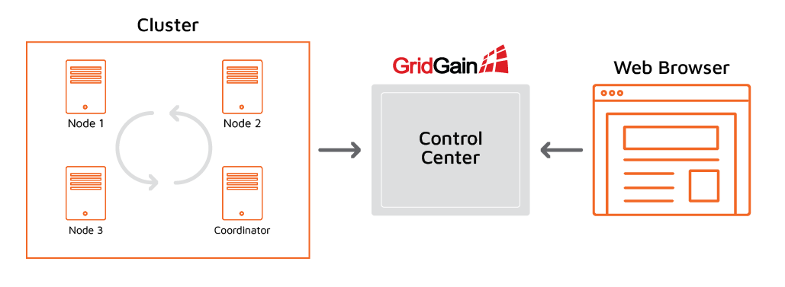
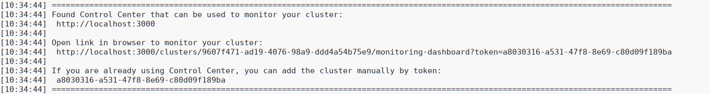
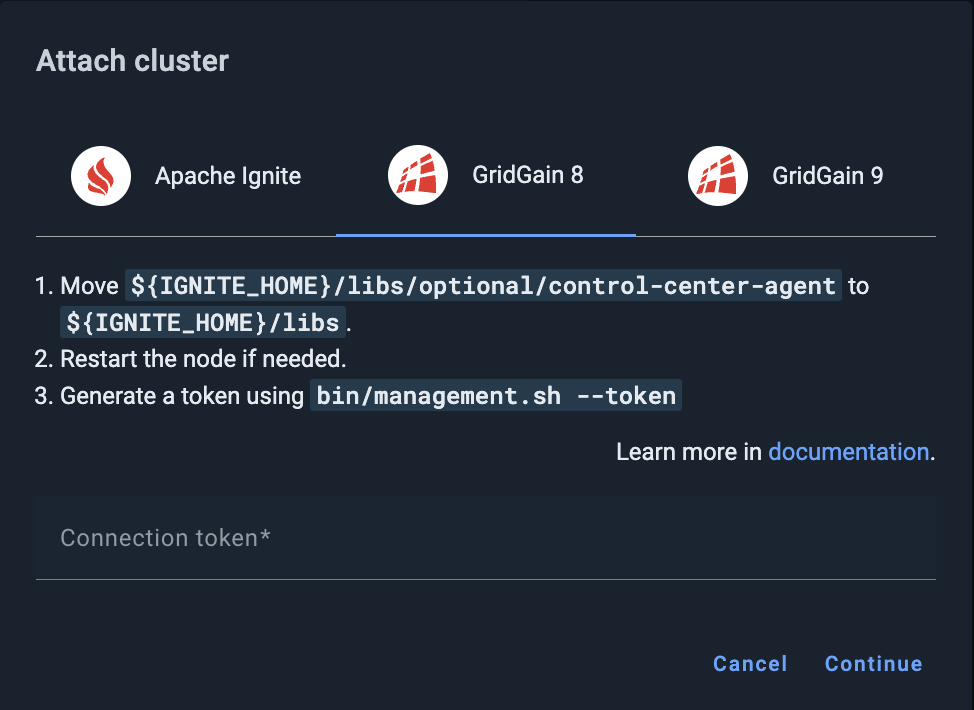
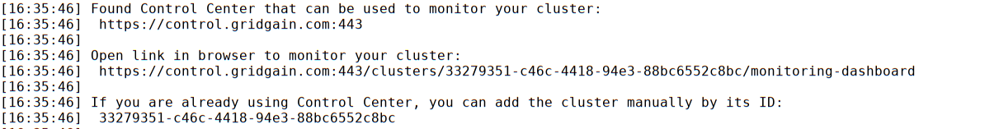

# Attaching a GridGain 8 Cluster

This page explains how to attach a GridGain 8 cluster to Control Center. You can attach as many clusters as your license supports. Control Center allows you to switch between clusters at will.


To attach a GridGain 9 cluster, follow [this instruction](connect-gridgain9-cluster.md). To attach an Apache Ignite cluster, follow [this instruction](connect-ignite-cluster.md).


The following diagram illustrates how Control Center interacts with the cluster and the web browser.




Cluster must have open egress on `TCP:8080`. Control Center must have open ingress for `TCP:8080`. If the cluster is SSL-enabled, change `8080` to `443`.



Depending on configuration, [secured clusters](../../gg8/auth/authorization-permissions.md) might require a cluster-level authentication for some (or all) of the actions.


## Enabling the Control Center Module

The connection between the cluster and Control Center is initiated from the cluster side.

For this to happen, you need to enable the `control-center-agent` module in the cluster. The module must be enabled on all server nodes. If you plan to connect client nodes to your cluster, enable the module on the client nodes as well. Otherwise, you will get the following exception on the client node:

```bash
java.lang.ClassNotFoundException: org.gridgain.control.agent.configuration.ControlCenterAgentConfiguration
```

Depending on how you deploy your cluster, you can enable the module in different ways:

- If you start nodes from the distribution package by executing `ignite.sh`, copy the `{GRIDGAIN_HOME}/libs/optional/control-center-agent` folder to `{GRIDGAIN_HOME}/libs/`.
- If you start nodes using Maven, see [this section](https://gridgain.com/docs/latest/developers-guide/setup#enabling-modules) for the information on how to enable modules.
- If you use a GridGain Docker image, see [Enabling Modules](https://gridgain.com/docs/latest/installation-guide/installing-using-docker#enabling-modules).

When you start your cluster with the Control Center Agent enabled, you can use the `management.sh` script to enable and disable management functions for the cluster. The management script is located in the `bin` directory of the distribution package. Detailed descriptions are available in the [Command Line Options](../../admin-guide/command-line.md) page.

As the cluster tries to connect to Control Center, you should see the following messages in the console output of the coordinator node (the oldest node in the cluster):



If you have no [Control Center URI](#control-center-uri) configured, or if you want to use a URL different from the one you have configured, copy the link (URL + token) and paste it into your browser.

Alternatively, copy the connection token and perform the [Attaching the Cluster to Control Center](#attaching-the-cluster-to-control-center) procedure.

## Attaching the Cluster to Control Center

To attach the cluster to Control Center:

1. Click the **+** icon on the Control Center toolbar.
2. In he **Attach cluster** dialog that opens, select the **GridGain 8** tab.

   
3. In the **Connection token** field, enter the token you have generated while [Enabling the Control Center Module](#enabling-the-control-center-module) .
4. Click **Continue**.

   If the cluster is found and the token is successfully validated, the success notification appears in the dialog.
5. Click **Attach**.

The attached cluster displays in the [My cluster](../../gg8/dashboard/my-cluster.md) screen.

## Configuring Your Cluster

The following procedures are optional.

### Enabling Metrics

Control Center collects metrics from the cluster nodes that are running. Most metrics are available by default, but some metrics must be enabled in the cluster before you can view them in Control Center.

You can enable metrics in two ways:

- In the cluster configuration, or
- Via JMX Beans at runtime

### Enabling Tracing

You can enable tracing capabilities and view traces in Control Center in two ways:

1. The best way to configure tracing is to use the [Tracing](../../gg8/tracing/tracing.md#tracing) screen of the Control Center.
2. To configure tracing programmatically, see the [Tracing](https://gridgain.com/docs/latest/administrators-guide/monitoring-metrics/tracing) page for more detail.

### Control Center URI

The Control Center URI is the URI where the GridGain Control Center is running. Your cluster must know that URI to be able to establish connection with Control Center.

When started with "control-center-agent" enabled, the cluster tries to connect to `http://localhost:3000` by default.

If the connection is established, you should see the following messages in the output of the coordinator node:



If you run an on-premise Control Center instance, set its URI by using the management script:

```bash
{GRIDGAIN_HOME}/bin/management.sh --uri https://control_center_uri:3000
```

The management script also generates the token required for connecting the cluster to Control Center.

You can also set the URI in the GridGain system properties: `-Dcontrol.center.agent.uris=https://portal-test.gridgain.com`.


This option works only when you are launching a new cluster. Restarting an already running cluster and adding this System Property will not work.


### Assigning Cluster Name

You can assign a name to your cluster. The name is a human-readable label used only within Control Center — it does not affect cluster operation.

You can change the cluster name from the context menu in **My Cluster** tab both for [GridGain 8](../../gg8/dashboard/my-cluster.md#renaming-the-cluster) and [GridGain 9](../../gg9/dashboard/my-cluster.md#renaming-the-cluster), or by using the control script:

```bash
{IGNITE_HOME}/bin/control.sh --change-tag newTagValue [--yes]
```

If you don't set the cluster name, an auto-generated name is displayed instead.
