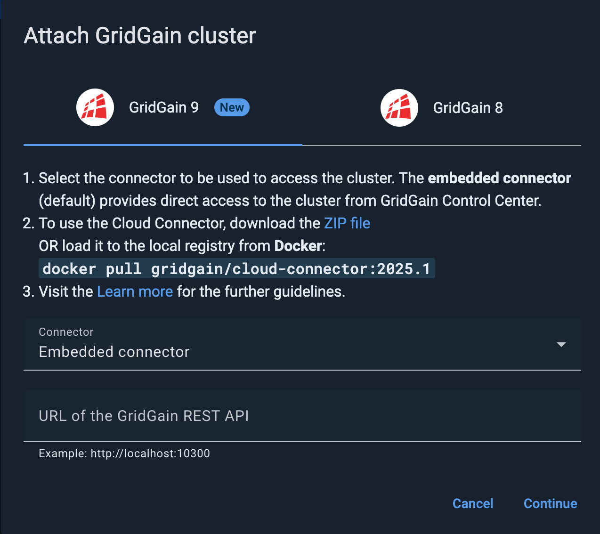
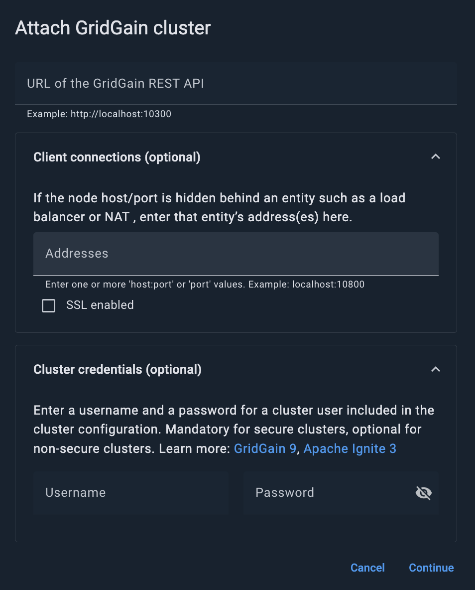
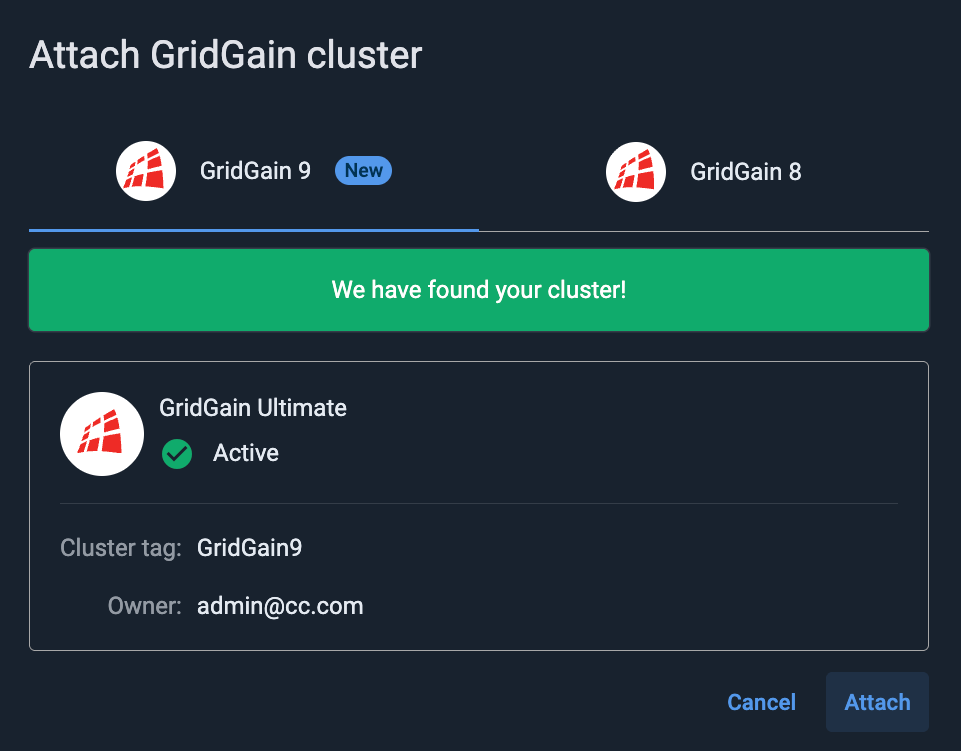

# Attaching a GridGain 9 Cluster

This page explains how to attach a GridGain 9 cluster to Control Center.


Make sure that Control Center supports the [specific GridGain 9 version](../../README.md#supported-gridgain-9-versions) your cluster is running on.


You can attach as many clusters as your license supports.


To attach a GridGain 8 cluster, follow [this instruction](connect-gridgain-cluster.md). To attach an Apache Ignite cluster, follow [this instruction](connect-ignite-cluster.md).


## Start the Cluster

1. Follow the [GridGain 9 documentation](https://www.gridgain.com/docs/gridgain9/latest/installation/installing-using-zip#starting-the-node) to start the cluster.
2. Copy aside the URL address of the cluster as you will need it to connect to the cluster from within Control Center.

Cluster must have open ingress on REST and client ports (`10300` and `10800`, respectively, in the default configuration) for the Control Center backend to connect.


While Control Center needs access to the GridGain nodes, these nodes also need to be able to reach Control Center to send metrics.


## Enable Connection to Secured Clusters

If your cluster is secured (has SSL/TLS configured), and if it uses self-signed certificates, you need to pass the cluster's trust store parameters to Control Center. This can be done by setting up the `JVM_OPTS` environment variable:

```bash
JVM_OPTS=-Xms1g -Xmx2g -server -XX:MaxMetaspaceSize=256m -XX:MaxDirectMemorySize=1g -Djavax.net.ssl.trustStore=/some/local/path/truststore.p12 -Djavax.net.ssl.trustStorePassword=changeit
```

## Attach the Cluster to Control Center

To attach the cluster to Control Center:

1. Click the **+** icon on the Control Center toolbar.
2. In he **Attach cluster** dialog that opens, select the **GridGain 9** tab.

   
3. To use an instance of the [Cloud Connector service](../../gg9/cloud-connector/connect-cloud-connector.md) (instead of the default Embedded connector), select the required instance from the **Connector** drop-down list.
4. In the **URL of the GridGain REST API** field, enter the cluster URL.
5. If the node you are connecting to is hidden behind an entity like a NAT or a load balancer:
   1. Expand the **Client connections** section.

      
   2. Enter the NAT's or load balancer's address(es) in the **Client connections** field. The format is either `host:port` or `host`. Make sure you have mapped the node address to the NAT/balancer address in the cluster.
6. To enable SSL encryption in Control Center communications with the cluster, select the **SSL enabled** check box.
7. If you are attaching a secure cluster:
   1. Expand the **Cluster credentials** section.

      
   2. Enter **Username** and **Password** that correspond to the credentials of one of the users included in the [cluster configuration](https://www.gridgain.com/docs/gridgain9/latest/administrators-guide/config/cluster-config#security-configuration).
8. Click **Continue**.

   The dialog indicates that the cluster has been found.

   
9. Click **Attach**.

The attached cluster displays in the [My cluster](../../gg9/dashboard/my-cluster.md) screen.

Its status is `Uninitialized`. You must [initialize the cluster](../../gg9/dashboard/my-cluster.md#initializing-the-cluster) to enable monitoring and management activities.

## Attach the Cluster in Docker to Control Center in Docker

1. Install the Cluster as it described in [GridGain 9 documentation](https://www.gridgain.com/docs/gridgain9/latest/installation/installing-using-zip). Make sure that GridGain 9 utilizes the same network Control Center does, and that the name for the Cluster is defined:

   ```bash
   docker run -d -p 10300:10300 -p 10800:10800 -p 3344:3344 --network control-center --name gridgain  gridgain/gridgain9:latest
   ```
2. Use the cluster name, e.g., `http://gridgain:10300`, to attach the cluster to Control Center.

## Attach the Cluster in Docker to Control Center Running locally or Vice Versa

1. Find your local IPv4 address.
   1. Use the following command if the cluster and GridGain run on Mac:

      ```bash
      ipconfig getifaddr en0
      ```
   2. Use the following command if the cluster and GridGain run on Linux:

      ```bash
      ip a
      ```
2. Use the address, e.g., `http://192.168.1.16:10300`, to attach the cluster to Control Center.
