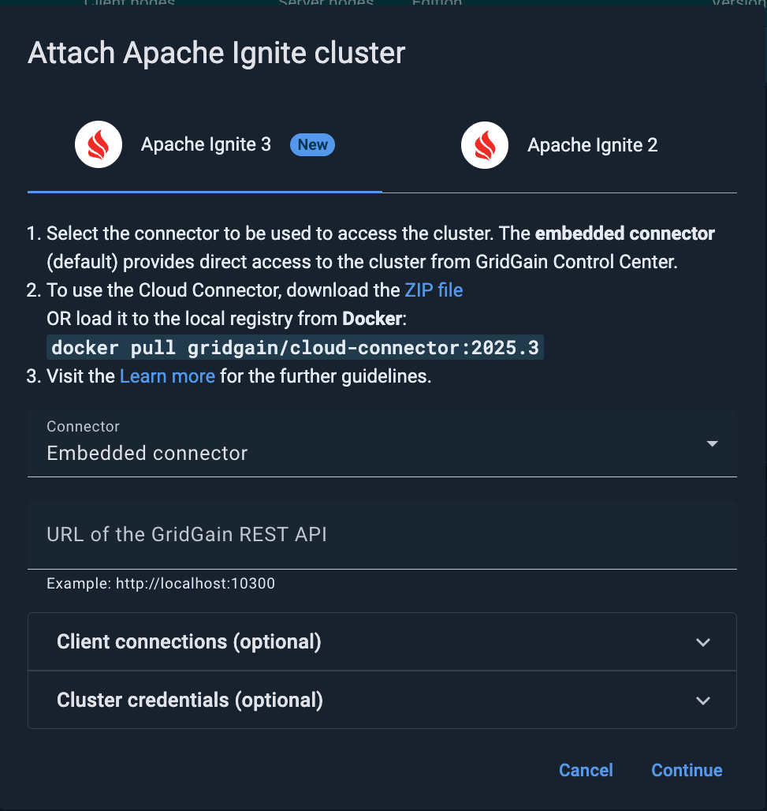
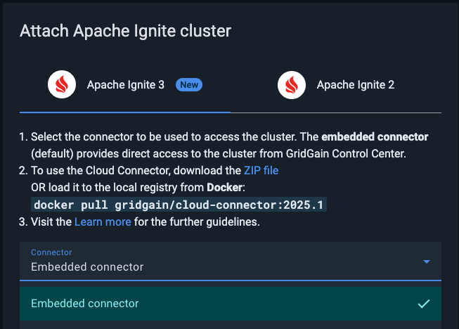

# Attaching an Apache Ignite 3 Cluster

This page explains how to attach an Apache Ignite 3 cluster to GridGain Control Center.

You can attach as many clusters as your license supports.


To attach an Ignite 2 cluster, follow [this instruction](connect-ignite-cluster.md).


## Start the Cluster

Follow the [Ignite 3 documentation](https://ignite.apache.org/docs/ignite3/latest/quick-start/getting-started-guide) to start the cluster.

## Attach the Cluster to Control Center

### By Using the Custom Connector

You can install the Cloud Connector tool to collect data from your cluster and send it to Control Center. In this case, you will not need to expose your cluster to Control Center, as the Connector can be run in your local network.

To attach the cluster to Control Center by using the embedded connector:

#### Install the Connector

Follow the Cloud Connector installation instructions.

#### Connect to the Cluster

1. Click the **+** icon on the Control Center toolbar and select **Attach Apache Ignite**.
2. In the **Attach Apache Ignite cluster** dialog that opens, select the **Apache Ignite 3** tab.

   
3. In the **Connector** field, select the name of your Connector.
4. Specify the URL of the Ignite cluster. The Connector will attempt to connect to the node on the specified URL from the machine it is running on.
5. If the node you are connecting to is hidden behind an entity like a NAT or a load balancer (see [Configure Access Ports](#configure-access-ports) above), enter that entity's address(es) in the **Client connections** field. The format is either `host:port` or `port`. Make sure you have mapped the node address to the NAT/balancer address in the cluster.
6. To enable SSL encryption in Control Center/cluster communications, select the **SSL enabled** check box.
7. If you are attaching a secure cluster, enter **Username** and **Password** that correspond to the credentials of one of the users included in the cluster configuration.
8. Click **Continue**.
9. In the subsequent dialog, click **Attach**.

The attached cluster displays in the [My cluster](../../gg9/dashboard/my-cluster.md) screen.

If its status is `Uninitialized`, [initialize the cluster](../../gg9/dashboard/my-cluster.md#initializing-the-cluster) to enable monitoring and management activities.

### By Using the Embedded Connector

You can directly connect to GridGain Control Center without installing a connector tool. In this case, Control Center will access the node and collect required information from it. Your node will need to be exposed to Control Center cloud addresses for the connection to work.

To attach the cluster to Control Center by using the embedded connector:

#### Configure Access Ports

Open egress ports `10300` and `10800` to Control Center's [GCP Cloud NAT IP address](https://cloud.google.com/nat/docs/overview) - `35.209.75.152` - in the cluster firewall rules. The above address will be used to access the cluster from Control Center.

For AWS-based clusters:

1. Create an Apache Ignite 3 cluster based on AWS EC2 instances.
2. Configure firewall rules using [AWS security groups](https://docs.aws.amazon.com/AWSEC2/latest/UserGuide/changing-security-group.html) - add the `10300` and `10800` ports to the security group's inbound rules with `35.209.75.152/32` as the source.

#### Connect to the Cluster

1. Click the **+** icon on the Control Center toolbar and select **Attach Apache Ignite**.
2. In the **Attach Apache Ignite cluster** dialog that opens, select the **Apache Ignite 3** tab.

   
3. In the **Connector** field, select **Embedded connector**.
4. Specify the URL of the Ignite cluster. Control Center will attempt to connect to the node on the specified URL from the cloud.
5. If the node you are connecting to is hidden behind an entity like a NAT or a load balancer (see [Configure Access Ports](#configure-access-ports) above), enter that entity's address(es) in the **Client connections** field. The format is either `host:port` or `port`. Make sure you have mapped the node address to the NAT/balancer address in the cluster.
6. To enable SSL encryption in Control Center/cluster communications, select the **SSL enabled** check box.
7. If you are attaching a secure cluster, enter **Username** and **Password** that correspond to the credentials of one of the users included in the cluster configuration.
8. Click **Continue**.
9. In the subsequent dialog, click **Attach**.

The attached cluster displays in the [My cluster](../../gg9/dashboard/my-cluster.md) screen.

If its status is `Uninitialized`, [initialize the cluster](../../gg9/dashboard/my-cluster.md#initializing-the-cluster) to enable monitoring and management activities.
