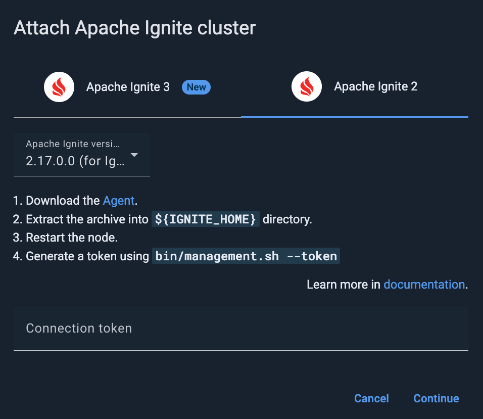

# Attaching an Apache Ignite Cluster

This page explains how to attach an Apache Ignite 2 cluster to GridGain Control Center. You can attach as many clusters as your license supports. Control Center allows you to switch between the clusters at will.


To attach a GridGain 9 cluster, follow [this instruction](connect-gridgain9-cluster.md). To attach a GridGain 8 cluster, follow [this instruction](connect-gridgain-cluster.md).


The following diagram illustrates how Control Center interacts with the cluster and web browser.


## Enabling the Control Center Module

The connection between the cluster and Control Center is initiated from the cluster side. For this to happen, you need to enable the `control-center-agent` module in the cluster. The module must be enabled on all server nodes. If you plan to connect client nodes to your cluster, enable the module on the client nodes as well. Otherwise, you will get the following exception on the client node:

```bash
java.lang.ClassNotFoundException: org.gridgain.control.agent.configuration.ControlCenterAgentConfiguration
```


Cluster must have open egress on `TCP:8080`. Control Center must have open ingress for `TCP:8080`. If the cluster is SSL-enabled, change `8080` to `443`.


### Binary Package

1. [Contact us](https://www.gridgain.com/contact) to obtain the `gridgain-control-center-on-premise-[version]` archive.
2. Unpack the archive into the folder with the Apache Ignite installation.

   The archive contains the following folders:

   ```
   bin/
   libs/
       control-center-agent/
   ```
3. Copy the content of the `bin` folder to `{IGNITE_HOME}/bin/`, and the `libs/control-center-agent` folder to `{IGNITE_HOME}/libs`.
4. If you start Ignite nodes from a java application, manually copy the libraries from `gridgain-control-center-agent-{version}/libs/control-center-agent` to your classpath.
5. Start your cluster. You should see the following message in the console output of the coordinator node:

   
6. If you have no `Control Center URI` configured, or if you want to use a URL different from the one you have configured, copy the link (URL + token) and paste it into your browser. Alternatively, copy the connection token and perform the [Attaching the Cluster to Control Center](#attaching-the-cluster-to-control-center) procedure.

### Maven Dependency

If you use Maven to start your nodes, add the following dependency to your `pom.xml`:

```xml
<repositories>
    <repository>
        <id>GridGain External Repository</id>
        <url>http://www.gridgainsystems.com/nexus/content/repositories/external</url>
    </repository>
</repositories>

<dependencies>
    <dependency>
        <groupId>org.gridgain</groupId>
        <artifactId>control-center-agent</artifactId>
        <version>2.17.0.0</version>
    </dependency>
</dependencies>
```


Note that the Control Center Agent artifact version depends on the Apache Ignite version. Please refer to the [Download page](https://www.gridgain.com/tryfree#controlcenteragent) that maps Apache Ignite and Control Center Agent versions.


## Attaching the Cluster to Control Center

To attach the cluster to Control Center:

1. Click the **+** icon on the Control Center toolbar.
2. In he **Attach cluster** dialog that opens, select the **Apache Ignite** tab.

   
3. In the **Connection token** field, enter the token you have generated while [Enabling the Control Center Module](#enabling-the-control-center-module) .
4. Click **Continue**.

   If the cluster is found and the token is successfully validated, the success notification appears in the dialog.
5. Click **Attach**.

The attached cluster displays in the [My cluster](../../gg8/dashboard/my-cluster.md) screen.

## Configuring Your Cluster

The following procedures and deployment modes are optional.

### Enabling Tracing

You can enable tracing capabilities and view traces in Control Center in two ways:

1. The best way to configure tracing is to use the [Tracing](../../gg8/tracing/tracing.md) screen of the Control Center.
2. To configure tracing programmatically, see the [Tracing](https://ignite.apache.org/docs/ignite2/latest/monitoring-metrics/tracing) page for more detail.

### Embedded Mode

When launching Ignite in embedded mode, please include the following JVM arguments:

```bash
--add-exports=java.base/jdk.internal.misc=ALL-UNNAMED
--add-exports=java.base/sun.nio.ch=ALL-UNNAMED
--add-exports=java.management/com.sun.jmx.mbeanserver=ALL-UNNAMED
--add-exports=jdk.internal.jvmstat/sun.jvmstat.monitor=ALL-UNNAMED
--add-exports=java.base/sun.reflect.generics.reflectiveObjects=ALL-UNNAMED
--add-opens=jdk.management/com.sun.management.internal=ALL-UNNAMED
--illegal-access=permit
```

### Docker Deployment

To connect an Apache Ignite cluster to Control Center deployed in Docker, please perform the steps and note information below:

Deploy a Control Center Agent in Docker as it is not provided in the original delivery:

- Download the Control Center Agent and unzip it to the `control-center-agent` directory.
- Run `start.sh` that creates new Docker image and starts both Control Center and 2 Apache Ignite nodes.

The containers must have a common network, otherwise Control Center Agent will not detect Control Center and will not be able to connect to it.

Use the configuration below for the Control Center deployed in Docker:

```yaml
version: '3.7'
services:
  ignite-server-node:
    image: apacheignite/ignitecc:2.17.0
    environment:
      - CONFIG_URI=/opt/ignite/ext-config/ignite-config-node.xml
      - IGNITE_WORK_DIR=/opt/ignite/work
      - OPTION_LIBS=control-center-agent
    volumes:
      - ./config:/opt/ignite/ext-config
      - ./work:/opt/ignite/work
```

Use the configuration below for the GridGain hosted Control Center:

```yaml
version: '3.7'
services:
  ignite-server-node:
    image: apacheignite/ignitecc:2.17.0
    environment:
      - CONFIG_URI=/opt/ignite/ext-config/ignite-config-node.xml
      - IGNITE_WORK_DIR=/opt/ignite/work
      - OPTION_LIBS=control-center-agent
    volumes:
      - ./config:/opt/ignite/ext-config
      - ./work:/opt/ignite/work
```
