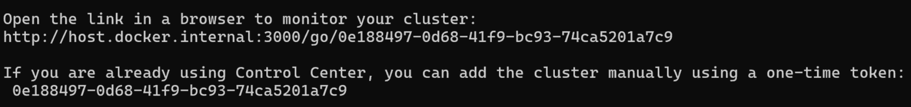

# Connecting to Demo Cluster

GridGain provides a preconfigured demo you can use to see what a real application look like from within Control Center.

If you already have a GridGain cluster, you can skip this step and connect to your own cluster as described in the [next step](connect/connect-gridgain-cluster.md).

## Prerequisites

You will need some tools preconfigured to run the demo cluster:

- Docker 19 or later, or Docker Desktop Community 2.3 or later, including Docker Compose 1.25.5 or later
- Apache Maven 3.3 or later


Cluster must have open egress on `TCP:8080`. Control Center must have open ingress for `TCP:8080`. If the cluster is SSL-enabled, change `8080` to `443`.


## Download the Demo Project

The demo project has a simple preconfigured GridGain cluster that you can run with Docker and a simple application that simulates load on the cluster. [Download](https://github.com/GridGain-Demos/ignite-streaming-monitoring-demo) and unzip the demo source repository or use Git to clone the repository:

```bash
git clone https://github.com/GridGain-Demos/ignite-streaming-monitoring-demo.git
```

## Start the Demo GridGain Cluster

To start the demo cluster:

1. Launch Docker.
2. Open a terminal window and navigate to the root of the demo you have downloaded or cloned.
3. To start a two-node GridGain cluster, with each node running as a separate container, run:

   ```bash
   docker-compose -f docker/ignite-cluster.yaml up -d --scale ignite-server-node=2
   ```

   The cluster nodes will store data in `ignite-streaming-monitoring-demo\work\db` folder. By default, 150MB is allocated per node.

## Prepare for Attachment to Control Center

To work with a local copy of Control Center:

1. Connect to the container of the first cluster node:

   ```bash
   docker exec -it docker-ignite-server-node-1 bash
   ```
2. Go into the `/opt/gridgain/bin/` folder of the container:

   ```bash
   cd /opt/gridgain/bin/
   ```
3. Instruct the cluster to connect to the local Control Center container:

   ```bash
   ./management.sh http://host.docker.internal:3000
   ```
4. Generate a new one-time token to register the cluster with Control Center:

   ```bash
   ./management.sh --token
   ```

   The token appears in the response to the `--token` command:

   
5. Copy the token aside to use it to [Attach Cluster to Control Center](#attach-cluster-to-control-center).
6. Quit the node's container:

   ```bash
   exit
   ```

Now, the cluster is configured to work with the local installation of Control Center.

## Attach Cluster to Control Center

To attach cluster:

1. In Control Center, click **Attach cluster**.

   
   If you already have other clusters attached, you can find the **Attach cluster** button in the **Cluster management** screen.
   
2. In the **Attach cluster** wizard that opens:
   1. Make sure you have **GridGain** selected.
   2. Enter the connection token.
   3. Click **Continue**.

   The wizard shows the process of the attachment.

   Once the cluster is attached to Control Center, you can see the dashboard with metrics.
3. Activate your cluster from the **Dashboard** to enable subsequent steps.

## Launch Market Orders Application

Now that the cluster is running and connected, launch the application to simulate load for it. You need Internet connection, as the application will connect to [PubNub Market Order data stream](https://www.pubnub.com/developers/realtime-data-streams/financial-securities-market-orders/).

1. Create an executable file:

   ```bash
   mvn clean package
   ```
2. Dockerize the application:

   ```bash
   docker build -f docker/StreamingAppDockerfile -t ignite-streaming-app .
   ```
3. Deploy the application in Docker:

   ```bash
   docker-compose -f docker/ignite-streaming-app.yaml up -d
   ```

## Check Messages

Your cluster should be receiving messages. You can check what those messages are from **SQL** screen, for example:

```sql
SELECT * FROM Trade ORDER BY order_date DESC LIMIT 10;
```

## Next Steps

Now you have a working cluster with some simulated load. Feel free to explore and try various Control Center features. GridGain nodes you launched are running GridGain Community, but you can do the same steps by starting Apache Ignite or GridGain Ultimate nodes.

To explore more Control Center features you can:

- [Connect your personal GridGain cluster](connect/connect-gridgain-cluster.md)
- [Install Control Center on-premise](../installation/install-binary.md)
