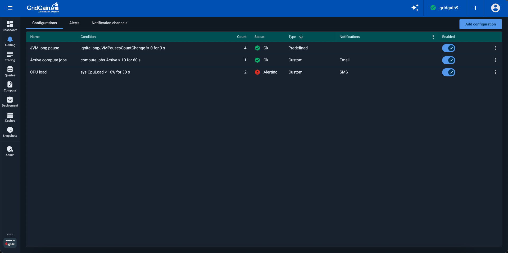
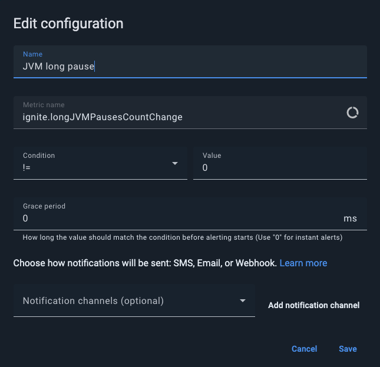
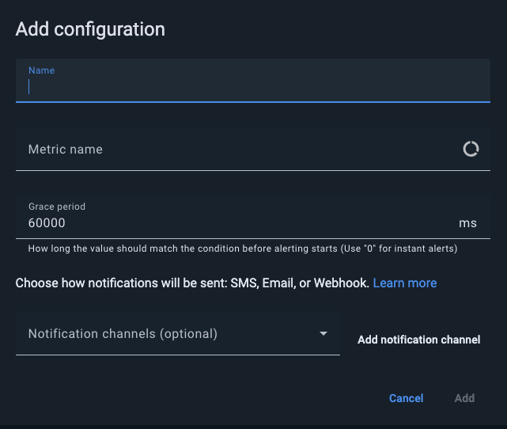
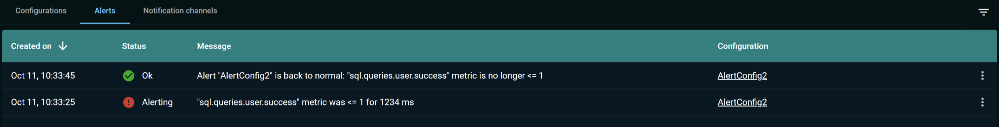
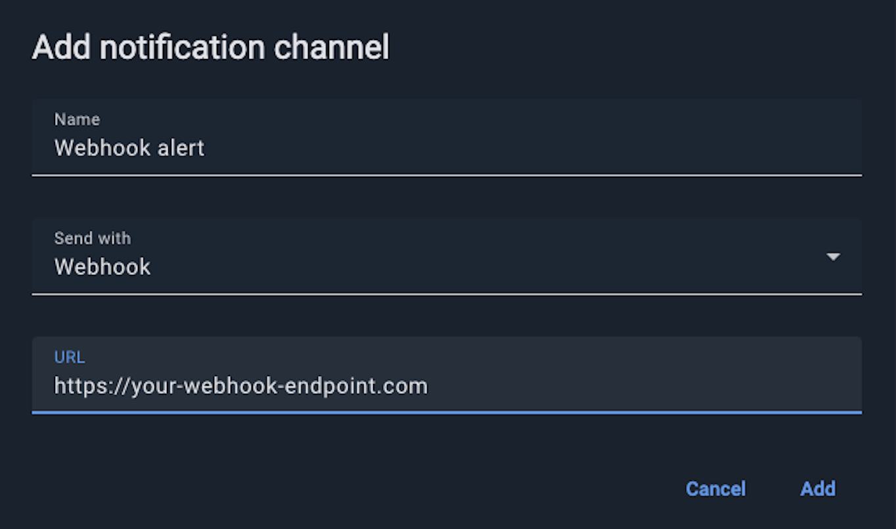

# Alerting

On the **Alerting** screen, you can configure alerts for user-defined conditions that could indicate cluster issues.

You can use one of the available numeric metrics to specify the condition. For example, you can specify a condition for sustained high CPU load or excessive disk usage on nodes. If a condition lasts for the specified time, Control Center sends a notification via email, SMS, or webhook.

Each alert can have multiple channels assigned.


Depending on configuration, [secured clusters](../auth/authorization-permissions.md) might require a cluster-level authentication for some (or all) of the actions.


## Predefined Alerts

When a cluster is attached, the Control Center automatically creates a set of predefined alert configurations. They appear on the **Alerting** screen as `Predefined`.



You can modify the name and threshold values of a predefined alert or delete the alert completely. However, you cannot change the underlying metric itself.



## Creating Alerts

On the **CONFIGURATIONS** tab, click the **ADD ALERT** button and fill out the fields of the dialog box that appears.



| Field | Description |
|---|---|
| Name | The name of the alert |
| Metric name | The metric that you want to monitor |
| Condition | The condition to be met |
| Value | The value to which the metric is to be compared |
| Grace Period | The amount of time that the condition can exist before an alert is generated. The grace period prevents occasional spikes from triggering alerts. A setting of `0` enables instant alerts. |
| Notification Channels | The notification channels that are associated with the alert. To create a notification channel, click **ADD NOTIFICATION CHANNEL**. |

## Viewing Alert History

The **Alerts** tab displays the alert history.



| Column | Description |
|---|---|
| Created On | The time when the alert was generated. |
| Status | The status of the alert:<br>- Alerting - the alert is active (has been triggered and is sending messages)<br>- Ok - the alert is inactive (the triggering condition has passed) |
| Message | The alert message. |
| Configuration | The configuration of the alert. |

The **Filter** section, on the right, enables you to filter the alert list by configuration, status, and the creation period.

## Creating Notification Channels


If you are running a self-hosted Control Center, configure email server and/or SMS provider settings. See [Configuration](../../admin-guide/configuration.md).


To create a notification channel:

1. Go to the **NOTIFICATION CHANNELS** tab and click **ADD NOTIFICATION CHANNEL**.
2. Enter the name of the notification channel.
3. In the **Send with** field, select **Email**, **SMS** or **Webhook**.
4. In the **Send to** field, enter an email address or a phone number. If **Webhook** option is selected, provide the URL of the endpoint that accepts alerts.



### Configure Webhook Notifications

When an alert is triggered, Control Center sends a `POST` request to the configured webhook URL with the following JSON payload:

| Column | Description |
|---|---|
| eventType | Event type. Always is `CONTROL_CENTER_ALERT`. |
| alertId | ID of the triggered alert. |
| alertName | Alert name as configured in Control Center (e.g. `High CPU Usage`). |
| clusterId | ID of the cluster that triggered the alert. |
| clusterTag | Cluster name (for GridGain 9 clusters) or cluster tag (for GridGain 8) associated with the cluster (e.g. `production-cluster`). |
| state | Current state of the alert. Possible values:<br>- `ALERTING` – The condition has lasted long enough, so the alert is now active.<br>- `GOOD` – The condition is no longer met; the system has returned to normal. |
| message | Alert message describing the condition that caused it (e.g. `CPU usage has exceeded 80% threshold`). |
| timestamp | Time the alert was triggered, in milliseconds. |
| controlCenterUrl | URL of the Control Center instance that sent an alert. |

Below is a sample JSON sent by the Control Center when an alert is triggered:

```json
{
  "eventType": "CONTROL_CENTER_ALERT",
  "alertId": "123e4567-e89b-12d3-a456-426614174000",
  "alertName": "High CPU Usage",
  "clusterId": "987fcdeb-51a2-43d7-b123-456789abcdef",
  "clusterTag": "production-cluster",
  "state": "ALERTING",
  "message": "CPU usage has exceeded 80% threshold",
  "timestamp": 1704067200000,
  "controlCenterUrl": "https://control-center.example.com"
}
```
