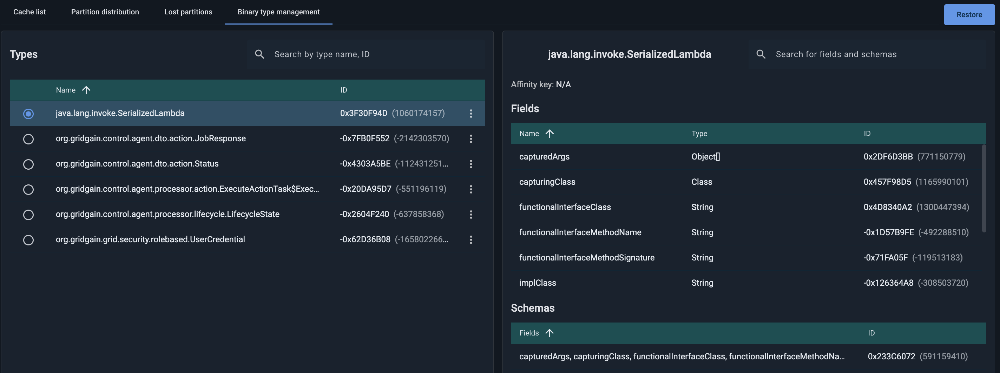

# Binary Type Management

Use this tab to manage binary types.

GridGain prohibits changing a column type (e.g. `INT` to `VARCHAR` or even `LONG`) in both SQL tables and caches, due to the Binary Object format limitations. To work around this limitation, you can delete a binary type's metadata (and all the data of that type) using this tab.


This functionality is also available via the [control.sh --meta commands](https://www.gridgain.com/docs/latest/administrators-guide/control-script).


## View Binary Types

To view a binary type's fields and schemas:

1. Do one or both of the following:
   1. Scroll down the list on the **Binary type management** tab.
   2. Start typing the required type's name or ID in the search field above the list.
2. Select the option button next to the required binary type.

   The selected type's information is displayed in the right-hand section.

## Download Binary Types

You can download a binary type to your machine as a `<typeID>.bin` file. It can be used to restore that type later (see [Restore Binary Types](#restore-binary-types)) or to migrate it (without data) to another cluster.

To download a binary type, from the type's context menu, select **Download**.

## Remove Binary Types

To remove metadata for a binary type from your cluster and save the removed metadata to a `<typeID>.bin` file:

1. From the type's context menu, select **Remove**.
2. In the confirmation dialog that opens, click **Remove**.

   The metadata is removed from the cluster. The file to be used for restoring this data (see [Restore Binary Types](#restore-binary-types)) is automatically downloaded to your machine.
3. If the download does not start automatically, click the **Download** button in the dialog that opens.

## Restore Binary Types

To restore the previously removed metadata for a binary type (see [Remove Binary Types](#remove-binary-types)) or for a new/migrated binary type from the `<typeID>.bin` file:

1. Click **Restore** in the top right corner.
2. In the **Restore binary type** dialog that opens, do one of the following:
   1. Drop the required file into the field, or
   2. Click **Select** and select the required file using your file system navigator.

      The metadata for the selected binary type is restored in your cluster.
