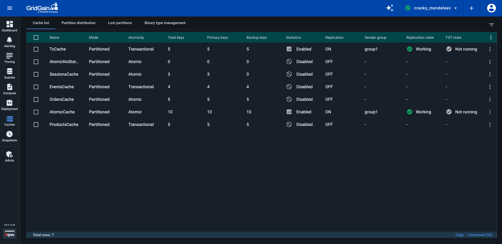
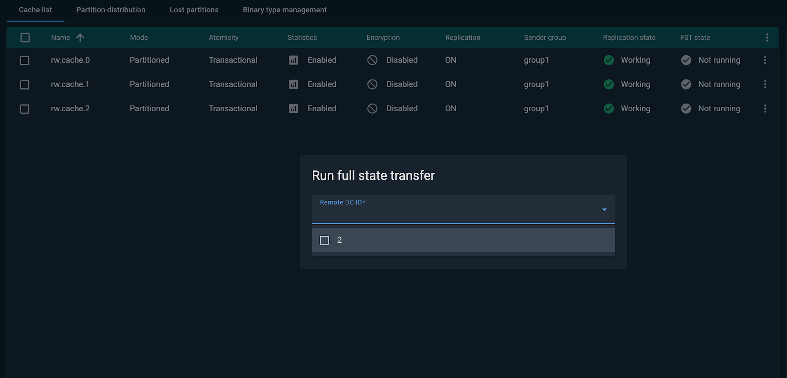

# Cache List

The **Cache list** tab displays a list of all active caches. You can copy this data or export it to a CSV file.


Hidden columns will be copied and exported too.


By default, the list includes the following columns:

| Column | Description |
|---|---|
| Name | The cache name. |
| Mode | See [Data Partitioning](https://gridgain.com/docs/latest/developers-guide/data-modeling/data-partitioning). |
| Atomicity | See [Atomicity Modes](https://gridgain.com/docs/latest/developers-guide/configuring-caches/atomicity-modes#atomicity-modes). |
| Statistics | Whether statistics gathering for the cache is enabled or disabled. |
| Replication | Whether the cache participates in [data replication (DR)](https://www.gridgain.com/docs/latest/administrators-guide/data-center-replication/introduction) (ON/OFF). |
| Sender group | The name of the sender group the cache belongs to. Relevant if `Replication=ON`. |
| Replication state | The incremental data replication state (`STOPPED`/`WORKING`). Relevant if `Replication=ON`. |
| FST state | The state of the full state transfer (`WORKING`/`FAILED`). Relevant if `Replication=ON`. |
| FST Statistic | Shows the total number of entries transferred for this cache during the last finished FST. In-progress FST is not included. FST statistic is collected only while Control Center is online |
| Total keys | The total number of keys stored in the cache. |
| Primary keys | The number of primary keys stored in the cache. **Hidden** by default. Add via the list's context menu. |
| Backup keys | The number of backup keys stored in the cache. **Hidden** by default. Add via the list's context menu. |

The leftmost column of the list offers check boxes that you use to select multiple caches for enabling or disabling statistics (see cache management options below).

You can:

- Add or remove columns to/from the list by selecting or deselecting column names in the list's context menu.
- Filter the cache list by any of its columns using the **Filters** pane on the right.

To manage a cache, use that cache's context menu. The menu contains the following items:

| Menu item | Description |
|---|---|
| Enable statistics | Enables collection of cache statistics. You can enable statistics for multiple caches at a time using the check boxes to select caches. |
| Disable statistics | Disables collection of cache statistics. You can disable statistics for multiple caches at a time using the check boxes to select caches. |
| Show partition distribution | Redirects to the Partition Distribution tab with the corresponding information on partition distribution of the selected cache. |
| Show lost partitions | Redirects to the Lost Partitions tab with the corresponding information on lost partitions (if any) of the selected cache. |
| Show cache configuration | Opens the read-only Cache Configuration dialog. See [Configure Caches](https://gridgain.com/docs/latest/administrators-guide/data-center-replication/configuring-replication#3-configure-caches) for more details. |
| Load from cache store | Executes the cache.loadCache() method for the selected cache to preload data from the underlying database into memory. |
| Run rebalance | Starts rebalance process. See [Data Rebalancing](https://gridgain.com/docs/latest/developers-guide/data-rebalancing) for more details. |
| Run scan query | Opens a new **Scan query** tab in the **Queries** screen and [runs a scan query](../queries/querying.md#scan-queries) on the selected cache with all the advanced options set to default values. |
| Remove all | Deletes all entries from the cache via `removeAll()`. If [DR](https://www.gridgain.com/docs/latest/administrators-guide/data-center-replication/introduction) is enabled, deletions will be propagated to the remote cluster. See [this](https://www.gridgain.com/docs/gridgain8/latest/developers-guide/key-value-api/basic-cache-operations#clearing-caches) page to choose the correct method for your environment. |
| Clear | Clears cache entries locally via `clear()`. If [DR](https://www.gridgain.com/docs/latest/administrators-guide/data-center-replication/introduction) is enabled, deletions will not be propagated. See [this](https://www.gridgain.com/docs/gridgain8/latest/developers-guide/key-value-api/basic-cache-operations#clearing-caches) page to choose the correct method for your environment. |
| Destroy selected cache | Removes the cache. |
| Pause replication | Pauses the [DR process](https://www.gridgain.com/docs/latest/administrators-guide/data-center-replication/introduction). |
| Resume replication | Resumes the previously paused [DR process](https://www.gridgain.com/docs/latest/administrators-guide/data-center-replication/introduction). |
| Start full state transfer | Starts the full state transfer process. In clusters that [support](../../README.md#supported-gridgain-8-and-apache-ignite-versions) targeting specific data centers, one or more data center IDs are required before initiating a transfer; otherwise, it will run on all remote receivers. |
| Stop full state transfer | Stops the full state transfer process. |

When running **Start full state transfer** for clusters that [support](../../README.md#supported-gridgain-8-and-apache-ignite-versions) targeting specific data centers, you must select one or more `DC ID` from the list.

