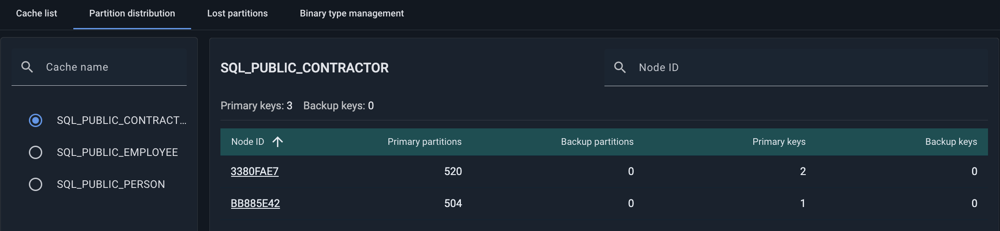
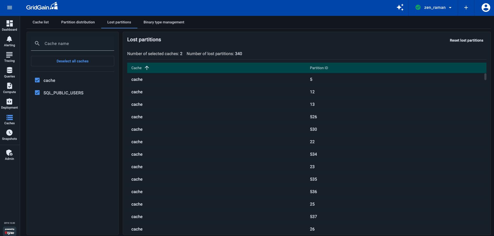

# Partition Distribution

Use this tab to monitor the distribution of cache partitions across the cluster nodes.

Navigate to the left pane of the tab to select a cache.

The nodes of the selected cache are displayed in the table, containing information on primary partitions, backup partitions, primary keys, and backup keys.

Click a node ID to see the detailed information on partitions on the selected node. The information is displayed on the right pane, including the partition type, partition ID, and the count of keys.

## Lost Partitions

A partition becomes *lost* when neither its primary nor any backup copy is available. This usually happens if one or more cluster nodes go down and there are not enough backups configured. When a partition is lost, part of the cache becomes unavailable.

To recover lost partitions:

- If [persistence](https://www.gridgain.com/docs/gridgain8/latest/developers-guide/persistence/native-persistence) is enabled and the data still exists on disk, restart the failed nodes to restore the partitions.
- If the failed nodes cannot be restarted, or persistence is not enabled, use the **Reset Lost Partitions** action to clear the lost partition status and restore full cache availability.

  
  If persistence is enabled, the partition data on the failed nodes cannot be recovered after running this action.
  
