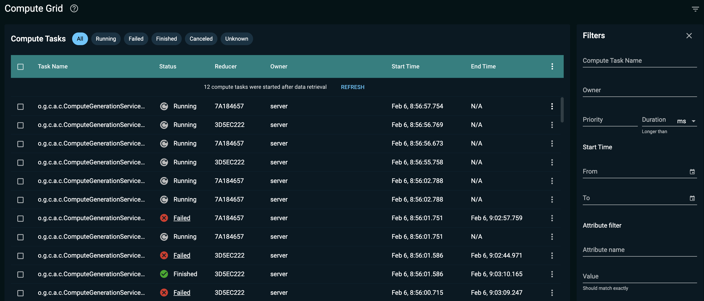

# Compute Grid

You can use the **Compute** screen to monitor Compute tasks that are executed on the cluster.

GridGain Portal constantly checks for new tasks that were added and provides the number of new tasks since the last update. Click **Refresh** to load all new tasks.


Depending on configuration, [secured clusters](../auth/authorization-permissions.md) might require a cluster-level authentication for some (or all) of the actions.


## Distributed Computing Configuration

Distributed computing configuration is described in detail in the [Distributed Computing](https://www.gridgain.com/docs/latest/developers-guide/distributed-computing/distributed-computing) section of GridGain documentation.

Below are some configuration parameters that are recommended for managing Compute jobs.

### Priority Ordering

To manage job and task priorities, you need to configure `PriorityQueueCollisionSpi` in your code. Detailed instructions can be found in the [Priority Ordering](https://www.gridgain.com/docs/latest/developers-guide/distributed-computing/job-scheduling#priority-ordering) section of GridGain documentation.

## Monitoring Jobs

The primary table in this screen provides the following information:

| Column Name | Description |
|---|---|
| Session ID | Hidden by default. The unique ID of the Compute job session. |
| Task Name | The name of the tasks, specified when it was created. |
| Status | Task status. Possible values: - Running - the task is still running. - Finished - the task is completed successfully. - Failed - the task failed. - Canceled - the task is cancelled. - Unknown - something went wrong with the Outdated task, current status is not clear and there will be no new updates. |
| Reducer | The ID of a node that does map and reduce operations for the task. |
| Owner | The owner of the job. Empty if security is not configured. |
| Start Time | The time the job started at, in "month date, HH:MM:SS:mmm" format. |
| End Time | The time the job ended at, in "month date, HH:MM:SS:mmm" format. If the job is in progress or no data is available, shows N/A instead. |
| Duration | Hidden by default. Current job duration. Updates every second. |
| Nodes | Hidden by default. The number of nodes that are executing the task. |
| Priority | Hidden by default. Task priority. |


You can reduce the space the compute table occupies on your disk using [Disk Space Optimizations](../../admin-guide/disk-space-optimization.md).


### Configuring visible columns

To configure visible columns, click ⋮ in table header. Then, click on table columns field and select fields that you want visible.

### Extended Details

Click ⋮ for a **Running** task and select **View Details** to see extended information about the task. The detailed information table provides data about each subtask that is executed in a job.

| Column Name | Description |
|---|---|
| Node ID | Unique node ID |
| Queued | Number of queued jobs on a node. |
| Running | Number of running jobs on a node. |
| Suspended | Number of suspended jobs on a node. |
| Failed | Number of failed jobs on a node. |
| Canceled | Number of canceled jobs on a node. |
| Finished | Number of finished jobs on a node. |
| Total | Total number of jobs on a node. |

### Session Information

Click ⋮ and select **View Session Attributes** to see extended information about the session. This action is only available if you have `ComputeTaskSessionFullSupport ` configured for the cluster. The table contains the following information:

| Column Name | Description |
|---|---|
| Attribute Name | This column has a name of the session property. The properties listed are: - Endpoint status - Endpoint policy applied - Status of policy application - When session started - When session ended - Session duration - Session identifier |
| Value | Property value. |

### Canceling Tasks

Click ⋮ next to a task and select **Cancel Task(s)**. The task will be canceled. This action is only available for **Running** tasks. This action can be applied to multiple tasks by first selecting them in the table.

### Changing Task Priority

Click ⋮ next to a task and select **Change Priority**. In the subsequent dialog, set the task priority. `PriorityQueueCollisionSpi` must be configured on the cluster. This action can be applied to multiple tasks by first selecting them in the table.

## Filtering Tasks

You can limit visible tasks by configuring 2 different filters. Newly received tasks are not filtered, so you will see the number of new tasks regardless of if they fall under filter conditions or not.

### Premade Filters

There are some premade filters for common task states:

- All
- Running
- Finished
- Canceled
- Failed
- Outdated
- Unknown

You can select them from the top of the page.

### Extended Filters

You can configure additional filter options on the right of the screen.

Unlike quick filters, you can only have one extended filter active at a time. You can filter based on the following:

- Task name;
- Task priority;
- Minimum duration of the task;
- Start time;
- End time.
- Attribute, composed of:
  - Attribute name
  - Attribute filter

Extended filters will be reset if you leave the page, but you can save the URI to open the page with the same filter configuration.

## Excluding Data on Internal Tasks

Sometimes, GridGain has to run internal tasks while handling distributed computing. You can exclude these tasks by configuring your GridGain cluster properties by using the [control script](https://www.gridgain.com/docs/latest/administrators-guide/control-script#cluster-properties). The following properties manage what tasks will be collected by the agent:

| Property | Description |
|---|---|
| EXPORT_EXCLUDE_INTERNAL_TASKS | If `true`, internal tasks will be excluded. Otherwise, all unfiltered tasks are monitored. Default value is `true`. |
| EXPORT_IGNORED_TASKS | The filter for compute tasks to not be monitored. Can be a regular expression. |
| EXPORT_MONITORED_TASKS | The filter for compute tasks to be monitored. Can be a regular expression. |
