# Configuring Widgets for GridGain 8 Clusters

## Adding Widgets for GridGain 8 Clusters

To add a widget to a dashboard, select that dashboard's tab in the **Dashboard** screen and click **Add widget**.

You can add widgets of the following types to all dashboards except **My Cluster**:

- **Gauge chart** - the selected metric as a gauge
- **Nodes** — a table containing information about cluster nodes
- **Metrics (single value)** - the current value of the selected metric
- **Metrics (chart)** — the selected metric as a time series
- **Metrics (table)** — multiple metrics in tabular form
- **Metrics (histogram)** — the selected metric as a histogram
- **Heat map** — the selected metric as a heat map
- **Rebalance** — the progress of an ongoing rebalancing process
- **SQL query** - the results of an SQL query, updated at a specified frequency (`SELECT` only)
- **System view** - the selected system view table, updated at a specified frequency
- **Caches** — a table containing information about existing caches
- [DR receiver](predefined/dr-receiver.md) widgets
- [DR sender](predefined/dr-sender.md) widgets

Once a widget is added, you can edit its parameters - see [Editing Widgets](#editing-widgets).

## Widget Types

### Gauge Widget

The **Gauge** widget displays a selected metric in a gauge from 0 to 100. You can view how close the value is to its expected maximum, for example, for CPU load.

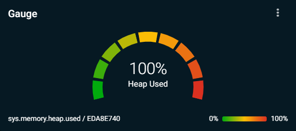

### Nodes Widget

The **Nodes** widget is a table that contains information about cluster nodes. You can copy this data or export it to a CSV file.


Hidden columns will be copied and exported too.


You can add and remove columns from the table via the widget's menu. To open the widget's menu, click the `⋮` icon in the top-right corner of the widget.

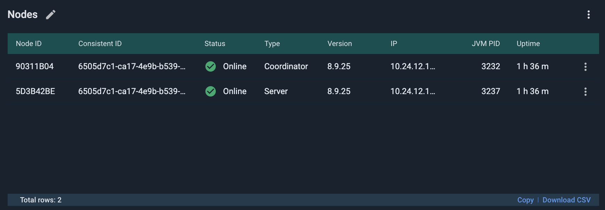

The following information is available in the **Nodes** widget:

| Column | Description |
|---|---|
| Order | The order of the node. |
| Node ID | The ID of the node. |
| Consistent ID | The consistent ID of the node. |
| Name | The name of the node. |
| Host | The name of the host where the node is running. |
| Online | Whether the node is online or offline: - "Online" — the node is up and connected to the cluster. - "Offline" — the node is registered in the baseline topology but is either shut down or not connected to the cluster. |
| Type | The type of node: Coordinator, Server, or Client. |
| Version | The version of GridGain/Apache Ignite that was used to launch the node. If you are using the [Rolling Upgrades](https://gridgain.com/docs/latest/installation-guide/rolling-upgrades) feature that is available in GridGain Enterprise Edition, one cluster might have nodes with different versions. |
| IP | The IP address of the machine where the node is running. |
| JVM PID | The PID of the JVM. |
| Mac | The MAC address of the node. |
| Uptime | The uptime of the node. |

You can inspect the configuration of any node that is listed in the table. Click the `⋮` icon at the end of the row and select **Inspect configuration**.

You can show or hide columns in the **Nodes** list. Click the `⋮` icon at the end of the row and select **Table columns**. In the list that opens, select or clear check boxes to show or hide columns.

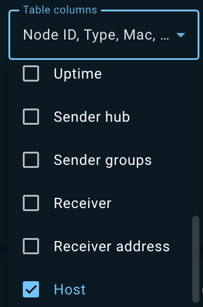

### Metrics Widgets

There are four types of widgets. Each type displays metrics in a particular form: value, chart, table, or histogram. A table can display multiple metrics. A value, chart, and histogram can display only one metric.

Metrics are grouped by scope. The term “scope” refers to whether the metrics provide information about the cluster as a whole, about a single node, or about a cache:

- **Cluster** metrics display information about the cluster as a whole. For example, the number of nodes in the cluster.
- **Node** metrics are specific to a node. For example, the amount of heap or the storage size on the node. The widget where the “Node” scope is selected contains the information for all cluster nodes.
- **Cache** metrics are specific to a cache. For example, the size of the cache. The widget where the “Cache” scope is selected contains the information about all caches.

To add a widget to a tab:

1. In the tab, click **Add widget**.
2. In the widget, click the `⋮` icon.
3. From the menu that opens, select the scope.
4. Type the name of the metric you want to display.

By default, the Metrics widgets are updated every 5 seconds.

#### Metrics (single value)

The **Single value** widget displays the current value of the selected metric, such as the number of caches, the query running time, etc.

#### Metrics (chart)

The **Metrics (chart)** widget displays the specified numeric metric as a chart, at 5-second granularity. The data is displayed for the period that is selected in the Time Period control (located in the Tab bar).

#### Metrics (table)

The **Metrics (table)** widget shows the latest values for selected metrics.

For node metrics, the first column shows each node’s consistent ID; for cache metrics, it shows the cache name. Subsequent columns display metrics values.

You can add as many metrics as needed.

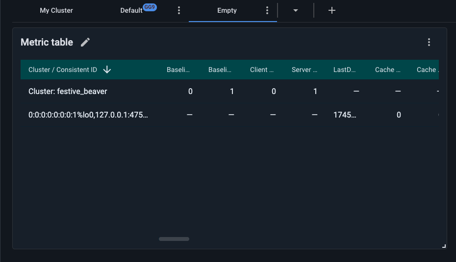

You can toggle between metrics layouts by clicking ⋮ and selecting the layout from **View** options.

By default, the widget uses a node-per-row layout: each row shows a node name followed by its selected metric values.

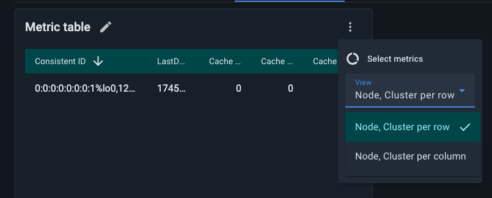

Node-per-column view might be useful when monitoring a large number of metrics across many nodes. In this layout, columns are added dynamically as metrics arrive.

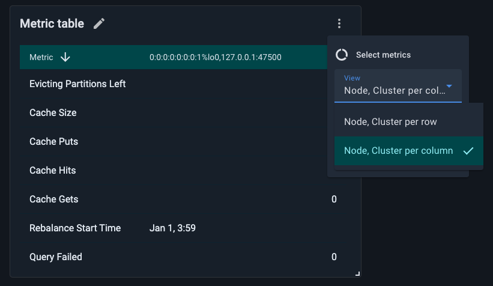

#### Metrics (histogram)

The **Metrics (histogram)** widget displays histogram metrics. The widget can display only metrics that return data structures that can be represented in a histogram. The parameters of the histogram (such as the bucket size) can be changed in the cluster configuration.

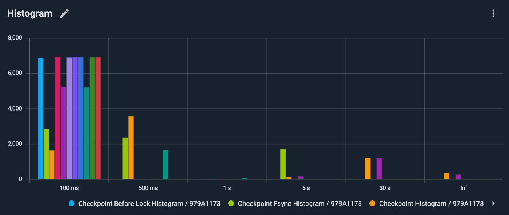

### Heat Map Widget

The **Heat Map** widget displays a selected metric in temperature-related colors. Smaller values are displayed in a "colder" color, and larger values are displayed in a "hotter" color.

### Rebalance Widget

The Rebalance widget displays the progress of the [rebalancing process](https://gridgain.com/docs/latest/developers-guide/data-rebalancing). When rebalancing is in progress, the widget displays the percentage of data that has been rebalanced.

You can use the rebalance widget to monitor [Rolling Upgrades](https://gridgain.com/docs/latest/installation-guide/rolling-upgrades). To display the versions of the nodes, click the widget configuration icon `⋮` and select **Show versions**.

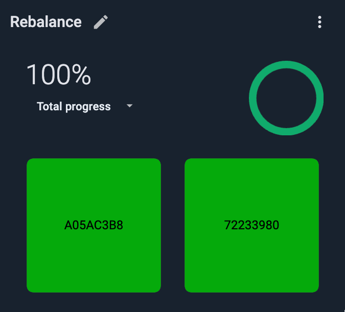

### SQL Query Widget

The **SQL query** widget shows the results of the SQL query you define and updates these results with the specified frequency.


Only `SELECT` SQL expressions are allowed.


To add the widget:

1. From the **Add a widget** menu, select **SQL query**.

   The **Edit widget** dialog opens.

   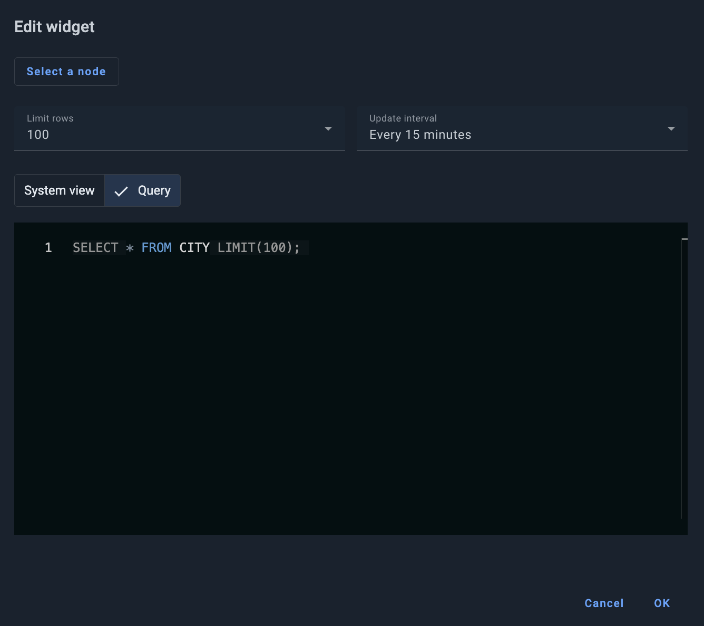
2. Click **Select a node** and select a node for the query in the dialog that opens. If you don't select a specific node, the widget runs on the coordinator node of the cluster.
3. From the **Limit rows** drop-down list, select the maximum number of rows for the query to return.
4. From the **Update interval** drop-down list, select an interval for the query to run.
5. If you want your query to run on a system view table, on the **System view** tab, from the **System view table** drop-down list, select the required system view.

   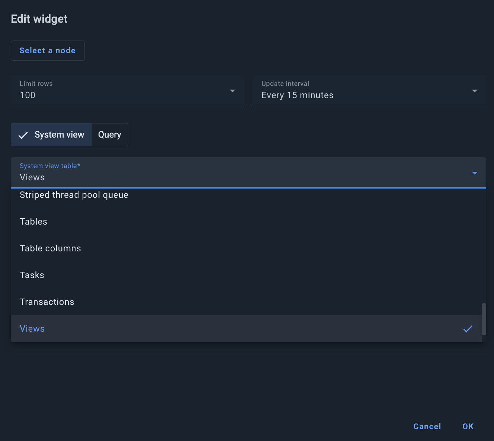
6. On the **Query** tab, enter the required SQL expression. Note that `FROM` and `LIMIT` values are automatically populated based on your selections in steps 3 and 5.
7. Click **OK**.

The widget displays as you have defined it and starts updating at the specified interval.

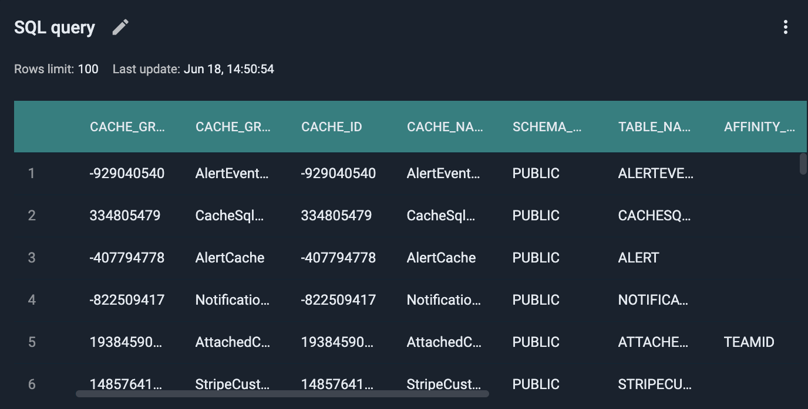

### System View Widget

This widget shows the selected *system view* table and updates that table with the specified frequency.

To add the widget:

1. From the **Add a widget** menu, select **System view**.

   The **Edit widget** dialog opens to the **System view** tab.

   
2. Click **Select a node** and select a node for the query in the dialog that opens. If you don't select a specific node, the widget runs on the coordinator node of the cluster.
3. From the **Limit rows** drop-down list, select the maximum number of rows to return.
4. From the **Update interval** drop-down list, select an interval for the query to run.
5. From the **System view table** drop-down list, select the required system view.
6. Click **OK**.

The widget displays as you have defined it and starts updating at the specified interval.

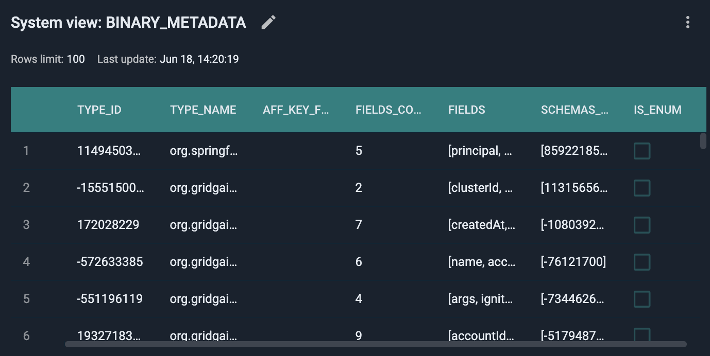

### Caches Widget

This widget is a table that contains the information about existing caches. You can copy this data or export it to a CSV file.


Hidden columns will be copied and exported too.


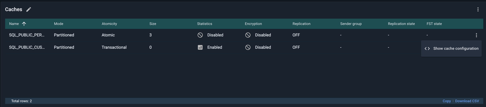

To quickly check a cache configuration, click **Show Configuration** in the context menu.

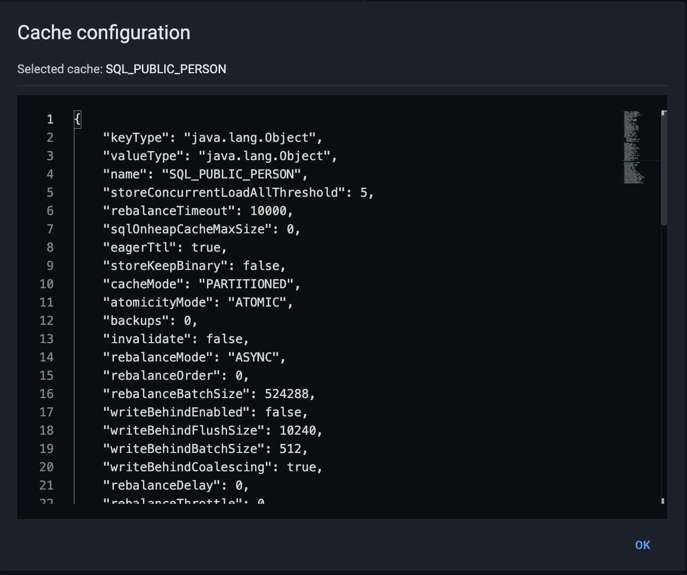

## Editing Widgets

### Changing Widget Name

To change the name of a widget:

1. Click the "pencil" icon in the widget's tile.
2. In the field that appears, edit the name as required.
3. Click the "check mark" icon.

### Editing Gauge and Heat Map Widgets

To edit a gauge or heat map widget:

1. Open the widget's context menu.

   
2. To change the static Min and/or Max value(s):
   1. Make sure the selector to the right of the **Min** and/or **Max** field(s) is on "value" (rather than "metric").
   2. Edit the value(s) in the **Min** and/or **Max** field(s).
3. To define the Min and/or Max value(s) dynamically, as the current value(s) of another metric(s):
   1. Switch the selector to the right of the **Min** and/or **Max** field(s) from "value" to "metric".
   2. In the **Select metric** dialog that opens, select the metric whose current value will serve as the Min or Max value of the metric the widget displays.
4. To show the current value of the metric in the widget (in addition to graphic/color representation), toggle on **Show percentage**.
5. To invert the color scheme (by default, red is for "high" and green is for "low"), toggle on **Invert color scheme**.
6. To select another metric to be displayed in the widget, select **Select metric**, then proceed as you would when adding a new widget.

### Editing SQL Query and System View Widgets

To edit the SQL Query or System View widget:

1. Open the widget's context menu.
2. Select **Table columns** to add or remove columns.
3. Toggle on or off **Show info** to show or hide the widget settings: the row number limit and the last update timestamp (on by default).
4. Toggle on or off **Show search** to show or hide the search bar across the top of the widget.
5. Select **Edit widget** to display the **Edit widget** dialog.

### Editing All Other Widgets

To edit all other widgets (except gauge and heat map):

1. Open the widget's context menu.

   
2. For Chart widgets, to show the widget's legend (included metrics and their colors), toggle on **Show legend**.
3. To select another metric(s) to be displayed in the widget, select **Select metric(s)**, then proceed as you would when adding a new widget.

## Expanding Widgets

To select a widget's display (normal vs expanded):

1. Open the widget's context menu.
2. To make the widget display in a separate window (in a larger size), select **Expand**.
3. To return to the initial "tile" display, select **Close**.

## Removing Widgets

To remove a widget from the dashboard:

1. Open the widget's context menu.
2. Select **Remove**.
