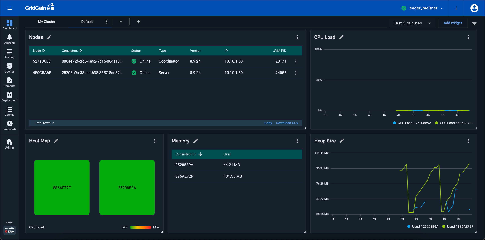
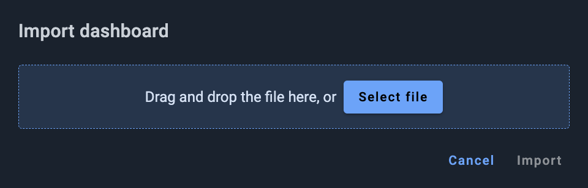
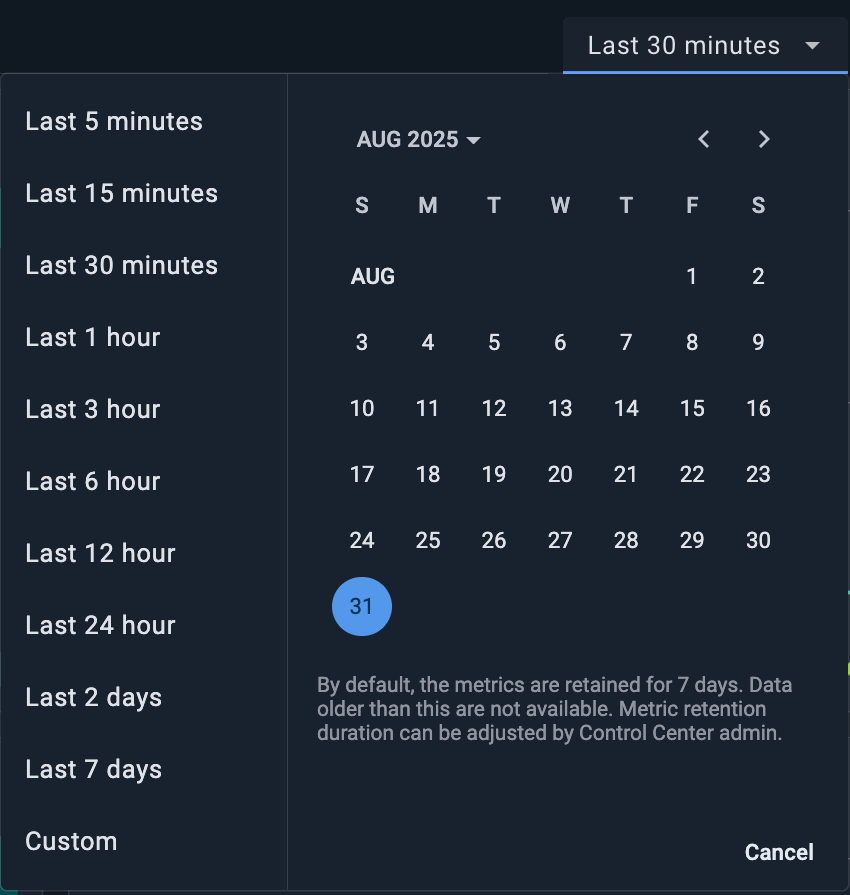
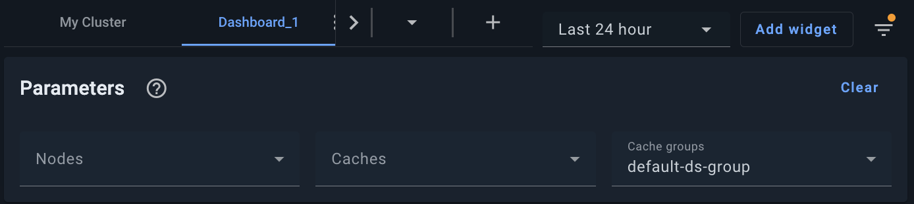
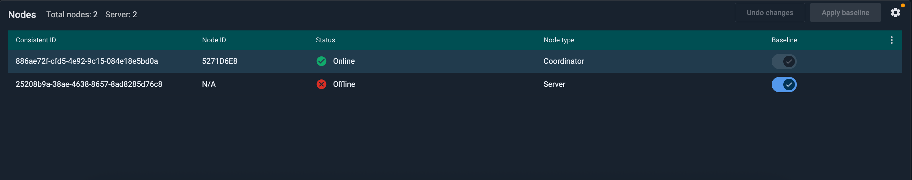
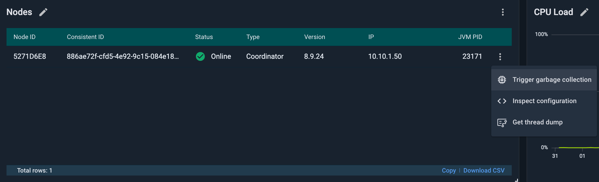
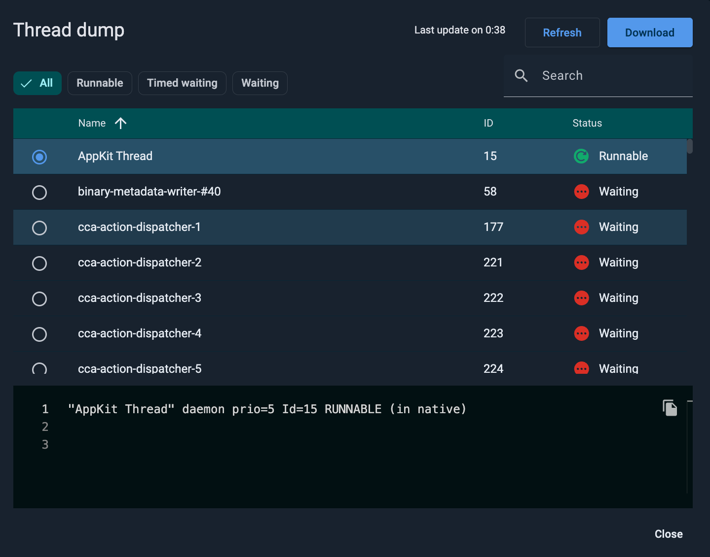

# Dashboard Overview for GridGain 8 Clusters

In addition to the [My Cluster tab](my-cluster.md), the **Dashboard** screen contains a default dashboard (the **Default** tab) that provides metrics for and essential information about the cluster. You can modify the contents and appearance of the **Default** dashboard, as well as add more dashboards (as new tabs on the screen).

The **Default** tab contains several *widgets*. A widget is a UI element that provides a visual representation of a set of metrics or provides information about the state of the cluster.

On **Default**, you can add any number of widgets.


Dashboards created for GridGain 8 clusters are different from the ones for GridGain 9 clusters. To denote the difference, a **GG9** badge appears next to the dashboard (tab) labels for the GridGain 9 clusters.


The **Default** tab consists of the following elements:

- **Tab bar** — for arranging widgets into tabs. By default, there is one tab which is called "Default Dashboard" and provides a predefined set of widgets. You can add tabs and reorganize the size and location of any widget.
- **Time period** control — for selecting the time period for charts.
- **Add widget** button — for [adding a widget](configuring-widgets.md).

## Adding Tabs

To add a tab, click the `➕` icon located in the tab bar and select to create an empty dashboard, or one of templates. The `⋮` menu of each tab enables you to rename, clone, or remove the tab.

## Dashboard Templates

Dashboard templates are a quick way to create a dashboard with predefined widgets. GridGain Control Center provides the following templates:

- **Default**: The default dashboard for monitoring cluster status. Has the following widgets: `Nodes`, `Heat Map`, `Memory`, `Cpu Load`, `Heap Size widgets`.
- **Persistence**: This dashboard has widgets that are configured for optimal persistence monitoring. Has the following widgets: `Last Checkpoint Duration`, `Storage Size`, `Write Throttling Max.`, `Write Throttling`, `Dirty Pages`, `Page replacement`
- **Sql**: This dashboard has widgets that are configured for monitoring SQL transactions. Has the following widgets: `Queries, Total`, `Query Free Memory, min`, `Query Free memory` (Heat Map), `Query Free memory` (Graph)

### Saving Dashboard as Template

You can save your current dashboard as a template by clicking ⋮ and selecting **Save as Template**. In the subsequent dialog, specify the template name.

### Managing Custom Templates

You can remove or rename an existing template. Click the `➕` icon located in the tab bar and select **Manage Templates**. In the dialog, click ⋮ next to the custom template, and select to **Rename** or **Delete** it.

### Exporting and Importing Dashboards

You can export the current dashboard's definition (including widgets, layout, etc.) as a JSON file. You can then import this JSON file into another environment and have the dashboard whose definition it contains added to your UI, with no need for additional configurations.


Widgets and settings in an exported dashboards may not fit the environment into which you import that dashboard. For example, the exported dashboard might contain a widget linked to a metric not defined in the target environment. Another example is exported widgets explicitly addressing specific node IDs, cache names, etc., while the corresponding nodes and caches are ID'd or named differently in the target environment. In such cases, the imported dashboard will not function as required. You need to test the imported dashboard and resolve the issues the testing reveals, if any.


#### Exporting

To export the current dashboard's definition as a JSON file, in the current dashboard's tab, select **Export dashboard** from the context menu.

The file named `Dashboard - <Dashboard_Name>.json` is saved to your local `Downloads` folder.

#### Importing

To import a dashboard definition from the previously exported JSON file:

1. Click the **+** icon on your **Dashboard** toolbar.
2. From the menu that opens, select **Import**.

   The **Import dashboard** dialog opens.

   
3. Drag and drop, or browse for, the required file.
4. Click **Import**.

   The selected file is imported. The dashboard it defines is shown as the current dashboard in your UI.

## Changing the Time Period for Charts

The tab bar contains the **Time Period** control. When you click this control, a date/time picker opens.

The picker enables you to select a time period for all widgets in the current tab (dashboard):

- *Relative* to the current date/time
- *Absolute* (custom) - unrelated to the current date/time

### Relative to the Current Time

To select a period relative to the current date/time:

1. In the left-hand section of the picker, select the required option; e.g., `Last 1 hour`, `Last 2 days`, etc.
2. Click **Apply**.

### Absolute (Custom)

To define a period in absolute terms:

1. In the left-hand section of the picker, select the `Custom` option.
2. In the right-hand (calendar) section of the picker, select the first and last dates of the period.
3. Click **Apply**.

## Interactive Zooming for Charts

To interactively zoom into the details of a chart:

1. Click your mouse within the chart at the "start" moment of the period you want to zoom into.
2. Drag the cursor to the "end" moment of the period you want to zoom into.

   All charts on the current dashboard are redrawn to show only the period you have defined (rather than the default period or the one specified previously with the time picker - see [Changing the Time Period for Charts](#changing-the-time-period-for-charts)). The chart scale automatically adjusts to the chart segment in the selected zoom.
3. Repeat steps (1) and (2) as needed.
4. To return to the initial zoom and scale, click the **Zoom out** button in the right-hand part of the dashboard toolbar.

## Parameter-based Filtering for Widgets

You can use the dashboard parameters to limit the widget scope to specific:

- Node(s)
- Cache(s)
- Cache group(s)

Each widget collects metrics according to its configuration. This does not change when you apply filtering parameters. What does change is what the widget shows in the UI. For example, if a widget is configured to collect the `CacheSize` metric for caches A, B, and C, and the parameter filters the widget to cache A, the widget will keep collecting `CacheSize` for all three caches, but it will display the data only for cache A.


A combination of a widget's configuration and the applied filtering parameters might result in "nothing to display." For example, if you've configured a widget for the `cache.Person.CacheSize` metric, and then used the filtering parameters to limit the widget to the `Organization` cache, the widget will show no data. To make the filtering parameters work in the above scenario, you need to reconfigure your widget - replace `cache.Person.CacheSize` with `cache.*.CacheSize`. Note that using the "all" (`*`) syntax increases the storage size required for the metrics.


To define the widget filtering parameters:

1. Click the icon to the right of the **Add widget** button to toggle on the **Parameters** panel.

   The panel displays across the top of the dashboard.

   
2. Do any or all of the following:
   - From the **Nodes** drop-down list, select one or more nodes.
   - From the **Caches** drop-down list, select one or more caches.
   - From the **Cache groups** drop-down list, select one or more cache groups.
3. Optionally, to undo all selections, click **Clear**.

The filtering parameters apply to all widgets on the dashboard.

## Triggering Garbage Collection for a Node

You can trigger garbage collection for a specific node if you suspect a memory leak.

Proceed as follows:

1. Locate the node for which you want to initiate garbage collection in the **Nodes** widget.

   
2. Select the **Trigger garbage collection** option from node's context menu.

   
3. In the confirmation dialog that opens, click **Trigger**.

## Collecting a Thread Dump for a Node

To collect a dump for a specific thread on a selected node in your cluster:

1. In the **Nodes** widget, locate the required node.
2. From the node's context menu, select **Get thread dump**.

   The **Thread dump** dialog opens. By default, it lists thread in all statuses, sorted by name in ascending order.

   The thread statuses are:

   - NEW - has not started yet
   - RUNNABLE - is executing on the Java virtual machine
   - BLOCKED - is blocked, waiting for a monitor lock
   - WAITING - is waiting indefinitely for another thread to perform a particular action
   - TIMED_WAITING - is waiting for another thread to perform an action (for a specified time period)
   - TERMINATED - has been executed

   The top thread on the list is selected, and that thread's dump is displayed for previewing in the lower part of the dialog.

   
3. To navigate to the required thread, do any or all of the following:
   1. Click column headers to change the sorting order.
   2. Click a status chip in the left-hand part of the toolbar to filter the list to a specific thread status.
   3. Start typing the required thread's name in the progressive search field in the right part of the toolbar to filter the list by name.
   4. Click **Refresh** in the top right corner of the dialog to refresh the thread list.
4. Select the required thread on the list.
5. Click **Download** in the top right corner of the dialog.

   The thread dump is downloaded to your machine as a .txt file.

## Next Steps

- [Add a widget](configuring-widgets.md)
