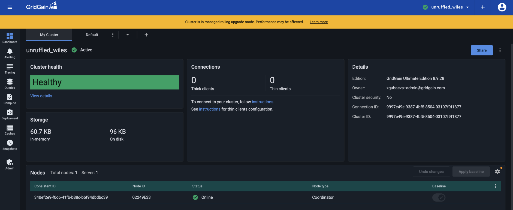
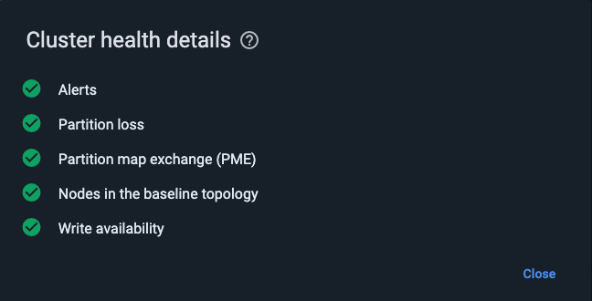
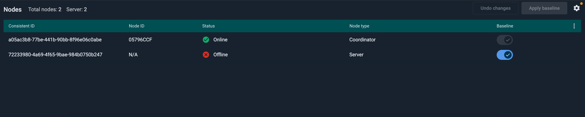
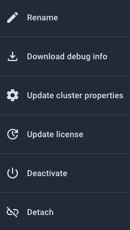
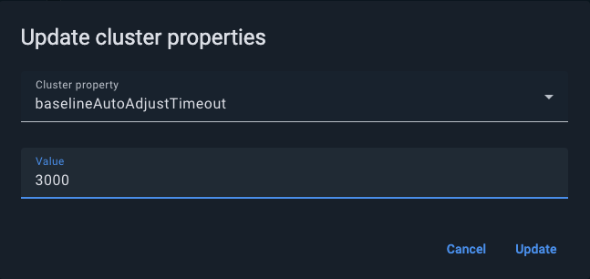

# My Cluster Screen

**My Cluster** opens as the first tab of the **Dashboard** screen when you select **Dashboard** from the navigation menu. It displays numeric and tabular information for the "current" cluster (selected in the cluster selector tool on the main toolbar).

When GridGain 8 cluster is in a [rolling upgrade mode](https://www.gridgain.com/docs/gridgain8/latest/installation-guide/rolling-upgrades), a banner indicating this state will appear on the top of **My Cluster** screen.



## Viewing Cluster Information

Use the widgets to view the relevant cluster information:

| Widget | Description |
|---|---|
| Cluster Health | The cluster status:<br>- `Warnings` - at least one of the alerts for the cluster has been triggered<br>- `Errors` - partition loss, PME (Partition Map Exchange) errors, or both<br>- `Healthy` - neither warnings nor errors are observed |
| Storage | The amount of memory the cluster uses:<br>- `In-memory`<br>- `On disk` |
| Connections | The cluster connection counters for thin and thick clients. A set of chips for adding connections. |
| Details | A table of the cluster details, including `Edition`, `Owner`, `CLuster Security`, `License expiry date`, `Cluster ID` and `Connection ID`. |
| Nodes | A list of cluster's nodes. |

### Viewing Cluster Health Details

To view details of the cluster health (status), in the **Cluster Health** widget, click the **View Details** link. The **Cluster Health Details** dialog shows what specific problems, if any, are observed in the cluster.



The following health checks are available for GridGain 8 and Apache Ignite 2 clusters:

| Check | Condition | Description |
|---|---|---|
| Alerts | WARNING | One or more configured alerts have been triggered. Each active alert appears as a separate entry showing the alert's own message. |
| Nodes in the baseline topology | WARNING | One or more baseline nodes are offline. The message lists the affected node IDs. |
| Write availability | WARNING | The cluster is in read-only mode (`ACTIVE_READ_ONLY`). Only cache read operations are allowed. |
| Partition loss | WARNING | One or more cache partitions have zero copies. |
| Partition map exchange (PME) | WARNING | Partition map exchange is running longer than expected, or cache operations are blocked waiting for PME to finish. |

### Viewing Cluster Nodes

The **Nodes** widget provides information about the nodes that are in the baseline topology.



The term *baseline topology* refers to a set of nodes that are meant to hold data.

To add columns to the table or remove them from the table, select the **Table Columns** option from the table's context menu, then select or clear check boxes for the columns on the list that opens.

To define the auto-adjustment timeout, click the **Configuration** icon above the node list, toggle the auto-adjustment on, then enter the timeout value (in seconds).

| Column | Description |
|---|---|
| Consistent ID | The consistent ID of the node. |
| Node ID | The ID of the node. |
| Status | Whether the node is online. A node that goes down remains registered in the baseline topology until you manually remove it or until it's removed automatically through [baseline autoadjustment](https://gridgain.com/docs/latest/developers-guide/baseline-topology#baseline-topology-autoadjustment). |
| Node Type | The type of the node: `Coordinator` or `Server`. To display `Client` nodes, toggle on **Show client nodes** in the context menu. |
| Baseline | A toggle that enables removing the node from the baseline or adding it to the baseline. |

By default, the widget displays only server nodes. To add client nodes to the widget, in the **Nodes** context menu, toggle on **Show client nodes**.

## Adding/Removing Nodes from Baseline

You cannot remove online nodes from the baseline topology. Therefore, before you remove an online node from the baseline, you must stop the node. Changes in the baseline topology trigger a rebalancing of the data (depending on the cluster configuration). Rebalancing can impact cluster performance for the duration of the rebalancing process.

To remove a node from the baseline topology:

1. Stop the node.
2. Switch off the **Baseline** control.
3. Click **Apply baseline**.

To add a node to the baseline topology:

1. Start the node and wait until it connects to the cluster.
2. Go to the **Baseline** screen in Control Center.
3. Switch on the **Baseline** control for the node.
4. Click **Apply baseline**.

## Enabling Baseline Autoadjustment

The [baseline autoadjustment feature](https://gridgain.com/docs/latest/developers-guide/baseline-topology#baseline-topology-autoadjustment) changes the baseline automatically when the cluster topology has been stable for a specified period.

You can enable baseline autoadjustment and set the timeout in the top-right corner of the **Baseline** screen. The timeout is set in seconds.

## Cluster Configuration

### View Configuration

To view cluster configuration, click the ⋮ in the top-right corner of the **My Cluster** tab and then choose the **View cluster configuration** option from the menu.



### Update Cluster Properties

You can modify cluster-wide settings by clicking the ⋮ in the top-right corner of the **My Cluster** tab and then choosing the **Update cluster properties** option from the menu.



For the full reference of available cluster properties, see the [Cluster Properties](https://www.gridgain.com/docs/gridgain8/latest/administrators-guide/control-script#cluster-properties) section in the GridGain 8 documentation.

## Viewing Graphic Dashboards

To view the default graphic [dashboard](dashboard-overview.md) for the current cluster, click the **Default** next to the **My Cluster** tab in the top left corner of the screen.

## Switching Between Clusters

If multiple clusters are registered in Control Center, you can switch between clusters by using the **Select Cluster** control on the top toolbar.


To view a [list of available clusters](../../cluster-management.md) on the **Cluster Management** screen, select **Cluster Management** from the menu on the top toolbar.


## Renaming the Cluster

The cluster name is a human-readable label used in Control Center to identify the cluster. Changing it does not affect cluster operation in any way.

To rename the cluster, select **Rename** from the context menu in the top right corner of the **My Cluster** screen.

You can also rename the cluster from the command line using the control script:

```bash
{IGNITE_HOME}/bin/control.sh --change-tag newName [--yes]
```

## Adding Connections

To add a connection to the cluster, in the **Connections** widget:

1. Click the required client/protocol chip.
2. Proceed to [define the new connection](https://www.gridgain.com/docs/latest/developers-guide/thin-clients/getting-started-with-thin-clients).

## Sharing Clusters

You can have access to a cluster as:

- *User* - a regular user who can view the cluster that has been shared with them individually or via a team, as well as use the actions that appear in the cluster's context menu.
- *Owner* - the user who created or attached the cluster. Owners have extended cluster access rights, including sharing the cluster with teams or users, suspension, removal, etc.

As a cluster owner, you can share that cluster with individual users and/or teams.


To [create and manage teams](../../profile/teams.md) on the **Teams** screen, select **Team Management** from the menu on the top toolbar.


### Sharing with Users and Teams

To share the current cluster, click **Share** above the **Details** widget. The **Share Cluster** dialog opens.


The dialog lists users and teams that already have access to the cluster.

In the entry field across the top of the **Share Cluster** dialog, start typing a Control Center user's email, an LDAP ID, or a team name. As you type, the incremental search mechanism displays suggestions in a drop-down list. Select one of the suggested users or teams. Alternatively, type the identifier to the end, then click \[Enter]. You can add multiple users and/or teams in a single operation. When done, click **Share**.

The users and teams you have entered appear in the corresponding sections of the **Share Cluster** dialog. The system notifies the users and team members that a cluster has been shared with them. To close the **Share Cluster** dialog, click **Close**.


If you have shared a [secured cluster](../auth/authorization-permissions.md), users might perform cluster-level authentication for some (or all) of the actions with that cluster.


### Stopping a Cluster Share

As a cluster owner, you can stop sharing your cluster with a team or with an individual user (remove access to the cluster that was previously granted to that team or user).

To stop sharing a cluster with team(s) and/or user(s), click **Share** above the **Details** widget.

In the **Share Cluster** dialog that opens, select **Stop Sharing** from the context menu by the required team or user name. In the confirmation dialog, click **Stop Sharing**.

## Activating and Deactivating Cluster

If your current cluster is active, you can deactivate it by selecting the **Deactivate** option from the context menu next to the **Share** button, then clicking **Deactivate** in the confirmation dialog.

If your current cluster is inactive, you can activate it by clicking the **Activate** button at the top of the screen, then clicking **Activate** in the confirmation dialog.

## Attaching Clusters

To attach a cluster, click **+** on the top toolbar, then follow the procedure that corresponds to your cluster:

- [Apache Ignite](../../getting-started/connect/connect-ignite-cluster.md)
- [GridGain 8](../../getting-started/connect/connect-gridgain-cluster.md)
- [GridGain 9](../../getting-started/connect/connect-gridgain9-cluster.md)

## Next Steps

- [Querying](../queries/querying.md)
- [Tracing](../tracing/tracing.md)
