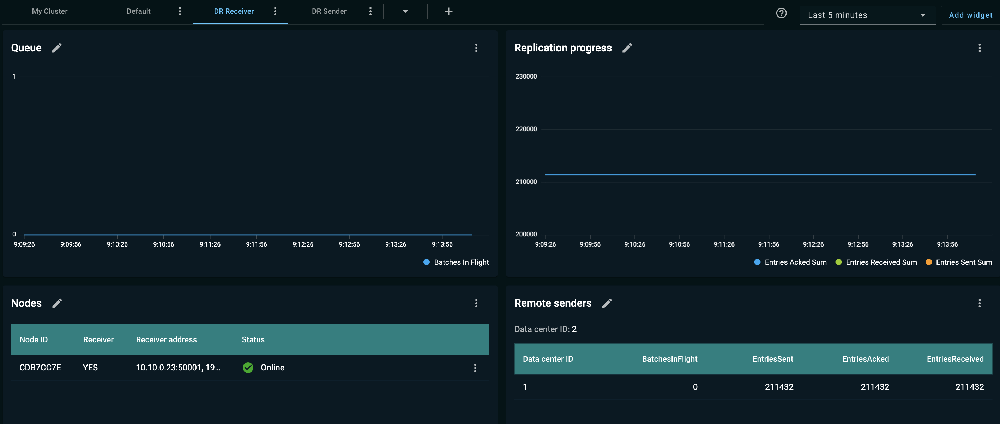

# DR Receiver Tab for GridGain 8 Clusters

The **DR receiver** tab (dashboard) displays statistics that pertain to the receiver nodes participating in [Data Center Replication (DR)](https://www.gridgain.com/docs/latest/administrators-guide/data-center-replication/introduction).

The **DR receiver** dashboard contains the following [widgets](../configuring-widgets.md).

## Queue

This is a metric line chart that enables you to detect issues in the DR process. It displays:

- BatchesInFlight - the number of batches that had been sent by the sender and have not been acknowledged yet

## Replication Progress

This is a metric line chart that provides a quick overview of the overall health and performance of the DR process. The metrics are collected in increments. They are reset when a node is restarted. The chart displays:

- EntriesSent sum - the total count of entries sent to the receiver caches; does not include retries
- EntriesAcked sum - the total count of entries acknowledged by the receiver data center
- EntriesReceived sum - the total count of entries received from the sender; includes retries

## Nodes

This widget helps you examine the DR topology and receiver node configurations. This is the same **Nodes** widget that is included in the [Default dashboard](../dashboard-overview.md), with the following extra columns:

- Receiver - whether the node is a receiver (YES/NO)
- Receiver addresses - the IP address of the node for DR purposes

## Remote Senders

This widget lists the clusters (data centers) that serve as senders to the current receiver cluster. It provides the [Replication Progress](#replication-progress) statistics in a tabular form, per sender cluster.
