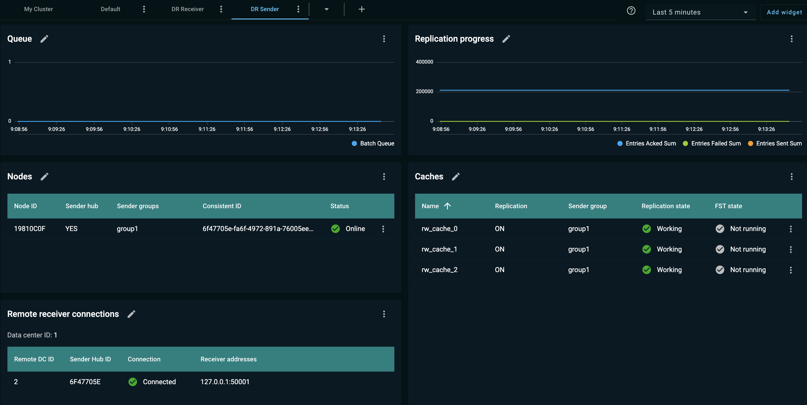

# DR Sender Tab for GridGain 8 Clusters

The **DR sender** tab (dashboard) displays statistics that pertain to the sender nodes participating in [Data Center Replication (DR)](https://www.gridgain.com/docs/latest/administrators-guide/data-center-replication/introduction).

The **DR sender** dashboard contains the following [widgets](../configuring-widgets.md).

## Queue

This is a metric line chart that enables you to detect issues in the DR process. It displays:

- BatchQueue - the number of batches in the processing queue; deviation from 0 suggests an issue originating with the sender, the receiver, or the network they operate on

## Replication Progress

This is a metric line chart that provides a quick overview of the overall health and performance of the DR process. The metrics are collected in increments. They are reset when a node is restarted. The chart displays:

- EntriesSent sum - the total count of entries the sender has sent to the receiver; includes retries
- EntriesAcked sum - the total count of entries acknowledged by the receiver data center
- EntriesFailed sum - the total count of entries failed (not acknowledged) by the receiver data center

## Nodes

This widget helps you examine the DR topology and sender node configurations. This is the same **Nodes** widget that is included in the [Default dashboard](../dashboard-overview.md), with the following extra columns:

- Sender hub - whether the node is a sender hub (YES/NO)
- Sender groups - the list of sender groups that share data with the sender hub

## Caches

This widget helps you examine the replicated cache configurations and the replication status per cache. The widget displays the list of caches. The list columns are the same as in the [Cache list](../../caches/caches.md) tab. By default, only the following columns are displayed:

- Cache name
- Replication
- Sender group
- Replication state
- FST state

To view a cache configuration, select **Inspect configuration** from that cache's context menu.

## Remote Receiver Connections

This widget lists connections defined between sender and receiver clusters (data centers).

The list contains the following columns:

- Remote DC ID - the remote data center ID
- Sender Hub ID - the sender hub ID
- Connection - the connection status (Connected/Disconnected)
- Receiver addresses - IP addresses of the receiver nodes
