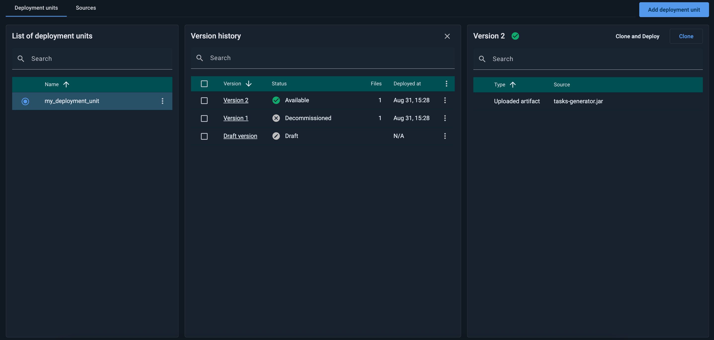
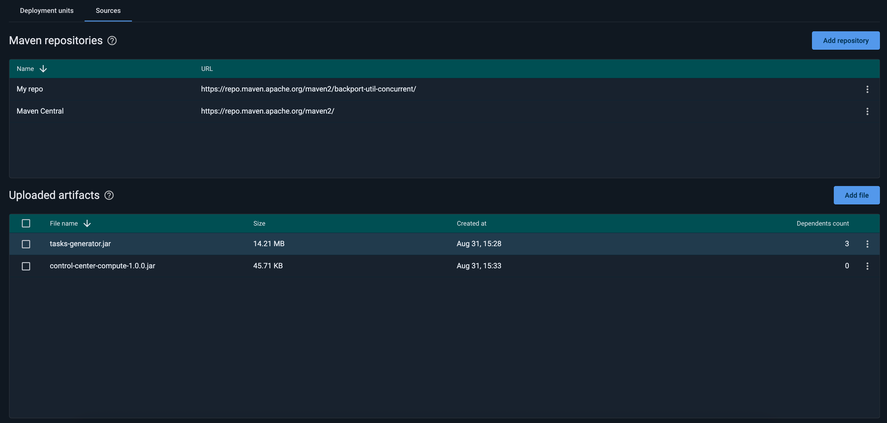
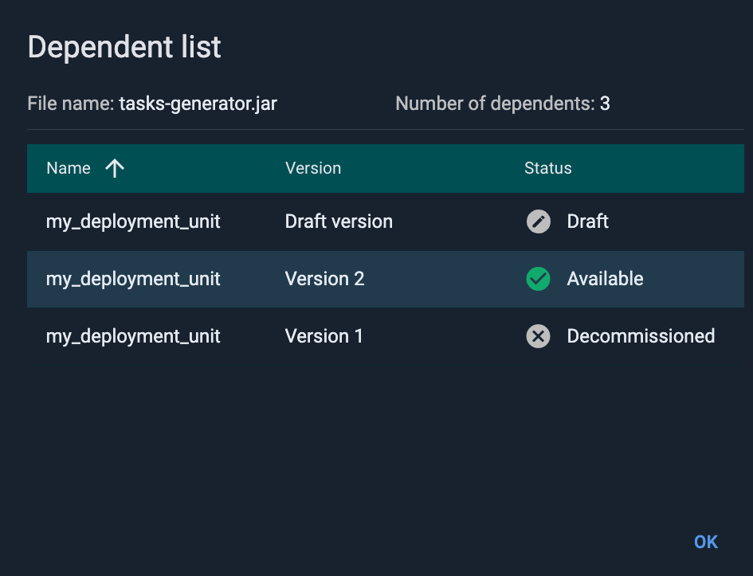

# Code Deployment with GridGain 8

You may want to deploy compute tasks to your GridGain nodes. For example, you often need a large number of dependencies to complete [distributed computing](https://www.gridgain.com/docs/latest/developers-guide/distributed-computing/distributed-computing) tasks.

With GridGain Control Center, you can quickly deliver all dependencies you need to your cluster by using **Deployment units**. Each deployment unit contains a list of dependencies that is passed to the cluster and stored in the metastorage. When you deploy a version, all nodes in the cluster receive the list of dependencies and download them from the specified repository or URL.


For code deployment to work on attached clusters, provide `ADMIN_OPS` permissions to the user who deploys the code. For details, see [Authorization and Permissions](https://www.gridgain.com/docs/latest/administrators-guide/security/authorization-permissions).





Depending on configuration, [secured clusters](../auth/authorization-permissions.md) might require a cluster-level authentication for some (or all) of the actions.


## How to Start With Code Deployment

1. Enable the event driven service processor on every node in the cluster. To do this, set the `IGNITE_EVENT_DRIVEN_SERVICE_PROCESSOR_ENABLED` to true:

   ```bash
   export IGNITE_EVENT_DRIVEN_SERVICE_PROCESSOR_ENABLED=true
   ```
2. Configure `ManagedDeploymentSpi` in your project. This will allow Control Center to deploy code to your cluster:

   
   
   ```xml
   <bean class="org.apache.ignite.configuration.IgniteConfiguration">
   <property name="deploymentSpi">
   <bean class="org.gridgain.control.agent.processor.deployment.ManagedDeploymentSpi"/>
   </property>
   </bean>
   ```
   

   
   ```java
   IgniteConfiguration cfg = new IgniteConfiguration();

   ManagedDeploymentSpi deploymentSpi = new ManagedDeploymentSpi();

   cfg.setDeploymentSpi(deploymentSpi);

   try (Ignite ignite = Ignition.start(cfg)) {
       //execute the task represented by a class located in the "user_libs" directory
       ignite.compute().execute("org.mycompany.HelloWorldTask", "My Args");
   }
   ```
   
   

## Deployment Units

In the **Deployment Units** tab you control the versions of dependencies you deploy to your cluster.



### Creating a new Deployment Unit

To create a new deployment unit, click **Add Deployment Unit** and specify the name for it in the subsequent dialog. The newly created deployment unit is stored as a draft in the cluster.

To add dependencies, click **Add Artifact**. In the subsequent dialog, you can specify where to procure artifacts from:

- **Uploaded Artifact** - one of files uploaded in the [Sources](#sources) tab. These artifacts are stored by Control Center and cluster nodes download them during deployment.
- **Maven Artifact** - the full Maven coordinate, for example `org.apache.commons:commons-collections4:4.1`;

  
  By default, dependencies are downloaded from the Maven Central repository. You can specify extra repositories in the [Sources](#sources) tab.
  
- **URL** - the direct URL of the dependency.

After you add all dependencies you need, click **Deploy Version**. Control Center will pass the list of dependencies to the cluster, and the deployment unit status will be changed to **Downloading**. When download is complete, the status will be changed to **Available**, and you can start your Distributed Computing tasks.

### Updating Deployment Unit

Deployment units are immutable, so you need to create and deploy a new version each time you want to change dependencies. To do this:

1. Click **Clone**. This will create a new version of your deployment unit in **Draft** state and increment version number.
2. Change the dependencies you need. To remove or edit existing dependencies, click ⋮ and select **Remove** or **Edit** respectively.
3. Click **Deploy Version**.

After you do this, Control Center will start downloading new dependencies. Old deployment unit version status will be changed to **Retiring**. It will have this status as long as there are jobs that use this class loader. When there are no jobs, the version will be **Decommissioned**.

### Version History

All deployment unit versions are stored by the cluster and displayed in the **Version History** tab in Control Center, which shows the following information:

| Menu item | Description |
|---|---|
| **Version** | Version number. |
| **Status** | Current version status. Possible version statuses:<br>- `Draft` - A new version that has not been deployed yet.<br>- `Downloading` - The version has been deployed and nodes are downloading dependencies.<br>- `Available` - The version is currently deployed on the cluster.<br>- `Failed to Deploy` - Failed to pass dependency information to the cluster. Click the error status to open a dialog with details, correct the issue, and retry.<br>- `Retiring` - The version is outdated and is currently being replaced by the new version. Some tasks using the dependency are still running.<br>- `Decommissioned` - The version is outdated and was replaced by a newer version. |
| **Files** | The number of files in the deployment units. |
| **Deployed at** | Time and date of the deployment. |

### Reverting to an older version

If you want to switch to an older version (for example, one of the updated dependencies did not work as expected), you can deploy the previous version with the new version number.

- Open **Version History**.
- Select the older version you need.
- Click **Clone and Deploy** and specify a new version bigger than previous.

Control Center will create a new version and copy all dependencies from the version you chose.

## Sources

You can use the **Sources** tab to configure repositories for your deployment units to download dependencies from.



## Maven Repositories

Your deployment units can use preconfigured Maven dependencies.

### Adding New Repositories

To add a new repository, click **Add repository**. In the dialog, specify:

- Repository name. This name will only be used to make it easier to find the repository in the Control Center interface.
- Maven repository URI, for example `https://search.maven.org/`. This repository will be used to resolve code dependencies.

### Removing Maven Repositories

To remove a Maven repository, click ⋮ and select **Remove**.

## Uploaded Artifacts

You can upload an artifact to Control Center in this section. Uploaded artifacts will be stored on the Control Center host, and sent to all deployment units as required.

### Uploading New Artifacts

To add a new artifact, click **Add file** button and select the file you need.

### Checking Dependent List

To find all deployment units that use a specific artifact, click ⋮ and select **View dependent list**. The dialog that opens lists all deployment units that use the selected artifact.



### Deleting Artifacts

To delete an artifact, click ⋮ and select **Remove**. If the selected artifact has dependents, they show in the **Dependent list** dialog - see [Checking Dependent List](#checking-dependent-list). Delete the listed dependents, then the artifact itself.
