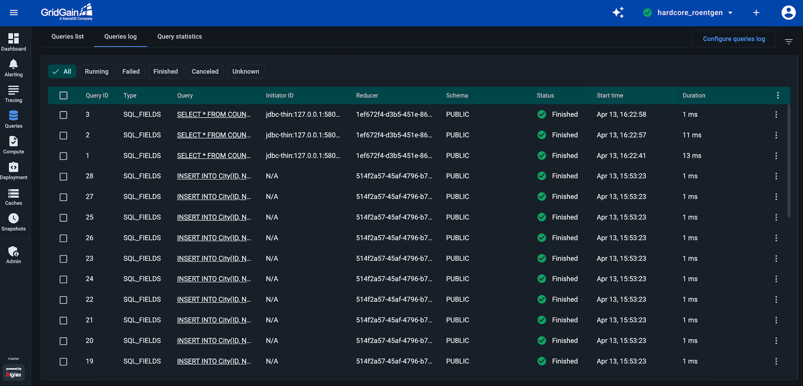
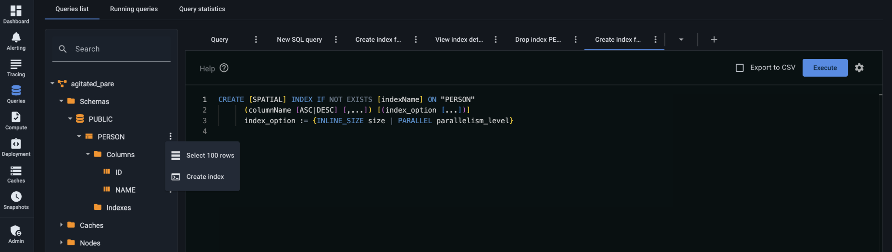
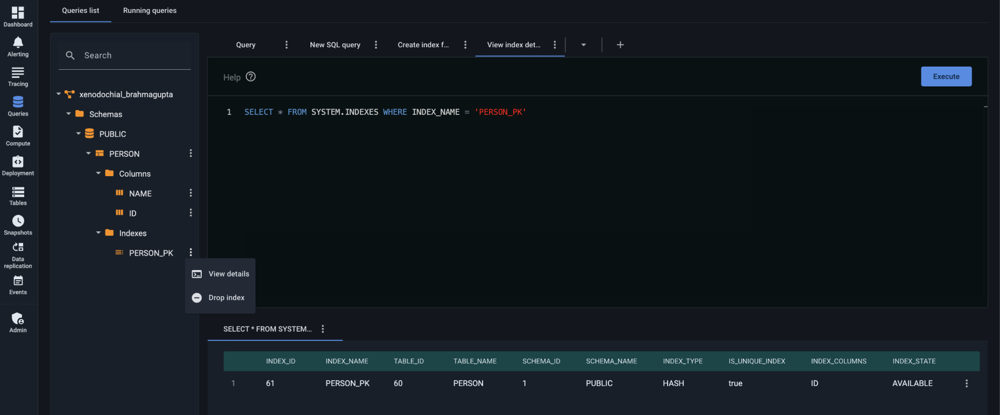
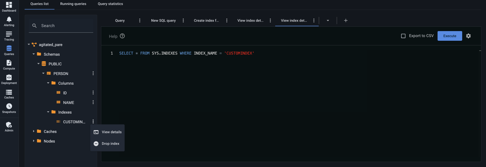
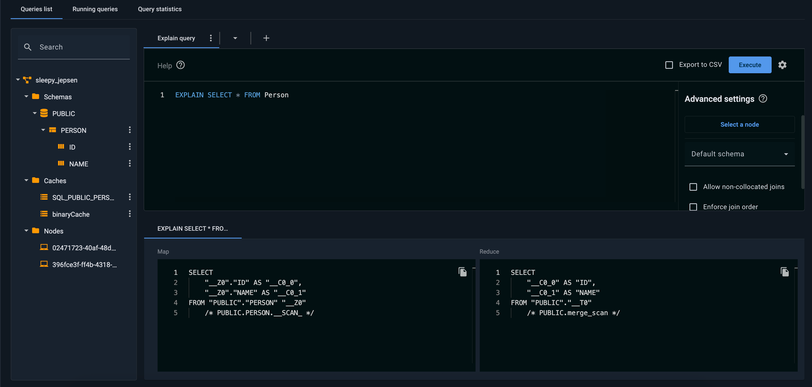
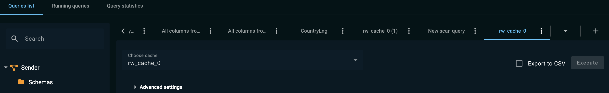
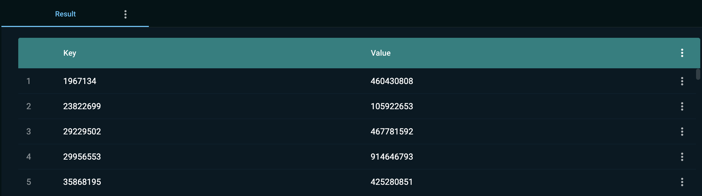
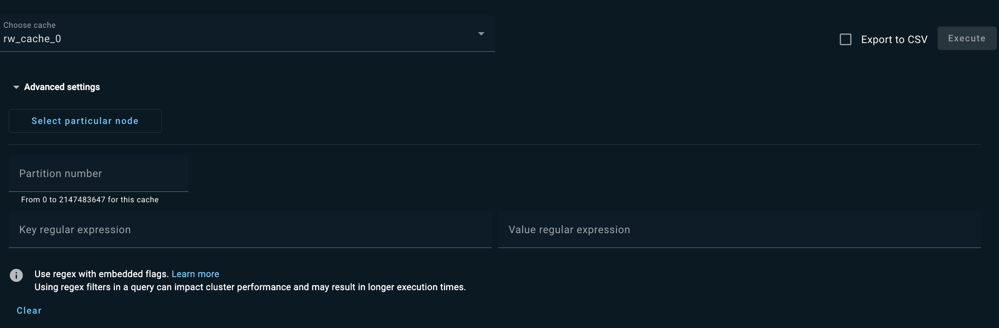
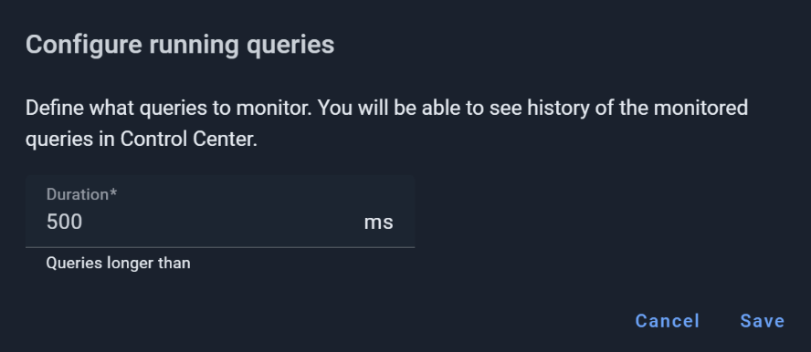
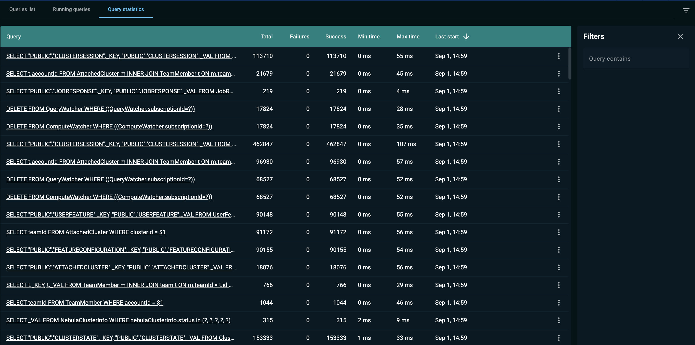

# Queries Screen for GridGain 8 Clusters

The **Queries** screen allows you to execute SQL queries against the GridGain 8 (Apache Ignite 2) cluster and view results. You can also view running queries and query statistics.

## Overview of SQL Screen

The **Queries** screen consists of three tabs:

- **Queries list** — execute SQL queries
- **Queries log** — view the list of running and recently completed queries
- **Query statistics** — view query statistics

The **Queries list** tab displays the **Search** tree that lets you view the tables, caches, and nodes that are available in the cluster.

The tree consists of the following branches:

- The Schemas branch contains the SQL tables.
- The Caches branch contains the names of the caches.
- The Nodes branch contains node IDs. You can [execute a SQL query on a specific node](#executing-queries-on-a-specific-node).


When you use the CREATE TABLE command to create a table, GridGain creates an [underlying cache](https://gridgain.com/docs/latest/developers-guide/data-modeling/data-modeling#key-value-cache-vs-sql-table). Therefore, when you create a table, a new cache appears in the tree.


## Executing Queries

### SQL Queries

Control Center allows you to execute both DML and DDL statements supported by GridGain/Apache Ignite. See the [SQL Reference](https://gridgain.com/docs/latest/sql-reference/sql-reference-overview) guide for details.

To execute a SQL statement, click the `+` icon in the queries tab bar and select **SQL query** from the dropdown list. Then, enter a statement in the query editor, and click **Execute**.

You can also select a statement you need out of a longer query and **Execute statement** instead.

The query results are displayed below the query editor. You can copy all results in the table by clicking ⋮ in the results tab and selecting **Copy**. Alternatively, you can use the context menu for the row to copy a single row of results.

#### Advanced Settings

Control Center provides a number of additional options that are not required for simpler queries. Click the cogwheel icon to open the Advanced Settings panel.

#### Selecting a Schema

You can set the schema for SQL statements in the **Default schema** field. The drop-down field contains a list of existing schemas. Control Center uses the schema that you selected in the **Default schema** field to resolve any unqualified reference that is included within any SQL statement that is executed on the tab. Refer to the [Understanding Schemas](https://gridgain.com/docs/latest/developers-guide/SQL/schemas) page for more information about schemas in GridGain.

#### Working with Indexes

You can create indexes via the context menu in the **Queries** screen.


Indexes for `PRIMARY KEY` are not displayed. Only custom indexes are available.


To view index details, click on the context menu and select **View Details**.

To drop an index, click on the context menu and select **Drop Index**.

#### Non-Colocated Joins

**Allow non-collocated joins**. Set this flag if you want to execute a join query that joins tables on a non-affinity key. If you don't set the flag, the results of the query might be incorrect. Refer to [this section](https://gridgain.com/docs/latest/developers-guide/SQL/distributed-joins#non-colocated-joins) for details.

#### Join Order

**Enforce join order**. This option enforces GridGain to use the order of joins as the order is specified in the query, rather than to rely on the optimizer. The optimizer cannot always determine the best order. Refer to [this section](https://gridgain.com/docs/latest/perf-troubleshooting-guide/sql-tuning#enforcing-join-order) for details.

#### Lazy Loading

**Lazy result set**. You set this flag to lazily load the results of the query. Use of this flag can help to prevent OutOfMemory exceptions that may occur when the result set is too large. Refer to the [Lazy Result Loading](https://gridgain.com/docs/latest/perf-troubleshooting-guide/sql-tuning#lazy-loading) section for details.

#### Executing Queries on a Specific Node

In a multi-node cluster, the data that is held in a table is distributed among all server nodes. When you run a SQL query, the query is distributed among the nodes in a map-reduce manner. However, you can limit the scope of the query to a specific node. If you limit the scope, the query is run against the data that is held on the specified node.

Click **Select particular node**, and, in the dialog box that appears, you select the node.

#### Using the Explain Statement

You can use the `EXPLAIN` statement to view the execution plan for a SELECT query. The execution plan can help you to analyze the query for performance optimization. Simply add 'EXPLAIN' at the beginning of the statement and click **Execute**.

Distributed queries are executed in a map-reduce manner. The execution plan consists of two parts: the map query (the query executed on each node with data) and the reduce query (the "reduce" part, which is performed on the node that initiates the query, the coordinator node).

### Scan Queries

Control Center allows you to execute [scan queries](https://www.gridgain.com/docs/latest/developers-guide/key-value-api/using-scan-queries) - simple search queries used to retrieve data from a cache in a distributed manner. When executed without parameters, a scan query returns all entries from the cache.

To execute a scan query, click the `+` icon in the **Queries list** tab bar and select **Scan query** from the dropdown list, then select a cache to query from the **Choose cache** list.

Alternatively, you can select the **Run scan query** option from the context menu for a specific cache:

- In the **Search** tree on the left, or
- In the [Caches screen](../caches/caches.md).

Once the cache is selected, the scan query runs with all the advanced options set to default values. The query result is displayed at the bottom of the **Queries list** tab.

#### Advanced Options

To run your scan query with advanced options:

1. Open the **Advanced settings** section by clicking the **Expand** triangle next to the label.

   
2. To limit the query to a specific node, click **Select particular node** and pick the required node in the dialog that opens.
3. To limit the query to a specific partition, type its ID in the **Partition number** field.
4. To use regex filters, define **Key** and **Value** regular expressions.
5. Click **Execute**.

#### Miscellaneous Functions

- To export the query results to a CSV file, select the **Export to CSV** check box.
- Use the query tab's context menu to:
  - **Rename** the tab
  - **Remove** the tab
  - **Copy** the tab

## Queries Log

The **Queries log** tab displays all the tracked queries.

| Column | Description |
|---|---|
| Type | - `SCAN`, a scan query - `SQL_FIELDS`, an SQL query that is executed via JDBC/ODBC or via the [SqlFieldsQuery](https://gridgain.com/docs/latest/developers-guide/SQL/sql-api#querying) API |
| Query | The query text. |
| Initiator ID | The originator of the query. Can be a client host and port (e.g., `jdbc-thin:127.0.0.1:58016`), a user name, a job name, or any other information identifying who initiated the query. Displays `N/A` if not available. |
| Reducer | The reducer node. |
| Schema | The schema. |
| Status | The query status: Running, Finished, Canceled, Failed, or Unknown. |
| Start Time | The time the query started. |
| Duration | The duration of the query. |


You can reduce the space the query table occupies on your disk using [Disk Space Optimizations](../../admin-guide/disk-space-optimization.md).


The **Filters** pane, on the right, enables you to granularly define what queries should be included in the list. The **Query type** field is a drop-down list where you can select a single specific type or **ALL** for all types to be included.

### Selecting Queries to Track

To reduce the Control Center load and the disk space occupied by the tracked queries, you can specify which of the running queries must be tracked. Only those queries you specify will be available for display in the **Queries log** tab.

To select queries to track:

1. Click **Configure queries log** in the top right corner of the tab.
2. In the **Configure queries log** dialog that opens, define the query parameters.

   

   For example, if you enter "500" in the **Duration** field, as shown above, only queries longer than 500 ms will be tracked. This includes those queries that are running (are in the Running status) when you save the configuration.
3. Click **Save**.

### Stopping Queries

You can stop a running query by pressing ⋮ and selecting **Kill query**.

## Query Statistics

The **Query statistics** tab displays statistics on the queries that have been executed in the cluster. The list includes the queries that where executed via Control Center and also via other tools.

The list is limited to the most recent 1000 queries.

The statistics include the following:

- how many times the query was executed
- how many times the query failed or succeeded
- what were the minimum and maximum execution time
- when the query was most recently executed

You can find the queries that match a specific text string by using the **Filters** field. Simply enter the text in the input field, and the list is filtered as you type.
