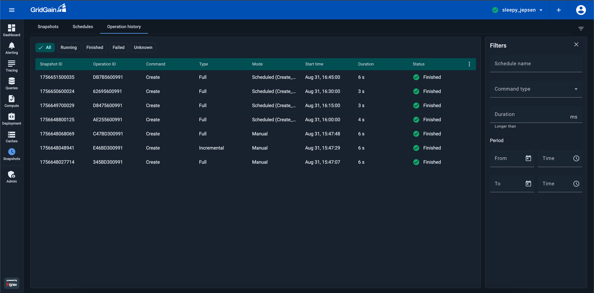
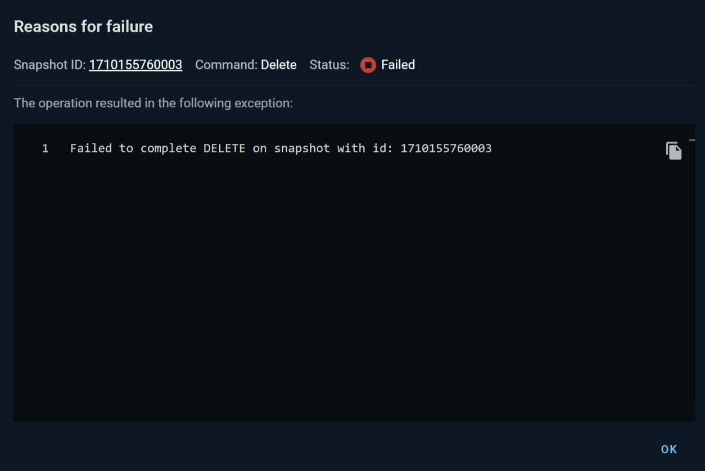

# Snapshot Operation History for GridGain 8 Clusters

The users of GridGain Ultimate edition can view the history of snapshot operations in the **Operation History** tab of the **Snapshots** screen.


For information about snapshots in GridGain, see [Snapshots and Recovery](https://gridgain.com/docs/latest/administrators-guide/snapshots/snapshots-and-recovery).


By default, the tab displays the following information for each snapshot operation:

| Column | Description |
|---|---|
| Snapshot ID | The snapshot ID. |
| Operation ID | The ID of the operation. |
| Command | The operation performed: Create, Check, Move, or Delete. |
| Type | The snapshot type: Full or Incremental. |
| Mode | The method that was used to create the snapshot: Scheduled or Manual. |
| Start time | The time when the operation started. |
| Duration | The operation duration. |
| Status | The status of the operation: Finished, Failed, Running, or Unknown. |

For operations whose status is Failed, you can view the failure reason in the **Reasons for failure** dialog. You this dialog by clicking the **Failed** link in the operation's **Status** field.

You can filter the list using the **Filters** section in the right-hand part of the tab.

You can also use the status buttons (**Running**, **Finished**, etc.) that appear across the top of the tab to filter the operation list by status.

You can hide/show the operation list columns:

1. Click `⋮` in the list title bar.
2. In the column list that opens, select or clear check boxes by the relevant column names.
