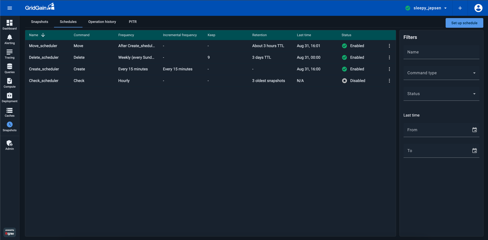
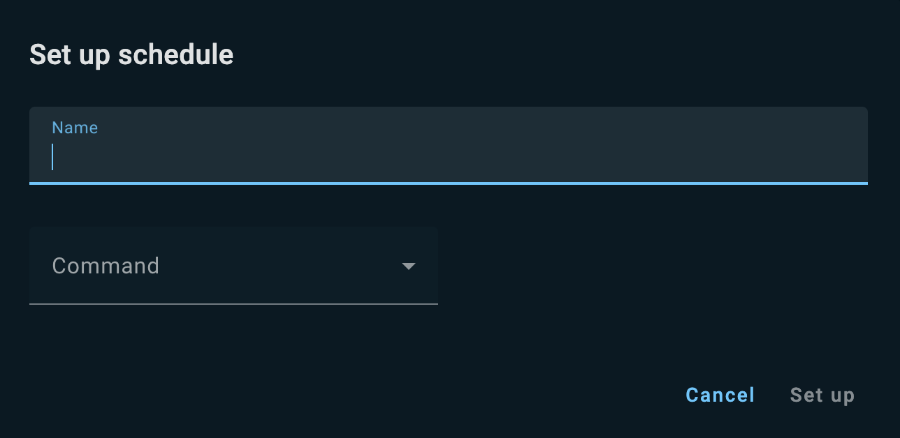
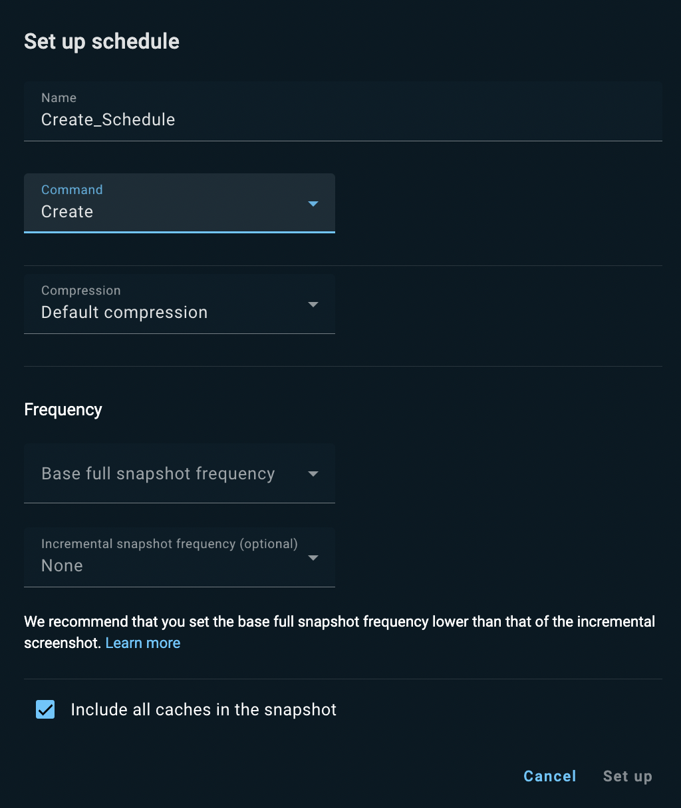
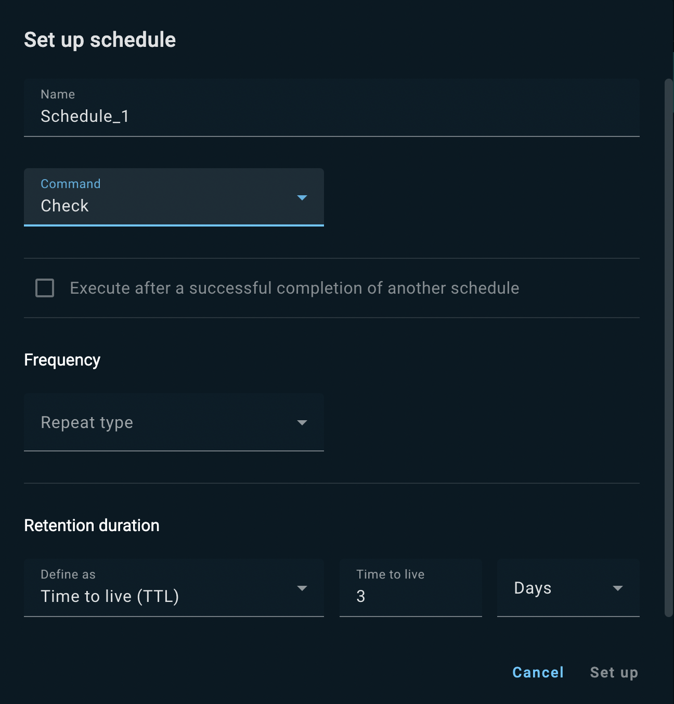
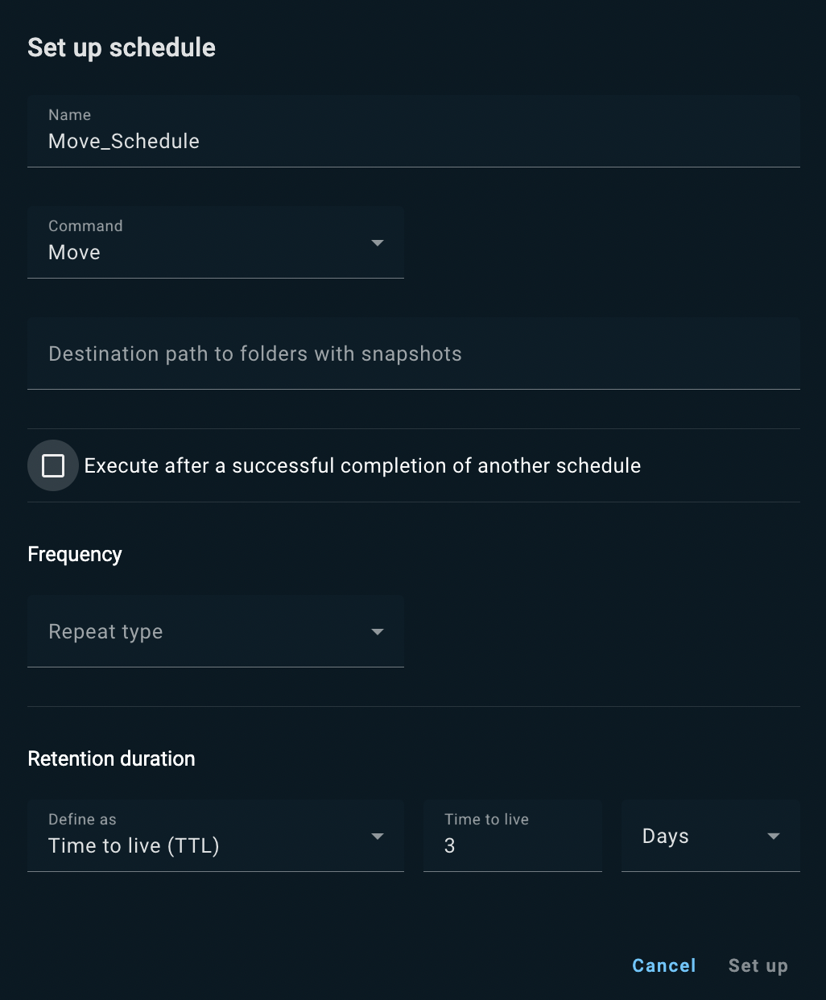
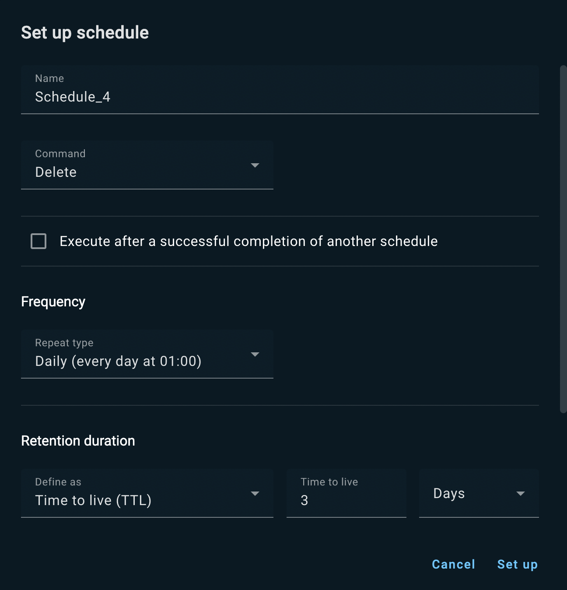

# Snapshot Schedule Management for GridGain 8 Clusters

The users of GridGain Ultimate edition can create and manage snapshot schedules in the **Schedules** tab of the **Snapshots** screen.


For information about snapshots in GridGain, see [Snapshots and Recovery](https://gridgain.com/docs/latest/administrators-guide/snapshots/snapshots-and-recovery).


## Viewing Schedules

The **Schedules** tab displays the following information for each snapshot schedule:

| Column | Description |
|---|---|
| Name | The schedule name. |
| Command | The scheduled operation: Create, Check, Delete, or Move. |
| Frequency | The schedule frequency or dependency on another schedule (runs after successful completion of schedule X). |
| Incremental frequency | The frequency of the incremental snapshot operation. The incremental snapshot is based on the full snapshot, which should be created less frequently than the incremental one. |
| Keep | The number of snapshots to keep (relevant for the Delete operation). |
| Retention | The period of snapshot retention: TTL, Latest snapshots, or Oldest snapshots. |
| Last time | The last time the schedule ran. |
| Status | The schedule status: Enabled or Disabled. |

You can filter the list using the **Filters** section in the right-hand part of the tab.

## Creating Schedules

To create a new snapshot schedule:

1. Click **Set up schedule**.

   The **Set up schedule** dialog opens.

   
2. In the **Name** field, enter a name for the schedule.
3. From the **Command** drop-down list, select the operation to schedule. The dialog layout changes according to the operation choice:
   - [Create](#create) - creates a snapshot
   - [Check](#check) - checks if the specified snapshot is valid (not broken) and can be restored
   - [Move](#move) - moves the snapshot data to a selected location
   - [Delete](#delete) - deletes the snapshot data
4. Fill out the dialog fields as described in the corresponding section below.
5. Click **Set up**.

The new schedule appears in the list - see [Viewing Schedules](#viewing-schedules).

### Create

If you selected the Create command for the new schedule, the layout of the **Set up schedule** dialog changes as follows.

1. From the **Compression** drop-down list, select the snapshot's data compression option:
   - Default compression - the data is compressed as defined by the cluster configuration
   - No compression - the data is saved uncompressed
   - 1...9 - the compression level for the ZIP compression
2. From the **Base full snapshot frequency** drop-down list, select a frequency for the full snapshot the schedule will initiate. If you select Custom, enter the snapshot running expression in the adjacent **Cron expression** field.
3. Optionally, from the **Incremental snapshot frequency** drop-down list, select a frequency for the incremental snapshot the schedule will initiate (based in the full snapshot you selected scheduled in the previous step). Leaving the None (default) value in this field means "no incremental snapshot." If you select Custom, enter the snapshot running expression in the adjacent **Cron expression** field.

   
   We recommend that you set the incremental snapshot frequency higher (more often) than the base full snapshot frequency.
   
4. To include in the snapshot only a specific cache, clear the **Include all caches in the snapshot** check box, then enter the required cache's name in the **Cache name** field that appears.

### Check

If you selected the Check command for the new schedule, the layout of the **Set up schedule** dialog changes as follows.

1. From the **Repeat type** drop-down list, select a frequency for the snapshot Check operation. If you select Custom, enter the operation running expression in the adjacent **Cron expression** field.
2. Alternatively, make the Check schedule dependent on another schedule ("base schedule"):
   1. Select the **Execute after a successful completion of another schedule** check box.
   2. From the **Schedule name** drop-down list that appears, select the "base" schedule.
3. In the **Retention duration** section, from the **Define as** drop-down list, select an option:
   - Time to Live (TTL) - check snapshots with a specific TTL. You need to enter the **Time to live** value (number of units) and select the unit from the adjacent drop-down list.
   - Oldest snapshots - check the oldest snapshots. You need to specify how many snapshots to check in the **Number of snapshots** field.
   - Latest snapshots - check the most recent snapshots. You need to specify how many snapshots to check in the **Number of snapshots** field.

### Move

If you selected the Move command for the new schedule, the layout of the **Set up schedule** dialog changes as follows.

1. In the **Destination path to folders with snapshots**, enter a valid path.
2. From the **Repeat type** drop-down list, select a frequency for the snapshot Move operation. If you select Custom, enter the operation running expression in the adjacent **Cron expression** field.
3. Alternatively, make the Move schedule dependent on another schedule ("base schedule"):
   1. Select the **Execute after a successful completion of another schedule** check box.
   2. From the **Schedule name** drop-down list that appears, select the "base" schedule.
4. In the **Retention duration** section, from the **Define as** drop-down list, select an option:
   - Time to Live (TTL) - move snapshots with a specific TTL. You need to enter the **Time to live** value (number of units) and select the unit from the adjacent drop-down list.
   - Oldest snapshots - move the oldest snapshots. You need to specify how many snapshots to move in the **Number of snapshots** field.
   - Latest snapshots - move the most recent snapshots. You need to specify how many snapshots to move in the **Number of snapshots** field.

### Delete

If you selected the Delete command for the new schedule, the layout of the **Set up schedule** dialog changes as follows.

1. From the **Repeat type** drop-down list, select a frequency for the snapshot Delete operation. If you select Custom, enter the operation running expression in the adjacent **Cron expression** field.
2. Alternatively, make the Delete schedule dependent on another schedule ("base schedule"):
   1. Select the **Execute after a successful completion of another schedule** check box.
   2. From the **Schedule name** drop-down list that appears, select the "base" schedule.
3. In the **Retention duration** section, from the **Define as** drop-down list, select an option:
   - Time to Live (TTL) - delete snapshots with a specific TTL. You need to enter the **Time to live** value (number of units) and select the unit from the adjacent drop-down list.
   - Oldest snapshots - delete the oldest snapshots. You need to specify how many snapshots to delete in the **Number of snapshots** field.
   - Latest snapshots - check the most recent snapshots. You need to specify how many snapshots to delete in the **Number of snapshots** field.
4. In the **Number of snapshots to keep** field, enter the number of snapshots to be exempt from the Delete operation.

## Viewing Operation History

To view [operation history](operation-history.md) for a schedule (all the instances when a snapshot was run according to that schedule):

- From the schedule's context menu, select **View operation history**.

The schedule's history shows in the **Operation History** tab.

## Disabling and Enabling Schedules

To disable a schedule:

1. From the schedule's context menu, select **Disable**.
2. In the confirmation dialog that opens, click **Disable**.

To enable a previously disabled schedule:

1. From the schedule's context menu, select **Enable**.
2. In the confirmation dialog that opens, click **Enable**.

## Removing Schedules

To permanently delete a schedule:

1. From the schedule's context menu, select **Remove**.
2. In the confirmation dialog that opens, click **Remove**.
