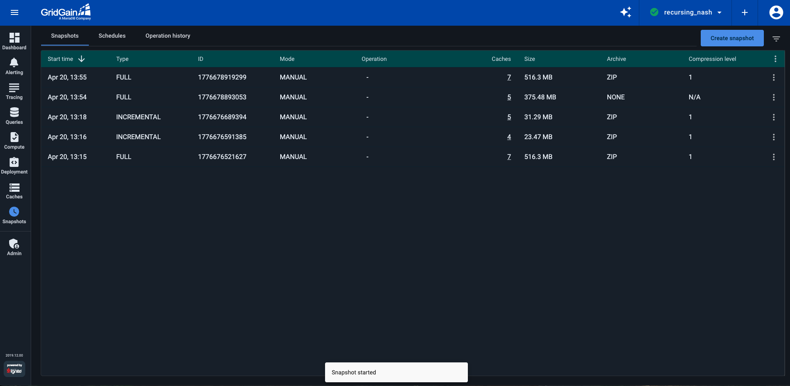
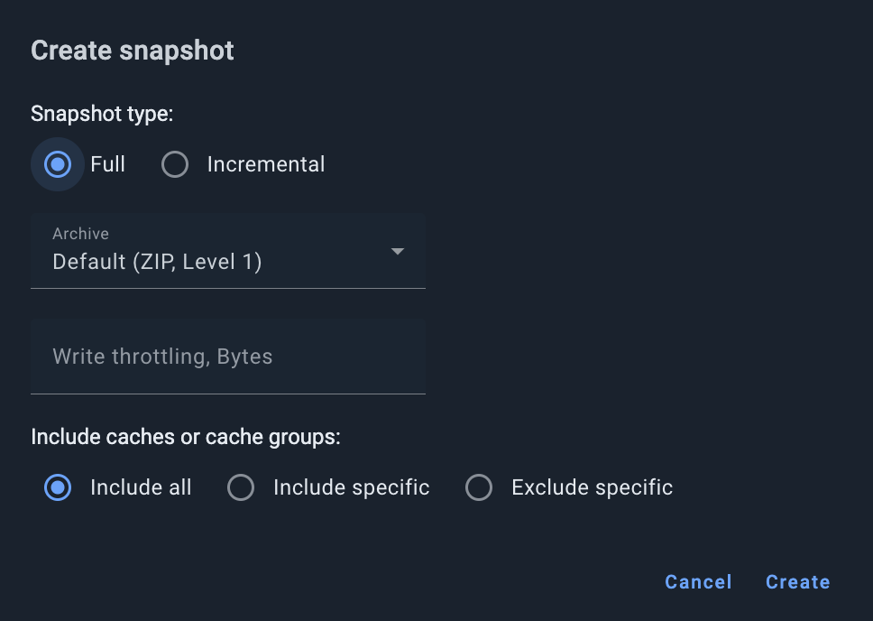
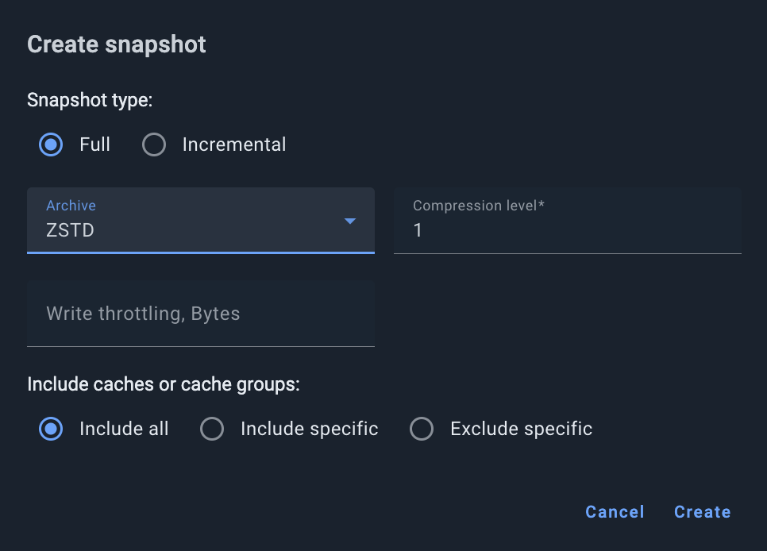
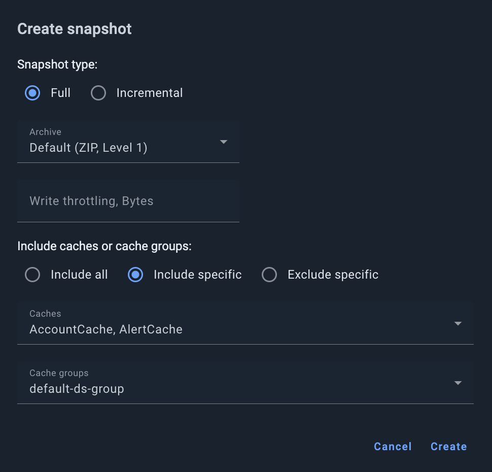
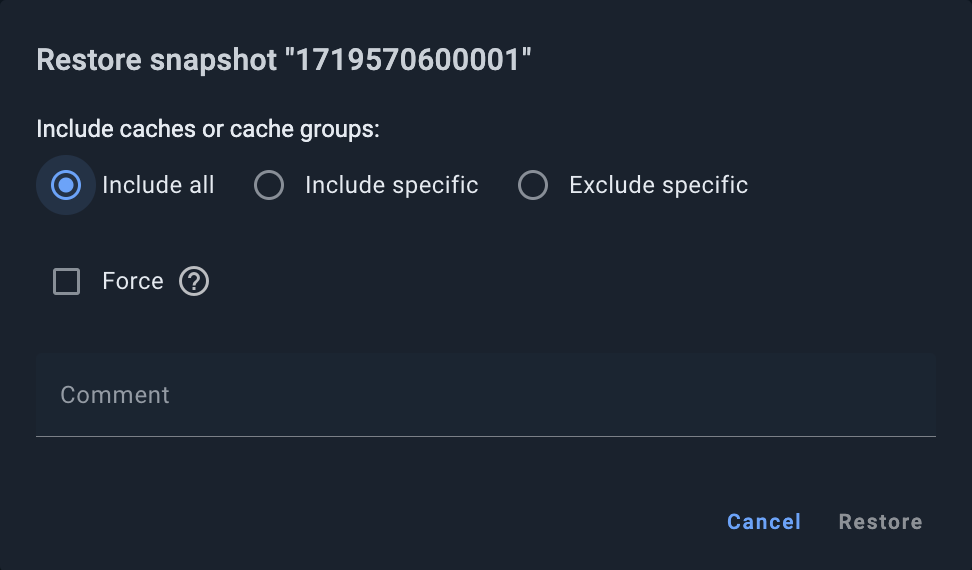
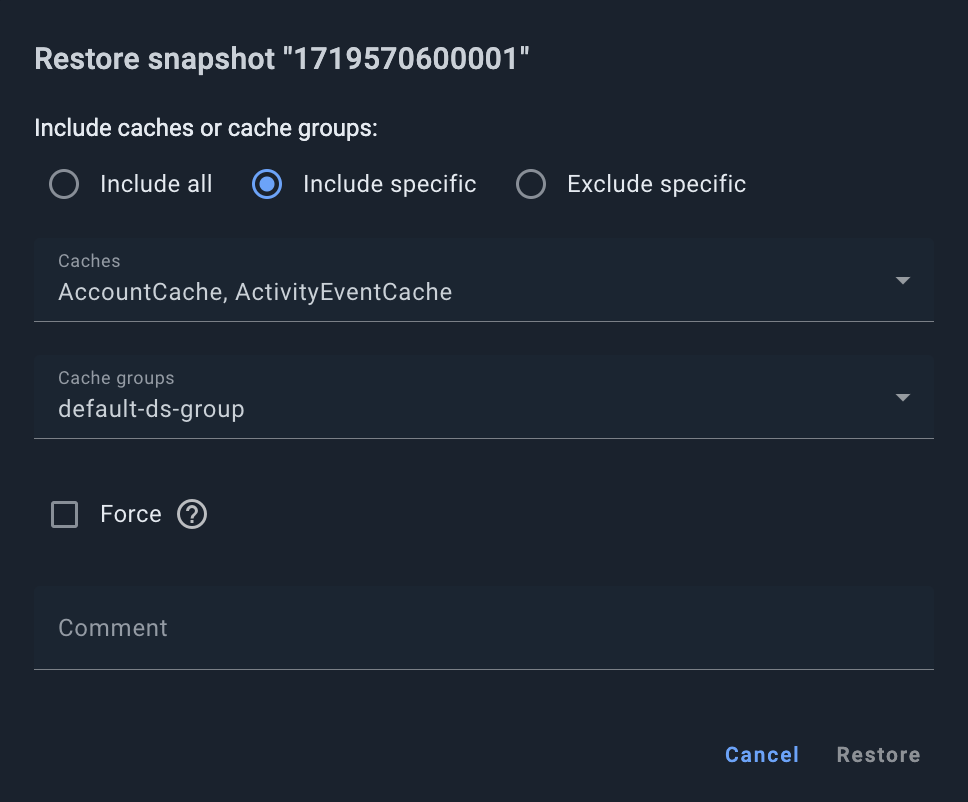
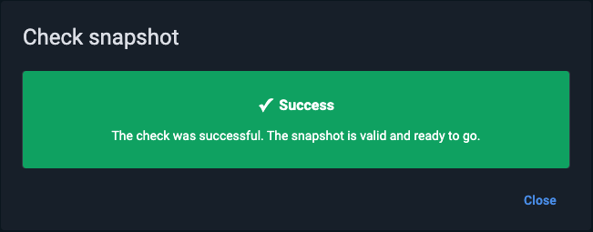
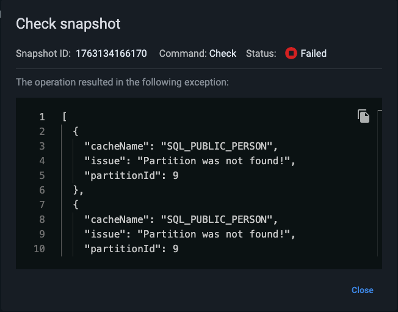

# Snapshot Management for GridGain 8 Clusters

The users of GridGain Ultimate edition can manage snapshots via the **Snapshots** tab of the **Snapshots** screen. This tab lets you create, restore, copy, move, delete, and perform integrity checks of snapshots.


You can also create and manage [snapshot schedules](snapshot-schedules.md), as well as view [history of snapshot operations](operation-history.md).


In addition to the snapshots created in Control Center, the list of snapshots contains the snapshots that were created by using programming APIs or the snapshot management tool. See [Snapshots and Recovery](https://gridgain.com/docs/latest/administrators-guide/snapshots/snapshots-and-recovery) or our video guide.

The **Snapshots** screen displays the following information about each snapshot:

To add columns to the table or remove them from the table, select the **Table Columns** option from the table's context menu, then select or clear check boxes for the columns on the list that opens.

| Column | Description |
|---|---|
| Start Time | Time when the snapshot create operation began. |
| Type | Full or incremental. |
| ID | The snapshot ID. |
| Mode | The method that was used to create the snapshot, automatically on a schedule or manually. |
| Operation | The status of the snapshot operation that is being executed on the snapshot. The column shows the progress of the operation while the operation is in progress, and changes to **OK** when the operation is complete. Possible values: - CREATING - MOVING - REMOVING - CHECKING - COPYING - RESTORING |
| Caches | The number of caches included in the snapshot. Click the number to view the names of the caches. |
| Size | The total size of the snapshot data. Displays a human-readable value (for example, `1.0 GB`). Displays `–` if the data is absent. **Hidden by default**. |
| Archive | The compression algorithm used for the snapshot. Possible values: `NONE`, `ZIP`, `ZSTD`, `LZ4`, `SNAPPY`. **Hidden by default**. |
| Compression | The compression level. `-1` means no compression is applied. Valid range is `-1` through `23`. **Hidden by default**. |

## Creating Snapshots


Before you can create snapshots, snapshot functionality must be enabled. See [Enabling Snapshots](https://gridgain.com/docs/latest/administrators-guide/snapshots/full-incremental-snapshots#enabling-snapshots).


To create a snapshot:

1. Click **Create snapshot**.

   The **Create snapshot** dialog opens.

   
2. Select the snapshot type: **Full** (default) or **Incremental**.
3. Optionally, to change the default snapshot compression (ZIP, level 1), select the compression type and, if prompted, the compression level.

   
4. Optionally, to limit the snapshot writing speed to a specific number of Bytes per second, enter the required number of Bytes in the **Write throttling** field.
5. Optionally, to change the default snapshot scope (all caches and cache groups):

   

   1. Select one of the alternative options:
      - **Include specific** to include only explicitly specified caches and groups
      - **Exclude specific** to include all caches and groups except for explicitly specified ones
   2. From the **Caches** and **Cache groups** drop-down lists, select the caches and groups to be included or excluded (depending on the option you have selected in (a) above).
6. Click **Create**.

A snapshot is created in each node's snapshot folder. Each node saves its part of the data. The snapshot folder is specified in the [node configuration](https://gridgain.com/docs/latest/administrators-guide/snapshots/full-incremental-snapshots#enabling-snapshots).

## Restoring Snapshots

To restore a snapshot:

1. Click on the `⋮` icon in the table row that corresponds to the snapshot that you want to restore.
2. From the menu that opens, select **Restore from snapshot**.

   The **Restore snapshot \<name>** dialog opens.

   

   By default, you restore all caches and cache groups found in the snapshot.
3. To exclude specific caches and cache groups:
   1. Select the **Exclude specific** option.

      The dialog layout changes.

      
   2. From the **Caches** and/or **Cache groups** drop-down lists, select the required entities.
4. Alternatively, to restore (include) only specific caches or cache groups:
   1. Select the **Include specific** option.

      This excludes from the restoration process all caches and groups found in the snapshot.
   2. From the **Caches** and/or **Cache groups** drop-down lists, select the entities to restore.
5. Optionally (if you are using the **Exclude specific** or **Include specific** option), select the **Force** check box to extend the include/exclude selection from caches to cache groups the caches belong to. For example, if you chose to exclude cache ABC that belongs to groups A and B, both these groups will be excluded.
6. In the **Comment** field, type a comment regarding the restoration action.
7. Click **Restore**.

## Copying/Moving Snapshots

To move or copy a snapshot to a specific path, click the `⋮` icon and select **Move** or **Copy**. Then, in the dialog box that appears, enter the destination path and click **OK**. The destination path must be available on each node.

## Verifying Snapshot Integrity

To verify that the snapshot data is not broken, run an integrity check. To run the check, click the `⋮` icon and select **Check**.

The `Operation` column indicates that a check is in progress. When the check is finished, the result is shown in the dialog.

- If snapshot is valid, you will see the following result:

  
- If snapshot is broken, you can view error details:

  
