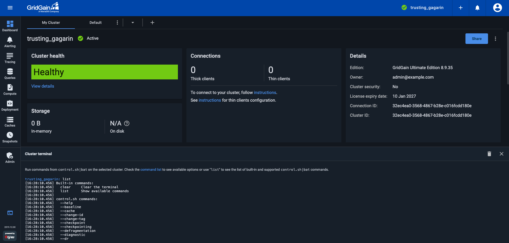

# Cluster Terminal for GridGain 8 Clusters

The **Cluster terminal** is a panel that lets you run [control script](https://www.gridgain.com/docs/gridgain8/latest/administrators-guide/control-script) commands against the currently selected cluster.

The terminal is docked at the bottom of the screen and works independently of the screen you are on, so you can keep it open while you navigate Control Center.



## Opening and Closing the Terminal

To open the terminal, click the **Cluster terminal** button at the bottom of the navigation bar on the left. Clicking the button again closes the panel. You can also close the panel by clicking the **Close** icon in the panel header.

To change the height of the panel, drag the splitter between the panel and the page above it. Control Center remembers the height you set and reuses it the next time you open the terminal.

## Running Commands

The prompt displays the name of the cluster that the commands are run against. This is always the cluster that is currently selected in Control Center; to run commands against a different cluster, switch clusters using the **Select Cluster** control on the top toolbar.

To run a command, type it at the prompt together with its arguments and press `Enter`. Enter commands the same way you would enter them for the control script, but omit the script name itself:

```shell
--baseline
--cache list
--state
```

The command output appears below the command. Each output line is prefixed with the timestamp reported for it, in the `[HH:MM:SS.mmm]` format. Warnings are displayed in yellow, and errors — including a command that could not be delivered to the cluster — in red.

For the list of commands and their arguments, see the [Control Script](https://www.gridgain.com/docs/gridgain8/latest/administrators-guide/control-script) page in the GridGain 8 documentation.


Commands are passed to the cluster as you type them, so a command runs even if it is not listed in [Supported Commands](#supported-commands). Autocompletion and the `list` command cover the commands in that section only.


### Built-in Commands

In addition to the control script commands, the terminal supports two built-in commands:

| Command | Description |
|---|---|
| `clear` | Clears the terminal output. Has the same effect as the **Clear** icon in the panel header. |
| `list` | Displays the built-in commands and the supported control script commands. |

### Keyboard Shortcuts

| Key | Action |
|---|---|
| `Tab` | Completes the command or subcommand you have started typing. If several commands match, they are all displayed and the line is left unchanged. Autocompletion works only when the cursor is at the end of the line. |
| `Up`, `Down` | Cycle through the last five commands you ran. |
| `Left`, `Right` | Move the cursor within the current line. |
| `Home`, `End` | Move the cursor to the beginning or the end of the current line. |

## Supported Commands

The `list` command and autocompletion recognize the following commands:

| Command | Description |
|---|---|
| `--baseline` | Prints the cluster baseline topology. Subcommands add, remove, and set baseline nodes, and manage baseline autoadjustment. |
| `--cache` | Views and manages caches: lists caches, verifies partitions and indexes, rebuilds indexes, and clears or destroys caches. |
| `--change-id` | Changes the cluster ID to a new value. |
| `--change-tag` | Changes the cluster tag to a new value. |
| `--checkpoint` | Starts checkpointing on the node with the specified node ID. If no node ID is specified, checkpointing starts on all nodes. |
| `--checkpointing` | Not a control script command. See the note below the table. |
| `--defragmentation` | Schedules or cancels defragmentation of the persistent store on the given nodes, and prints its status. |
| `--diagnostic` | Prints diagnostic information about the cluster. |
| `--dr` | Manages data center replication: prints the replication state and topology, pauses and resumes replication, runs full state transfers, and checks or repairs partition counters. |
| `--encryption` | Manages cluster encryption: prints or changes the master key and cache group keys, and controls cache group re-encryption. |
| `--help` | Prints the control script help, which lists the available commands and their syntax. |
| `--kill` | Cancels a running SQL query, continuous query, scan query, compute task, service, transaction, or client connection. |
| `--meta` | Manages binary metadata types: lists the types, prints details for a type, and removes or updates metadata. |
| `--metric` | Prints the value of a metric. If you specify a metric registry, the values of all its metrics are printed. |
| `--persistence` | Prints information about potentially corrupted caches, and cleans or backs up cache data files. |
| `--property` | Lists the distributed properties of the cluster, and gets or sets a property value. |
| `--rolling-upgrade` | Enables, finishes, or forces rolling upgrade mode, and prints its status. |
| `--set-state` | Changes the cluster state to `ACTIVE`, `INACTIVE`, or `ACTIVE_READ_ONLY`. |
| `--shutdown-policy` | Prints or sets the cluster shutdown policy. |
| `--state` | Prints the current cluster state. |
| `--tracing-configuration` | Prints or updates the tracing configuration. |
| `--tx` | Lists or kills transactions, and prints detailed information about a specific transaction. |
| `--warm-up` | Stops the warm-up procedure. |


`--checkpointing` is offered by autocompletion and listed by the `list` command, but it is not a control script command — the cluster rejects it as an unexpected argument. Use `--checkpoint` instead.


Subcommands, such as `--cache list` or `--baseline auto_adjust enable`, can also be completed with `Tab`. For the syntax and the arguments of each command and subcommand, see the [Control Script](https://www.gridgain.com/docs/gridgain8/latest/administrators-guide/control-script) page, or run `--help` in the terminal.

## Read-Only Mode

The terminal accepts input only when the cluster is in a state in which it can process operations, such as **Active** or **Inactive**. For a cluster in any other state — for example, **Disconnected** or **Suspended** — the panel is displayed but does not accept input. See [Cluster Statuses](../../cluster-management.md#cluster-statuses) for the list of cluster states.

## Terminal History

The commands you ran and their output remain in the panel until you clear them, even if you close and reopen the panel.

To clear the output, click the **Clear** icon in the panel header or run the `clear` command.

Reloading the page also clears the output and the list of recent commands.

## Permissions

Commands that you run in the terminal are subject to the same [authorization rules](../auth/authorization-permissions.md) as the actions you initiate from the Control Center screens. On a secured cluster, you are prompted for the cluster user name and password, and a command fails if the user you authenticated as lacks the permissions that the command requires.
