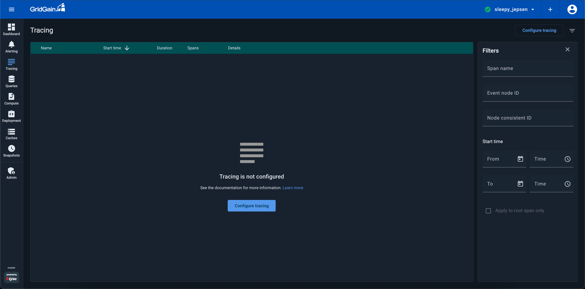
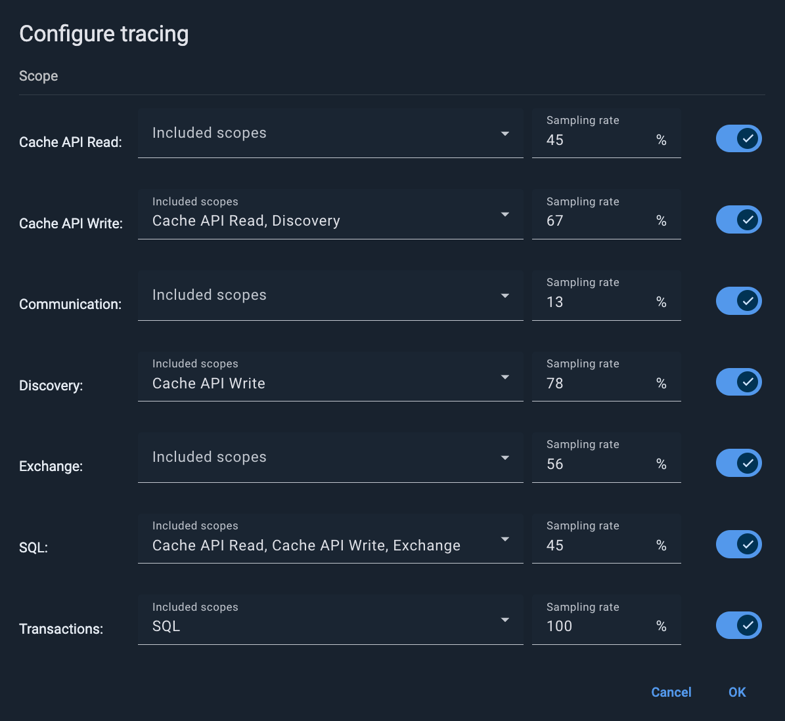

# Tracing SQL Transactions with Control Center

## Overview

There are many different types of SQL transactions: pessimistic, optimistic; different isolation levels and so on. However, in general, the longer a transaction lasts, the more it affects the overall performance of the system.

For more details, spend less than 5 minutes watching the video below.




Depending on configuration, [secured clusters](../auth/authorization-permissions.md) might require a cluster-level authentication for some (or all) of the actions.


Metrics cannot intercept all problems with your transactions, so you can look into the tracing section.

Each trace contains a group of spans. Span is a particular activity in the distributed system. You can look into each recorded transaction. If your transactions are long and there are big gaps in diagrams, but the actual operation happens at the very end, there is most likely something wrong with your code. To debug it, you can expand the root span and see general information about the trace.

Here are some common cases:

- There is a method that parses multiple caches, and a different method for attaching results to an external account;
- There is an annotation in the method that slows down the process;
- There is a call to an external API, which can respond with delays if it is heavily loaded;
- There is a validation that the external account is not null that leads lead to a rollback of the transaction on exceptions.

After you identify the cause for the delay, you can remove its cause and improve transaction speed.

## The Tracing Screen

The **Tracing** screen displays information about traces recorded during cluster operation. You need to [enable tracing](https://gridgain.com/docs/latest/administrators-guide/monitoring-metrics/tracing). The recorded information can include informational messages, error messages, duration of specific operations, stack traces, etc. You can use this information to troubleshoot cluster operation or identify latency issues.

The screen displays a table containing all recorded traces, including the name of the event, its start time, duration and number of spans.

A trace is recorded information about the execution of a specific event. Each trace consists of a tree of *spans*. A span is an individual unit of work performed by the system in order to process the event.

A trace can include spans from multiple nodes.

## Configuring Tracing

To configure tracing:

1. Click the **CONFIGURE TRACING** button in the upper right corner of the page.

   The **Configure Tracing** dialog appears.

   
2. Choose one or several **Included Scopes** from the drop-down list for each scope.

   
   To prevent your cluster from overload of tracing messages in the corresponding queue, enable only those scopes you really need.
   
3. For each of the selected scopes, specify a percentage in the **Sampling Rate** field.

   
   Sampling rate controls the percentage of the traces the system stores and analyzes. On `100%`, all traces are collected, which might overload the system resources. In most scenarios, you only need to collect a small percentage of the traces to get the general picture. Try a value of 5-10% and observe the results. Balance the usefulness of tracing vs the system performance.
   
4. Click **OK** for the changes to take effect.


You can reduce the space the trace table occupies on your disk using [Disk Space Optimizations](../../admin-guide/disk-space-optimization.md).


## Viewing Spans

A span contains a set of *tags* and a set of *logs* attached to it. A tag is a key-value pair with information about the span. A log is a key-value pair with information about a specific moment or event within a span.

In the configuration section you can set the “scopes” of transactions you want to track. For example, you can track “cache reads” and “cache writes”, communication between nodes, transactions, and so on.


You can reduce the space the span table occupies on your disk using [Disk Space Optimizations](../../admin-guide/disk-space-optimization.md).

