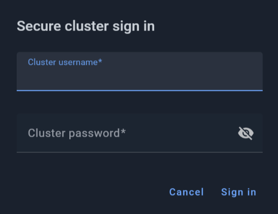

# Authorization and Permissions

You need an authorization to access the [secured GridGain clusters](https://www.gridgain.com/docs/gridgain9/latest/administrators-guide/security/authentication#authentication-and-authorization) via GridGain Control Center.

When you attempt to initiate a permission-protected action on a secured GridGain cluster, you are prompted to enter the cluster-specific username and password.

GridGain Control Center supports the following permissions.

## Queries Actions

To work with [queries](../queries/querying-gg9.md) some of the following permissions are required:

| Action | Permission |
|---|---|
| Use the `CREATE TABLE` SQL statement | CREATE_TABLE |
| Use the `SELECT` SQL statement | SELECT_FROM_TABLE |
| Use the `DROP TABLE` SQL statement | DROP_TABLE |
| Use the `INSERT` SQL statement | INSERT_INTO_TABLE |
| Use the `ALTER TABLE` SQL statement | ALTER_TABLE |
| Use the `DELETE` SQL statement | DELETE_FROM_TABLE |
| Use the `UPDATE SQL` statement | UPDATE_TABLE |
| Use the `CREATE INDEX` SQL statement | CREATE_INDEX |
| Use the `DROP INDEX SQL` statement | DROP_INDEX |
| Use the index in SQL statements | USE_INDEX |

To get status of [Running Queries](../queries/querying-gg9.md#running-queries) and stop them the following permissions are required:

| Action | Permission |
|---|---|
| Get status of running queries | GET_SQL_QUERY_STATE |
| Stop running queries | KILL_SQL_QUERY |

To be able to create,alter and drop [Distribution Zone](https://www.gridgain.com/docs/gridgain9/latest/sql-reference/distribution-zones) the following permissions are required:

| Action | Permission |
|---|---|
| Create new distribution zones | CREATE_DISTRIBUTION_ZONE |
| Alter distribution zones | ALTER_DISTRIBUTION_ZONE |
| Delete distribution zones | DROP_DISTRIBUTION_ZONE |

You can find list of the Distribution Zones on [Tables page](../tables/tables.md)

## Code Deployment Actions

Deploy and Remove [Code Deployment Unit](../deployment/code-deployment-gg9.md) actions require the following permissions:

| Action | Permission |
|---|---|
| Deploy code deployment unit | DEPLOY_UNIT |
| Remove deployment unit | UNDEPLOY_UNIT |

## Tables actions

Restart and Reset partition actions require the following permissions:

| Action | Permission |
|---|---|
| Reset partition | RESET_PARTITIONS |
| Restart partition | RESTART_PARTITIONS |

## Snapshot Actions

The [snapshot](../snapshots/snapshots-gg9.md) actions require the following permissions:

| Action | Permission |
|---|---|
| Create snapshot | CREATE_SNAPSHOT |
| Remove snapshot | DELETE_SNAPSHOT |
| Restore snapshot | RESTORE_SNAPSHOT |
