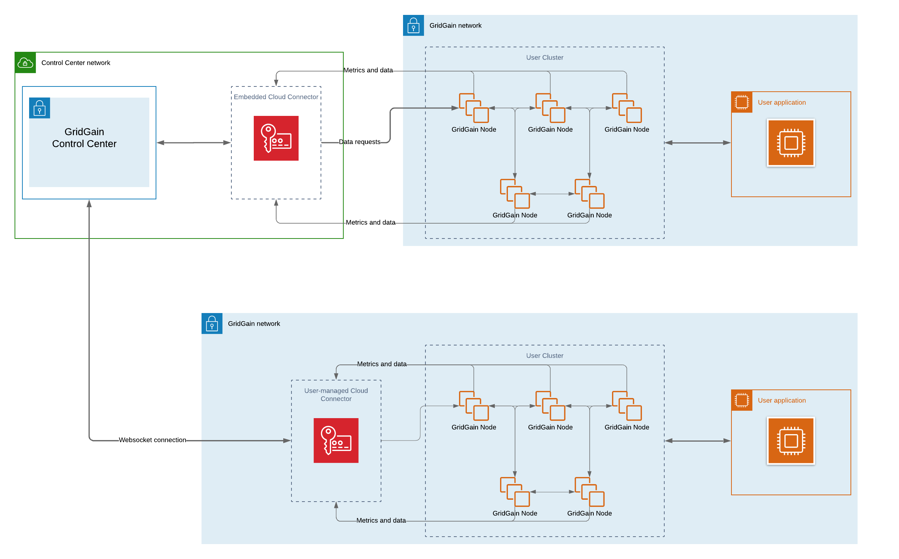

# Setting Up Cloud Connector with GridGain 9 and Control Center

Monitoring GridGain 9 clusters with Control Center typically requires exposing cluster ports to the internet, which can introduce security risks and complicate network configurations.

Cloud Connector resolves these issues by establishing a secure outbound connection from your network to Control Center, allowing clusters to remain within your private network while handling external communications securely.

The schema below displays the difference between connecting to GridGain 9 directly and by using Connector:



## Download and Install Cloud Connector

To start using cloud connector, [download](https://www.gridgain.com/media/control-center/gridgain-cloud-connector-2025.4.zip) it from the website and unpack the archive.

You can also use Docker image:

```bash
docker pull gridgain/cloud-connector:<version>
```

## Configure Cloud Connector

Once you have unpacked the archive, you need to configure the Cloud Connector to work with your cluster. Open the `application.properties` file and update the following mandatory properties:

- Set the `connector.cc-url` property to point to the Control Center URL.
- Enter your Control Center account credentials in the `connector.username` and `connector.password` fields.
- Specify a unique `connector.name` to identify your connector in Control Center.
- Specify a base URL that will be used to establish connection between the cluster and the connector in the `connector.base-url` property. This URL must be accessible from the monitored cluster nodes to allow cluster exporters to send metrics to Control Center.


If the `connector.base-url` property is modified, remember to [update](../dashboard/dashboard-overview-gg9.md) cluster configuration to reflect these changes.


- Here’s an example of what this part of the `application.properties` file could look like:

  ```properties
  connector.cc-url = http://localhost:3000
  connector.name = My Cloud Connector
  connector.base-url = http://localhost:3200
  connector.username = username
  connector.password = password
  ```

You can modify additional parameters such as SQL execution timeouts or monitoring intervals, or use their default values:

| Name | Docker Name | Description | Default value |
|---|---|---|---|
| connector.cc-url | CONNECTOR_CC_URL | Control Center Dashboard URL. | |
| connector.base-url | CONNECTOR_BASE_URL | Connector URL must be reachable from the monitored cluster nodes. | |
| connector.name | CONNECTOR_NAME | Connector name. | |
| connector.username | CONNECTOR_USERNAME | Your Control Center login. | |
| connector.password | CONNECTOR_PASSWORD | Your Control Center password. | |
| server.port | SERVER_PORT | Connector port. Must be accessible from the monitored cluster nodes. | 3200 |
| connector.cluster.monitoring.heartbeat-max-retry-attempt | CONNECTOR_CLUSTER_MONITORING_HEARTBEAT_MAX_RETRY_ATTEMPT | Max failed heartbeat attempts before cluster considered disconnected. Set to `0` by default, meaning any heartbeat failure disconnects the cluster. | 0 |
| connector.cluster.monitoring.heartbeat-interval | CONNECTOR_CLUSTER_MONITORING_HEARTBEAT_INTERVAL | The interval between the GG9 cluster heartbeats, in milliseconds. | 1000 |
| connector.cluster.monitoring.timeout | CONNECTOR_CLUSTER_MONITORING_TIMEOUT | The monitoring cycle timeout, in milliseconds. | 20000 |
| connector.cluster.monitoring.interval | CONNECTOR_CLUSTER_MONITORING_INTERVAL | The interval between monitoring cycles, in milliseconds. | 20000 |
| connector.sql.execute-timeout | CONNECTOR_SQL_EXECUTE_TIMEOUT | The timeout of SQL script execution, in hours. | 1 |
| connector.sql.query-timeout | CONNECTOR_SQL_QUERY_TIMEOUT | The timeout of SQL query execution, in hours. | 1 |
| connector.sql.fetch-timeout | CONNECTOR_SQL_FETCH_TIMEOUT | The timeout of cursor fetch execution, in minutes. | 10 |
| connector.sql.cursor-timeout | CONNECTOR_SQL_CURSOR_TIMEOUT | The cursor lifetime duration, in hours. If cursor in not fetched within this period, it is closed. | 1 |

## Start Cloud Connector

Once the connector is configured, you have two options to run it: using the provided script or in a Docker container. Choose the approach that best fits your setup and deployment needs.

### Running the Connector via Script

Open the command line and run the connector script from the extracted folder. The script will automatically load configuration from the `application.properties` file.



```bash
./connector.sh
```



```bash
connector.bat
```



### Running the Connector with RPM or DEB Package

To install the Cloud Connector via system package manager, use the following command:



```bash
sudo apt-get install gridgain-cloud-connector
```



```bash
sudo rpm -i gridgain-cloud-connector
```



Then [configure](#configure-cloud-connector) the connector by editing `/opt/gridgain-cloud-connector/application.properties` file.

Next, run the connector using `systemctl` or `service` command:

```bash
sudo systemctl start gridgain-cloud-connector
```

```bash
sudo service gridgain-cloud-connector start
```

## Attach the Cluster to Control Center

To start using the connector with Control Center and your cluster, refer to the documentation on attaching a [Gridgain 9](../../getting-started/connect/connect-gridgain9-cluster.md) or [Apache Ignite 3](../../getting-started/connect/connect-ignite-3-cluster.md#by-using-the-custom-connector) cluster.
