# Configuring Widgets for GridGain 9 Clusters

## Adding Widgets

To add a widget, select a tab in the Tab bar and click **Add widget**.

You can add widgets of the following types:

- **Gauge chart** - the selected metric as a gauge.
- **Nodes** — a table containing information about cluster nodes.
- **Metrics (single value)** - the current value of the selected metric.
- **Metrics (chart)** — the selected metric as a time series.
- **Metrics (table)** — multiple metrics in tabular form.
- **Heat map** — the selected metric as a heat map.
- **SQL query** - the results of an SQL query, updated at a specified frequency (`SELECT` only)
- **System view** - the selected system view table, updated at a specified frequency
- **DCR Topology** – shows a visual representation of a [data replication](../dcr/dcr.md) topology

## Widget Types

### Gauge Chart Widget

The **Gauge** widget displays the selected metric in a gauge from 0 to 100. You can view how close the value is to its expected maximum, for example, for CPU load.

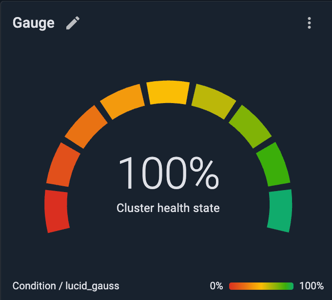

To add the **Gauge chart** widget:

1. Click **Add widget**.
2. From the list that opens, select **Gauge chart**.
3. Select a node and a metric in **Select metric** dialog.
4. Click **OK**.

### Nodes Widget

The **Nodes** widget is a table that contains information about cluster nodes. You can copy this data or export it to a CSV file.


Hidden columns will be copied and exported too.


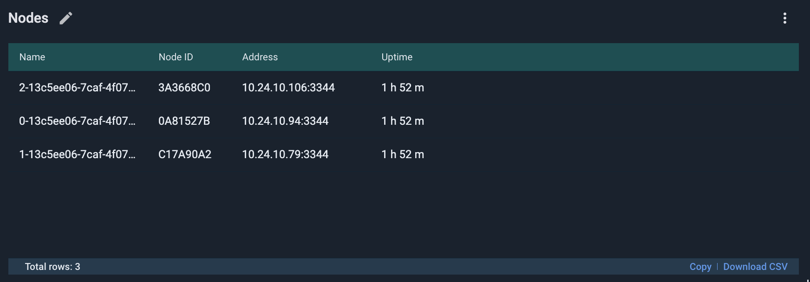

The following information is available in the **Nodes** widget:

| Column | Description |
|---|---|
| Name | The name of the node. |
| Node ID | The ID of the node. |
| Address | The `host:port` address of the node. |
| Uptime | The uptime of the node. |

To add the **Nodes** widget:

1. Click **Add widget**.
2. From the list that opens, select **Nodes**.

You can show or hide columns in the **Nodes** list:

1. Click the `⋮` icon at the end of the row and select **Table columns**.
2. In the list that opens, select or clear check boxes to show or hide columns.

### Metrics Widgets

There are three types of widgets: single value, chart, and table. A table and chart can display multiple metrics.

To add a widget to a tab:

1. Click **Add widget**.
2. From the list that opens, select **Metrics (chart)**, **Metrics (table)**, or **Single value**.

   The **Select metric** dialog opens.
3. If the widget type you chose is **Single value**, select a node and a metric.
4. If the widget type you chose is **Metrics (chart)** or **Metrics (table)**:
   1. On the **Basic view** tab of the dialog, select a metric.
   2. Optionally, to add multiple metrics to the chart or table, open the **Advanced view** tab and use the **Add metric** button for each new metric.

      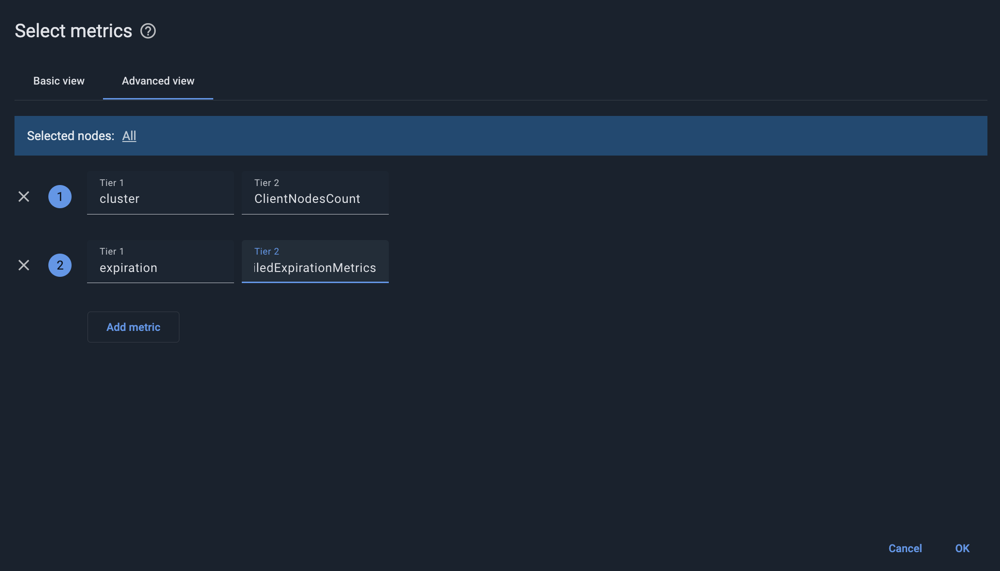
5. Click **OK**.

By default, the Metrics widgets are updated every 5 seconds.

#### Rate Metrics

GridGain 9 also provides monotonic rate metrics, which can be found among other metrics by using the `rate` keyword. These metrics report per-second changes rather than cumulative totals.

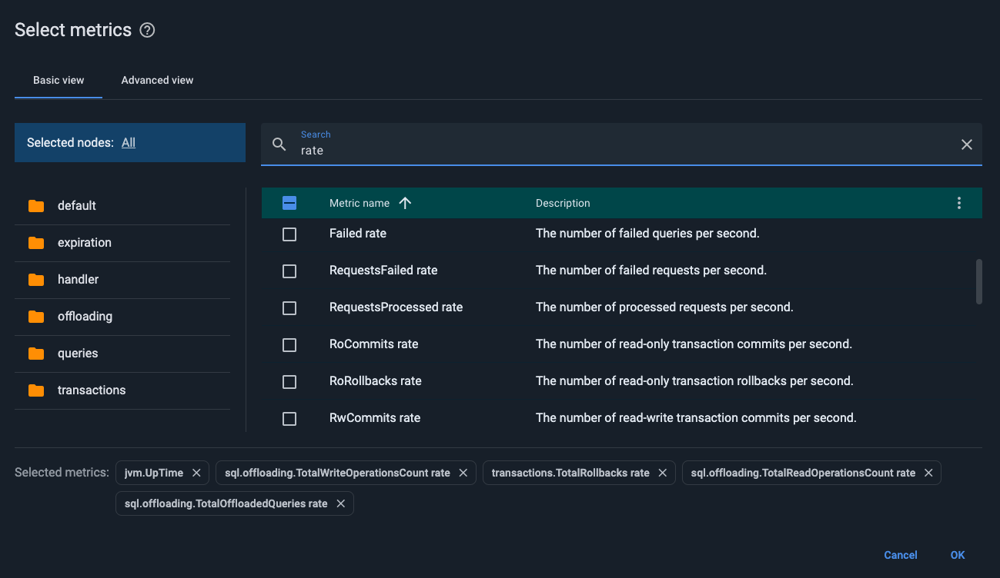

| Metric name | Description |
|---|---|
| client.handler.BytesReceived rate | The number of bytes received per second. |
| client.handler.BytesSent rate | The number of bytes sent per second. |
| client.handler.ConnectionsInitiated rate | The number of initiated connections per second. |
| client.handler.RequestsProcessed rate | The number of processed requests per second. |
| client.handler.RequestsFailed rate | The number of failed requests per second. |
| client.handler.SessionsAccepted rate | The number of accepted sessions per second. |
| client.handler.SessionsRejected rate | The number of rejected sessions per second. |
| client.handler.SessionsRejectedTls rate | The number of sessions rejected due to TLS handshake errors per second. |
| client.handler.SessionsRejectedTimeout rate | The number of sessions rejected due to timeout per second. |
| dcr.EntriesObserved rate | The number of entries received from the source cluster per second. |
| dcr.EntriesSent rate | The number of entries sent to receiver clusters per second. |
| expiration.TotalDeletedExpiredRowsCount rate | The number of deleted expired rows per second. |
| sql.queries.Canceled rate | The number of canceled queries per second. |
| sql.queries.ExceededMemoryQuota rate | The number of queries exceeding memory quota per second. |
| sql.queries.Failed rate | The number of failed queries per second. |
| sql.queries.Succeeded rate | The number of successful queries per second. |
| sql.queries.TimedOut rate | The number of queries that failed due to timeout per second. |
| sql.offloading.TotalOffloadedQueries rate | The number of queries spilled to disk per second. |
| sql.offloading.TotalBytesRead rate | The number of bytes read from disk by offloading per second. |
| sql.offloading.TotalBytesWritten rate | The number of bytes written to disk by offloading per second. |
| sql.offloading.TotalWriteOperationsCount rate | The number of write operations performed by offloading per second. |
| sql.offloading.TotalReadOperationsCount rate | The number of read operations performed by offloading per second. |
| tables.\*.\*.RwReads rate | The number of reads within read-write transactions per second. |
| tables.\*.\*.RoReads rate | The number of reads within read-only transactions per second. |
| tables.\*.\*.Writes rate | The number of write operations per second. |
| transactions.RwCommits rate | The number of read-write transaction commits per second. |
| transactions.RoCommits rate | The number of read-only transaction commits per second. |
| transactions.RwRollbacks rate | The number of read-write transaction rollbacks per second. |
| transactions.RoRollbacks rate | The number of read-only transaction rollbacks per second. |
| transactions.TotalCommits rate | The number of transaction commits per second. |
| transactions.TotalRollbacks rate | The number of transaction rollbacks per second. |

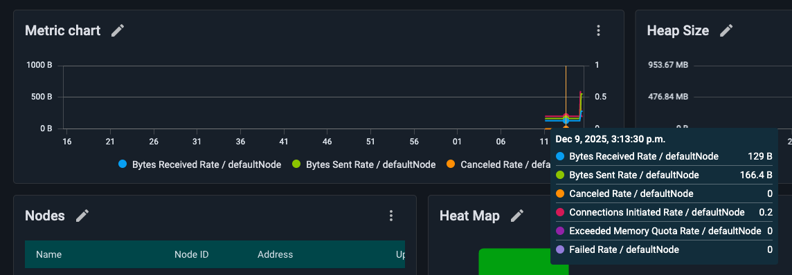

#### Metrics (single value)

The **Single value** widget displays the current value of the selected metric, such as the number of server nodes in the cluster, the query running time, etc.

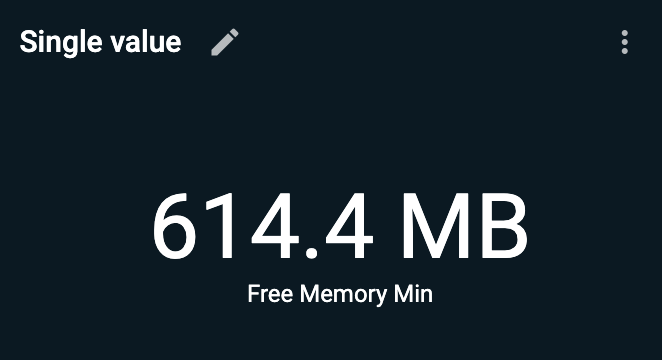

#### Metrics (chart)

The **Metrics (chart)** widget displays the specified numeric metric as a chart, at 5-second granularity. The data is displayed for the period that is selected in the Time Period control (located in the Tab bar).

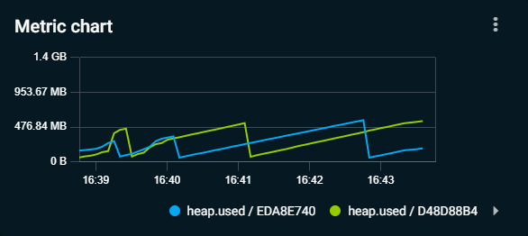

#### Metrics (table)

The **Metrics (table)** widget displays a table that details the last values of multiple metrics.

For node metrics, the first column of the table displays the names of the nodes. Other columns contain the values of the selected metrics. You can add as many metrics as you want.

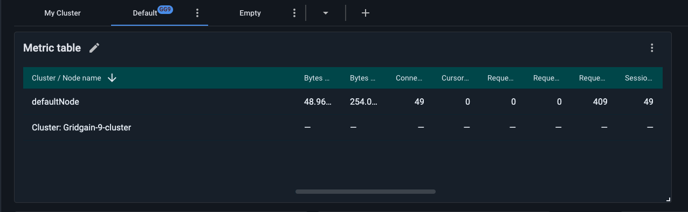

### Heat Map Widget

The **Heat map** widget displays a selected metric in temperature-related colors. Smaller values are displayed in a "colder" color, and larger values are displayed in a "hotter" color.

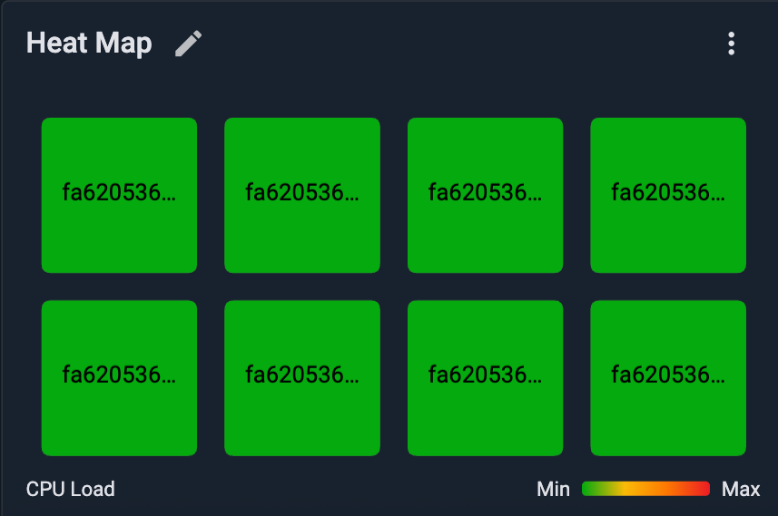

To add the **Heat map** widget:

1. Click **Add widget**.
2. From the list that opens, select **Heat map**.

   The **Select metric** dialog opens.
3. Select a metric to display.
4. Click **OK**.

### SQL Query Widget

The **SQL query** widget shows the results of the SQL query you define and updates these results at the specified frequency.


Only `SELECT` SQL expressions are allowed.


To add the widget:

1. From the **Add a widget** menu, select **SQL query**.

   The **Edit widget** dialog opens.

   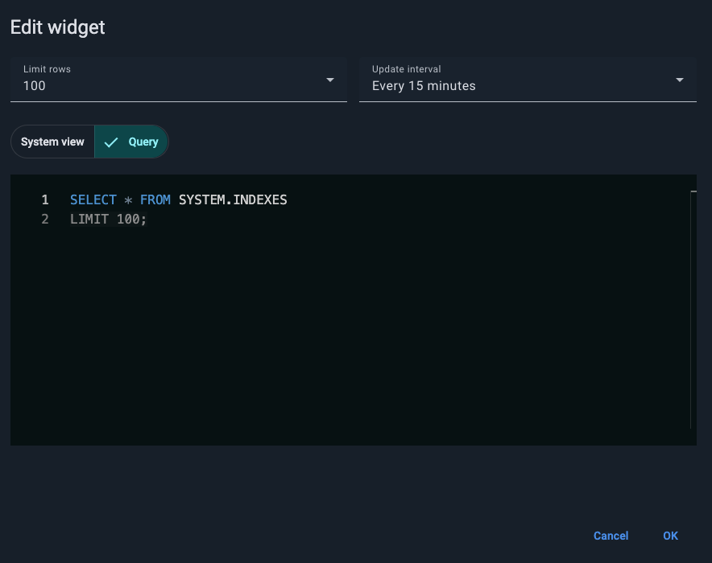
2. From the **Limit rows** drop-down list, select the maximum number of rows for the query to return.
3. From the **Update interval** drop-down list, select an interval for the query to run.
4. If you want your query to run on a system view table, on the **System view** tab, from the **System view table** drop-down list, select the required system view.

   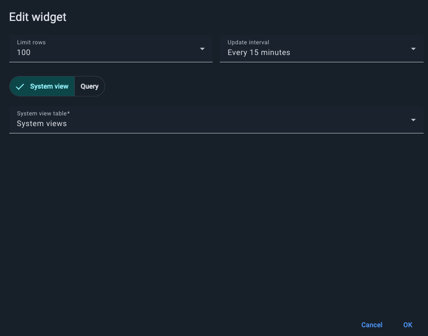
5. On the **Query** tab, enter the required SQL expression. Note that `FROM` and `LIMIT` values are automatically populated based on **Limit rows** and **System view table** if you defined them before.
6. Click **OK**.

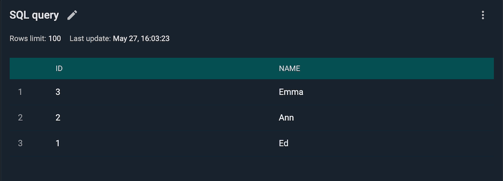

### System View Widget

This widget displays data from the selected *system view* and refreshes it at the specified interval. Any updates in the underlying table will appear in the widget.

To add the widget:

1. From the **Add a widget** menu, select **System view**.

   The **Edit widget** dialog opens to the **System view** tab.

   
2. From the **Limit rows** drop-down list, select the maximum number of rows to return.
3. From the **Update interval** drop-down list, select an interval for the query to run.
4. From the **System view table** drop-down list, select the required system view.
5. Click **OK**.

The widget displays as you have defined it and starts updating at the specified interval.

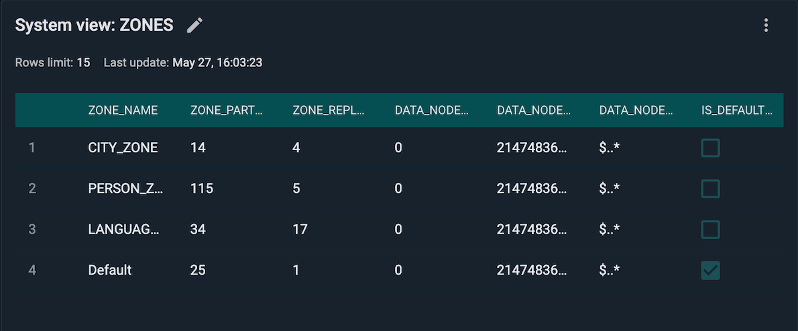

#### Compute System View

The [Compute system view](https://www.gridgain.com/docs/gridgain9/latest/administrators-guide/metrics/system-views#compute_tasks) lets you change the priority of a task or cancel it.

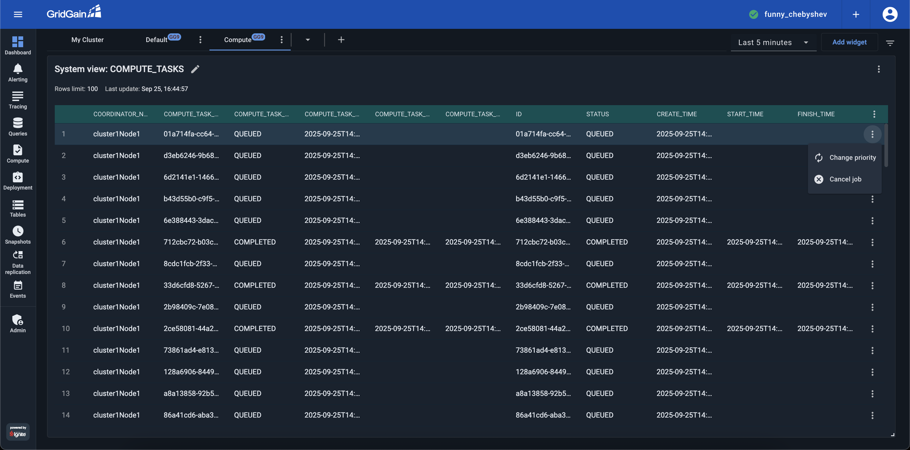

You can change the priority for tasks that are either in `SUBMITTED` or `QUEUED` status.

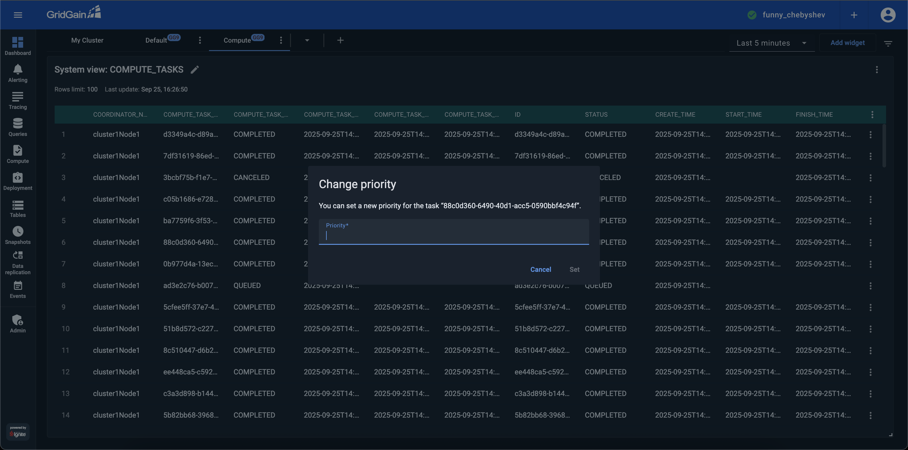

You can also cancel tasks that are in the `QUEUED` or `EXECUTING` status.

#### Transactions System View

Control Center supports terminating transactions on the cluster through the [Transactions](https://www.gridgain.com/docs/gridgain9/9.1.9/administrators-guide/metrics/system-views#transactions) *system view* widget.

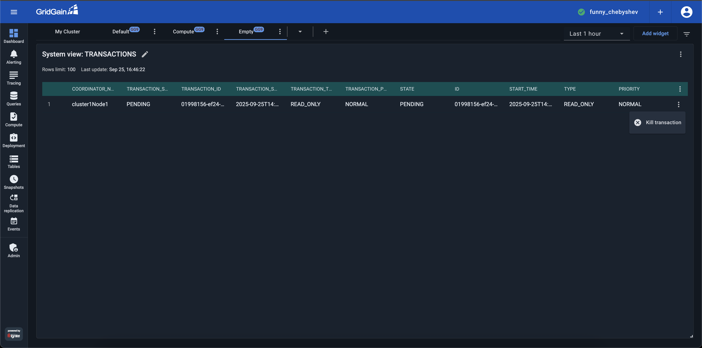

## Editing Widgets

### Changing Widget Name

To change the name of a widget:

1. Click the "pencil" icon in the widget's tile.
2. In the field that appears, edit the name as required.
3. Click the "check mark" icon.

### Editing Gauge and Heat Map Widgets

To edit a gauge or heat map widget:

1. Open the widget's context menu.

   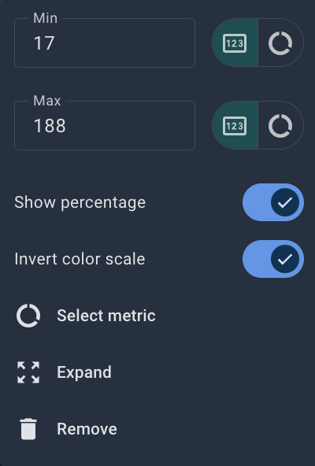
2. To change the static Min and/or Max value(s):
   1. Make sure the selector to the right of the **Min** and/or **Max** field(s) is on "value" (rather than "metric").
   2. Edit the value(s) in the **Min** and/or **Max** field(s).
3. To define the Min and/or Max value(s) dynamically, as the current value(s) of another metric(s):
   1. Switch the selector to the right of the **Min** and/or **Max** field(s) from "value" to "metric".
   2. In the **Select metric** dialog that opens, select the metric whose current value will serve as the Min or Max value of the metric the widget displays.
4. To show the current value of the metric in the widget (in addition to graphic/color representation), toggle on **Show percentage**.
5. To invert the color scheme (by default, red is for "high" and green is for "low"), toggle on **Invert color scheme**.
6. To select another metric to be displayed in the widget, select **Select metric**, then proceed as you would when adding a new widget.

### Editing SQL Query and System View Widgets

To edit the SQL Query or System View widget:

1. Open the widget's context menu.
2. Select **Table columns** to add or remove columns.
3. Toggle on or off **Show info** to show or hide the widget settings: the row number limit and the last update timestamp (on by default).
4. Toggle on or off **Show search** to show or hide the search bar across the top of the widget.
5. Select **Edit widget** to display the **Edit widget** dialog.

### Editing All Other Widgets

To edit all other widgets (except gauge and heat map):

1. Open the widget's context menu.

   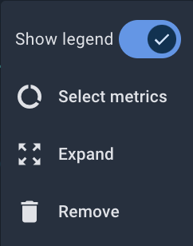
2. For Chart widgets, to show the widget's legend (included metrics and their colors), toggle on **Show legend**.
3. To select another metric(s) to be displayed in the widget, select **Select metric(s)**, then proceed as you would when adding a new widget.

## Expanding Widgets

To select a widget's display (normal vs expanded):

1. Open the widget's context menu.
2. To make the widget display in a separate window (in a larger size), select **Expand**.
3. To return to the initial "tile" display, select **Close**.

## Removing Widgets

To remove a widget from the dashboard:

1. Open the widget's context menu.
2. Select **Remove**.
