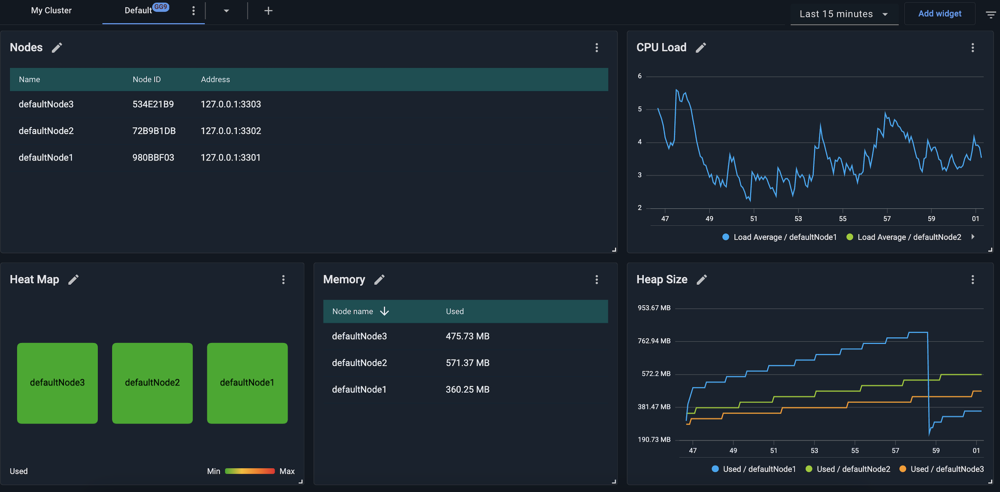
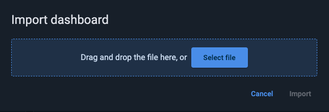
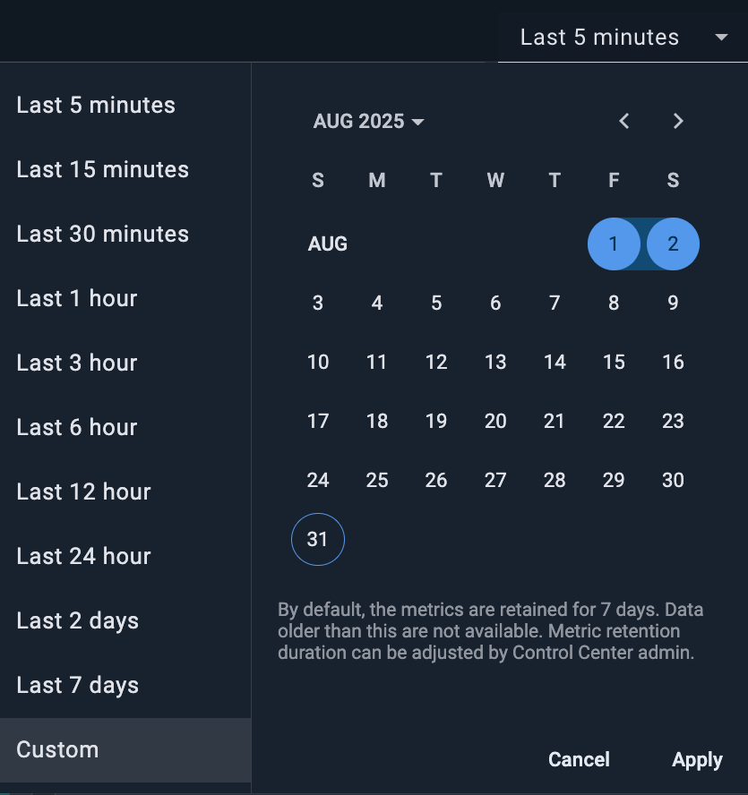
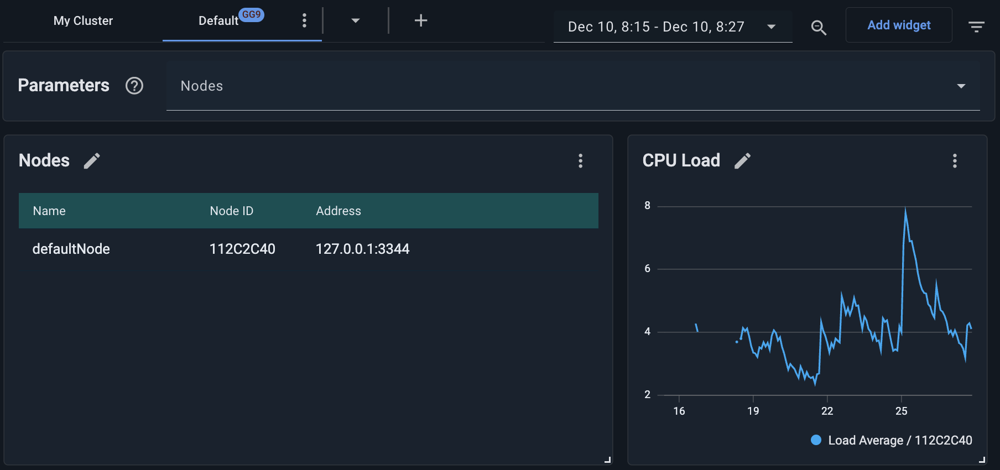

# Dashboard Overview for GridGain 9 Clusters

In addition to the [My Cluster tab](my-cluster.md), the **Dashboard** screen contains a default dashboard (the **Default** tab) that provides metrics for and essential information about the GridGain 9 cluster.


Metric monitoring works for clusters that run on GridGain 9.0.11 and more recent versions.


You can modify the contents and appearance of the **Default** dashboard, as well as add more dashboards (as new tabs on the screen).


Dashboards created for GridGain 9 clusters are different from the ones for GridGain 8 clusters. To denote the difference, a **GG9** badge appears next to the dashboard (tab) labels.


To be monitored, GridGain 9 clusters need to export metrics. The default cluster configuration does not include the required metric exporter. [Initializing your cluster via the Control Center UI](my-cluster.md#initializing-the-cluster) adds the necessary exporter automatically. If your cluster has been initialized via the CLI or REST API, you need to enable the metric exporter manually, by clicking the **Update configuration** button in any of the initially empty widgets.

In some environments, the way Control Center auto-configures the exporter may not work. To rectify that, use the [GridGain CLI](https://www.gridgain.com/docs/gridgain9/latest/ignite-cli-tool) to modify the cluster configuration as follows:

```bash
cluster config update "ignite.metrics.exporters=[
    {
        compression=none
        endpoint="{control_center_address}/api"
        exporterName=otlp
        headers=[]
        name="cc_exporter"
        period=5000
        protocol="http/protobuf"
    }
]"
```

In the `endpoint` field, enter the Control Center address reachable from the cluster nodes and append "/api". For example, `http://cc.host:3000/api`.

You can adjust the `period` value; it should be less than or equal to `control.metric-collector.pull-interval` defined in the [Control Center configuration](../../admin-guide/configuration.md#common-properties).

## Viewing the Default Tab

The **Default** tab contains several *widgets*. A widget is a UI element that provides a visual representation of a set of metrics or provides information about the state of the cluster.

On **Default**, you can add any number of widgets.



The **Default** tab includes the following elements:

- **Tab bar** — for arranging widgets into tabs. Initially, there are two tabs - "My Cluster" and "Default". You can add tabs and reorganize the size and location of any widget.
- **Time period** control — for selecting the time period for charts.
- **Add widget** button — for [adding a widget](configuring-widgets-gg9.md).

## Adding Tabs

To add a tab, click the `➕` icon located in the tab bar and select to create an empty dashboard, create a dashboard based on a template, or import a dashboard. The `⋮` menu of each tab enables you to rename, clone, or remove the tab.

## Dashboard Templates

Dashboard templates are a quick way to create a dashboard with predefined widgets. For GridGain 9 clusters, Control Center provides the following templates:

- **Default**: The default dashboard for monitoring cluster status. Has the following widgets: `Nodes`, `Heat Map`, `Memory`, `Cpu Load`, `Heap Size widgets`.
- **Empty**: This dashboard is an empty container where you can add a custom combination of widgets.

### Saving Dashboard as Template

You can save your current dashboard as a template by clicking ⋮ and selecting **Save as Template**. In the subsequent dialog, specify the template name.

### Exporting and Importing Dashboards

You can export the current dashboard's definition (including widgets, layout, etc.) as a JSON file. You can then import this JSON file into another environment and have the dashboard whose definition it contains added to your UI, with no need for additional configurations.


Widgets and settings in an exported dashboards may not fit the environment into which you import that dashboard. For example, the exported dashboard might contain a widget linked to a metric not defined in the target environment. Another example is exported widgets explicitly addressing specific node IDs, cache names, etc., while the corresponding nodes and caches are ID'd or named differently in the target environment. In such cases, the imported dashboard will not function as required. You need to test the imported dashboard and resolve the issues the testing reveals, if any.


#### Exporting

To export the current dashboard's definition as a JSON file, in the current dashboard's tab, select **Export dashboard** form the context menu.

The file named `Dashboard - <Dashboard_Name>.json` is saved to your local `Downloads` folder.

#### Importing

To import a dashboard definition from the previously exported JSON file:

1. Click the **+** icon ou your **Dashboard** toolbar.
2. From the menu that opens, select **Import**.

   The **Import dashboard** dialog opens.

   
3. Drag and drop, or browse for, the required file.
4. Click **Import**.

   The selected file is imported. The dashboard it defines is shown as the current dashboard in your UI.

### Relative to the Current Time

To select a period relative to the current date/time:

1. In the left-hand section of the picker, select the required option; e.g., `Last 1 hour`, `Last 2 days`, etc.
2. Click **Apply**.

### Absolute (Custom)

To define a period in absolute terms:



1. In the left-hand section of the picker, select the `Custom` option.
2. In the right-hand (calendar) section of the picker, select the first and last dates of the period.
3. Click **Apply**.

## Interactive Zooming for Charts

To interactively zoom into the details of a chart:

1. Click your mouse within the chart at the "start" moment of the period you want to zoom into.
2. Drag the cursor to the "end" moment of the period you want to zoom into.

   All charts on the current dashboard are redrawn to show only the period you have defined (rather than the default period or the one specified previously with the time picker - see Changing the Time Period for Charts). The chart scale automatically adjusts to the chart segment in the selected zoom.
3. Repeat steps (1) and (2) as needed.
4. To return to the initial zoom and scale, click the **Zoom out** button in the right-hand part of the dashboard toolbar.

## Parameter-Based Filtering for Widgets

You can use dashboard parameters to filter the data shown in widgets. Three types of filters are available:

- **Nodes** – Filters the display to selected node(s). Widgets still collect metrics according to their configuration (e.g., all nodes), but only show data for the selected ones.
- **Tables** – Filters all replications containing the selected table(s) and display the associated nodes if [Data Center Replication](../dcr/dcr.md) is configured and at least one replication is running.
- **Replications** – Filters by replication name to displays metrics for the topology nodes linked to this replication.

Each widget collects metrics according to its configuration. This does not change when you apply node filtering. What does change is what the widget shows in the UI. For example, if a widget is configured to collect a metric for all nodes in the cluster, and the selected parameter filters the widget to node A, the widget will keep collecting that metric for all nodes, but it will display the data only for node A.


If a widget is configured for a specific node (e.g., node A), and a different node (e.g., node B) is selected via the filter, the widget will show no data. To avoid this, reconfigure your widget and replace `node A` with `all nodes`.


### Applying Filters

1. Click the filter icon next to the **Add widget** button to open the **Parameters** panel.

   The panel appears at the top of the dashboard.

   
2. Use the drop-down menus to select:
   - One or more **Nodes**
   - One or more **Tables**
   - One or more **Replications** (if DCR is configured)
3. To reset all selections, click **Clear**.

All selected filters apply globally to all widgets on the dashboard.

## Next Steps

- [Add a widget](configuring-widgets-gg9.md)
