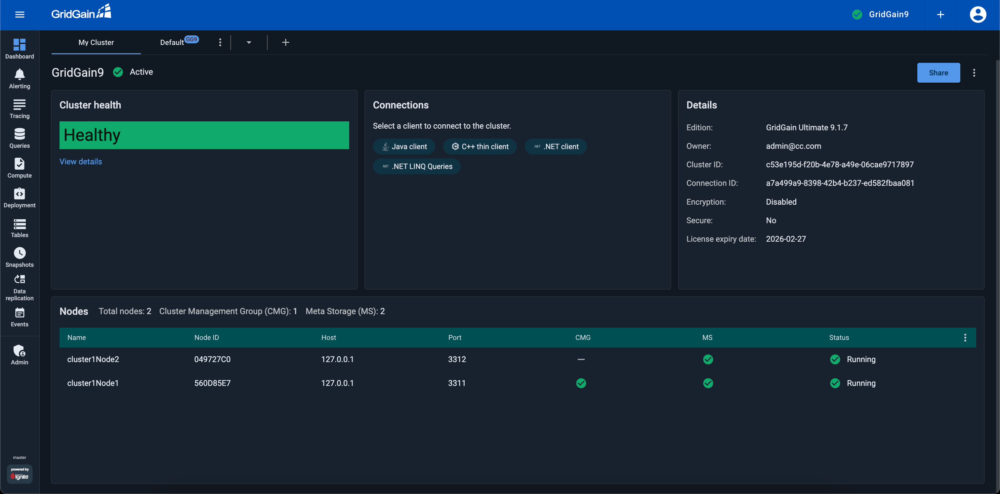
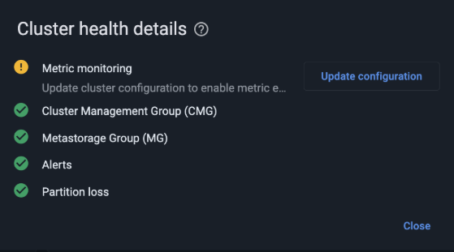
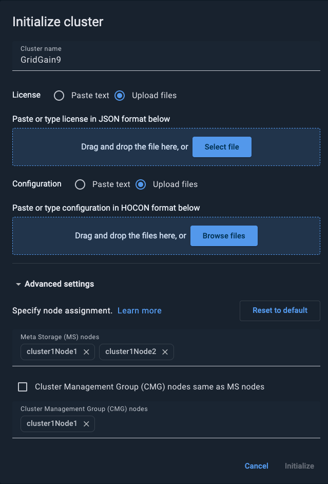
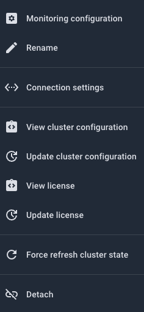
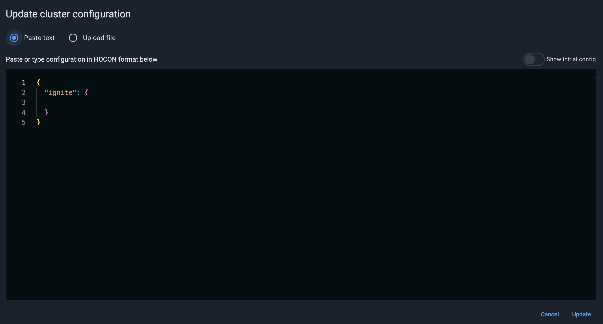
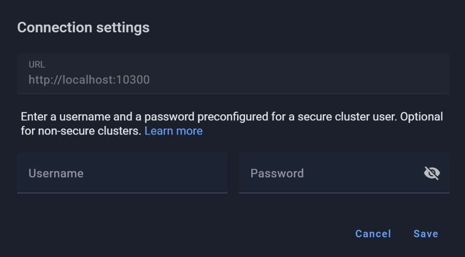
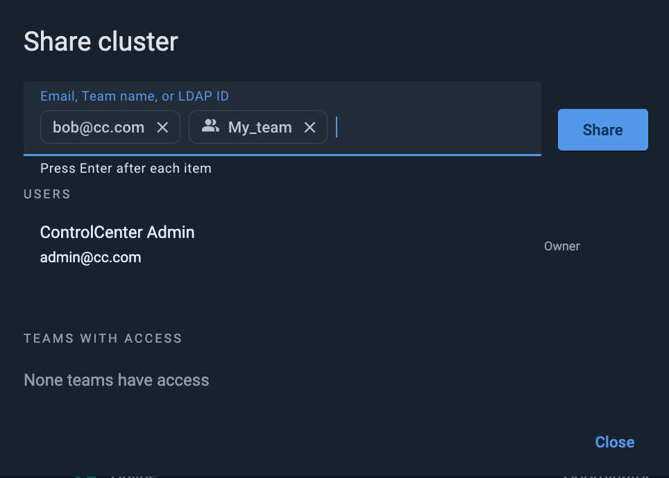
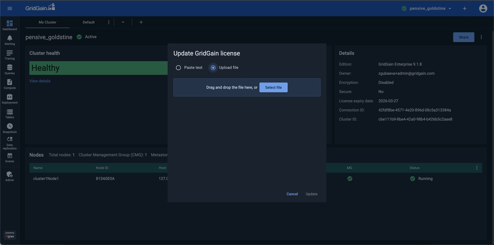

# My Cluster Tab

**My cluster** opens as the first tab of the **Dashboard** screen when you select **Dashboard** from the navigation menu. It displays numeric and tabular information for the "current" cluster (selected in the cluster selector tool on the main toolbar).




Depending on configuration, [secured clusters](../auth/authorization-permissions.md) might require a cluster-level authentication for some (or all) of the actions.


## Viewing Cluster Information

Use the widgets to view the relevant cluster information:

| Widget | Description |
|---|---|
| Cluster Health | The cluster status:<br>- `Warnings` - at least one of the alerts for the cluster has been triggered<br>- `Errors` - partition loss<br>- `Healthy` - neither warnings nor errors are observed |
| Connections | A set of chips for adding connections. |
| Details | A table of the cluster details, including `Type`, `ID`, `Owner`, etc. |
| Nodes | A list of cluster's nodes. |

### Viewing Cluster Health Details

To view details of the cluster health (status), in the **Cluster Health** widget, click the **View Details** link. The **Cluster Health Details** dialog shows what specific problems, if any, are observed in the cluster.



The following health checks are available:

| Check | Condition | Description |
|---|---|---|
| Alerts | WARNING | One or more configured alerts have been triggered. Each active alert appears as a separate entry showing the alert's own message. |
| Metric monitoring | WARNING | Metric monitoring is not enabled for this cluster. Update the cluster configuration to enable the metric exporter. |
| Cluster Management Group (CMG) | WARNING | One or more CMG nodes are offline. The message lists the affected node IDs. |
| Metastorage Group (MG) | WARNING | One or more Metastorage nodes are offline. The message lists the affected node IDs. |
| Partition loss | WARNING / Errors | One or more partitions are in a degraded, read-only, or unavailable state. The message lists the affected zones and partition counts. |

You can also retrieve cluster health information via the [REST API](../../admin-guide/rest-api.md).

### Viewing Cluster Nodes

The cluster nodes are shown in the **Nodes** widget at the bottom of the screen.

To auto-size a specific column or all columns in the table, select the corresponding option from the column's context menu.

To add columns to the table or remove them from the table, select the **Table Columns** option from the table's context menu, then select or clear check boxes for the columns on the list that opens.

For GridGain 9 clusters, the **Nodes** widget displays the following columns:

| Column | Description |
|---|---|
| Name | The node name. |
| Node ID | The ID of the node. |
| Host | The cluster host IP address. |
| Port | The cluster host port. |
| CMG | Whether the node is included in [Cluster Management Group](https://www.gridgain.com/docs/gridgain9/latest/administrators-guide/lifecycle#cluster-management-group). |
| MS | Whether the node is included in the [Metastorage Group](https://www.gridgain.com/docs/gridgain9/latest/administrators-guide/lifecycle#cluster-metastorage-group). |
| HTTP, HTTPS ports | The ports the node exposes. |
| Status | `Running` or `Validating` - see [explanation](https://www.gridgain.com/docs/gridgain9/latest/administrators-guide/lifecycle#cluster-initialization). |

## Renaming the Cluster

The cluster name is a human-readable label used in Control Center to identify the cluster. Changing it does not affect cluster operation in any way.

To rename the cluster, select **Rename** from the context menu in the top right corner of the **My Cluster** screen.

## Adding Connections

To [add](connect.md) a connection to the cluster, in the **Connections** widget:

1. Click the required client/protocol chip.
2. Proceed to [define](https://www.gridgain.com/docs/gridgain9/latest/developers-guide/clients/overview#client-connection) the new connection.

## Initializing the Cluster


You initialize GridGain 9 clusters.


To [initialize](https://www.gridgain.com/docs/gridgain9/latest/installation/installing-using-zip#initializing-the-cluster) the attached GridGain 9 cluster:

1. Click **Initialize** in the top right corner.

   The **Initialize cluster** dialog opens.

   
2. Add configuration and license file(s) using the **Browse** button or by dragging and dropping.
3. Optionally:
   1. Expand the **Advanced settings** section.
   2. Clear the **Cluster Management Group (CMG) nodes same as MS nodes** check box.
   3. Manually assign MS and CMG nodes.
   4. To reset the MS and CMG nodes to default configurations, click **Reset to default**.
4. Click **Initialize**.

The dialog closes. Once the initialization process is completed, the cluster status in the **My Cluster** screen changes to `Active`.

## Cluster Configuration

### View Configuration

To view cluster configuration, click the ⋮ in the right corner of **My Cluster** tab and then choose **View cluster configuration** option from the menu.



### Update Configuration

To change cluster configuration, click the ⋮ in the right corner of **My Cluster** tab and then choose **Update cluster configuration** option from the menu.

You can define configuration in the build-it editor or upload as a file.



## Monitoring Configuration

To enable [Running Queries](../queries/querying-gg9.md#running-queries) monitoring, select 'Running queries' option in the same dialog

To enable [Events](../events/events.md) monitoring, select 'Events' option in the same dialog

To enable the metric exporter for attached clusters, select option 'Metrics'.

```bash
cluster config update "ignite.metrics.exporters=[
    {
        compression=none
        endpoint="{connector_address}"
        exporterName=otlp
        headers=[]
        name="cc_exporter"
        period=5000
        protocol="http/protobuf"
    }
]"
```

- If you are using a custom connector for metrics, then in the `endpoint` field, enter the connector address that is reachable from the cluster nodes. Its value should match `cc.base-url` as documented in the Cloud Connector [section](../cloud-connector/connect-cloud-connector.md#configure-cloud-connector).
- If you prefer to use the embedded connector, then set the `endpoint` to the Control Center portal address.

## Updating Cluster Connection Settings

If you have [attached](../../getting-started/connect/connect-gridgain9-cluster.md) and initialized a GridGain 9 cluster when it was not secure (did not require cluster-level user authentication), AND this cluster became secure afterwards, you need to update the cluster connection settings to support authentication.

To update the cluster connection settings:

1. From the context menu in the top right corner, select **Connection settings**.

   
2. In the dialog that opens, enter **Username** and **Password**.
3. Click **Save**.

## Refreshing Cluster Metadata

Control Center collects cluster metadata including dashboard state, metrics, events, query logs, and connection health. If the displayed cluster information appears stale or inconsistent, you can clear it using the **Force refresh cluster state** option.


The cluster itself is not affected. Monitoring data repopulates automatically on the next monitoring cycle; charts and logs may briefly show gaps after the refresh.


To force-refresh the cluster state:

1. Click the ⋮ in the top right corner of the **My Cluster** tab.
2. Select **Force refresh cluster state**.
3. In the confirmation dialog, click **Confirm**.

## Sharing Clusters

You can have access to a cluster as:

- *User* - a regular user who can view the cluster that had been shared with them individually or via a team, as well as utilize the actions that appear in the cluster's context menu.
- *Owner* - the user who had created or attached the cluster. Owners have extended cluster access rights, including sharing the cluster with teams or users, suspension, removal, etc.

As a cluster owner, you can share that cluster with individual users and/or teams.


To [create and manage teams](../../profile/teams.md) on the **Teams** screen, select **Team management** from the menu on the top toolbar.


### Sharing with Users and Teams

To share the current cluster, click **Share** above the **Details** widget. The **Share cluster** dialog opens.



The dialog lists users and teams that already have access to the cluster.

In the entry field across the top of the **Share cluster** dialog, start typing a GridGain Control Center user's email, an LDAP ID, or a team name. As you type, the incremental search mechanism displays suggestions in a drop-down list. Select one of the suggested users or teams. Alternatively, type the identifier to the end, then click \[Enter]. You can add multiple users and/or teams in a single operation. When done, click **Share**.

The users and teams you have entered appear in the corresponding sections of the **Share cluster** dialog. The system notifies the users and team members that a cluster had been shared with them. To close the **Share cluster** dialog, click **Close**.


Depending on configuration, [secured clusters](../auth/authorization-permissions.md) might require a cluster-level authentication for some (or all) of the actions even from those users with whom the cluster had been shared.


### Stopping a Cluster Share

As a cluster owner, you can stop sharing your cluster with a team or with an individual user (remove access to the cluster that had been previously granted to that team or user).

To stop sharing a cluster with team(s) and/or user(s), click **Share** above the **Details** widget.

In the **Share cluster** dialog that opens, select **Stop sharing** from the context menu by the required team or user name. In the confirmation dialog, click **Stop sharing**.

## Viewing Graphic Dashboards

To view the default graphic [dashboard](dashboard-overview-gg9.md) for the current cluster, click the **Default** next to the **My cluster** tab in the top left corner of the screen.

## Switching Between Clusters

If multiple clusters are registered in GridGain Control Center, you can switch between clusters by using the **Select cluster** control on the top toolbar.


To view a [list of available clusters](../../cluster-management.md) on the **Cluster management** screen, select **Cluster management** from the menu on the top toolbar.


## Adding Clusters

To add a cluster, click **+** on the top toolbar. From the menu that opens, select an option:

- **Attach cluster** - proceed to [cluster attachment instructions](../../getting-started/connect/connect-gridgain9-cluster.md)

## Updating License

You can update GridGain 9 license via **My Cluster** [tab](my-cluster.md). Click the context menu and select **Update license** action.

License can be updated either by uploading the file or by pasting it as a text.



## Next Steps

- [Monitoring](dashboard-overview-gg9.md)
- [Querying](../queries/querying-gg9.md)
