# Data and Schema Import

The **Data and Schema Import** feature lets you migrate database schemas and data from external JDBC-compatible databases (PostgreSQL, MySQL, and others) or Apache Iceberg into a GridGain 9 cluster. It generates `DDL` statements for table creation and `COPY` statements for data migration.

You can open **Import Schema**/**Import Data** from:

- The **Import Schemas** menu [option](#managing-imported-schemas), accessible via the user profile menu.
- The **Queries** [screen](../queries/querying-gg9.md) — via the **Import Schema**/**Import Data** action button.

The import process consists of up to six steps:

1. [Connection](#connection)
2. [Schemas & Tables](#schemas--tables)
3. [Table Settings](#table-settings)
4. [Column Settings](#column-settings)
5. [Data Import](#data-import)
6. [Overview](#script-overview)


You can open **Data Import** directly from the **Queries** screen without going through the schema setup steps. Do this when the target tables already exist in GridGain cluster and you only need to load or reload data.


## Connection

Configure how Control Center connects to the source database.

### Control Center Connector

Select the **Control Center Connector** through which the connection to the cluster will be established. The connector must have network access to the source database.

### Connection Type

Choose the type of source system:

- **JDBC** — for relational databases such as PostgreSQL, MySQL, MariaDB, and other JDBC-compatible databases.
- **Apache Iceberg** — for Iceberg tables accessed via a REST or JDBC catalog.

### JDBC Connection

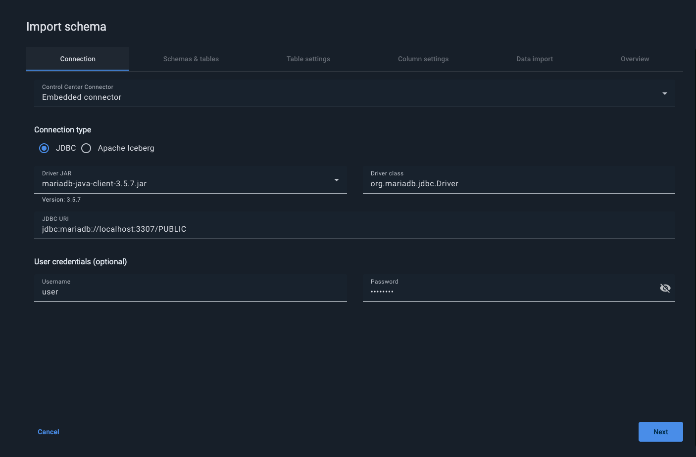

When **JDBC** is selected, provide the following:

| Field | Description |
|---|---|
| Driver JAR | Select a preloaded driver JAR from the list, or upload a custom one. |
| Driver class | The JDBC driver class name. Populated automatically when a known driver is selected. |
| JDBC URL | The JDBC connection string for the source database (for example, `jdbc:mysql://localhost:3307`). |
| Username / Password | Optional credentials for the source database. Passwords are never stored by Control Center. |


Preloaded JDBC drivers are provided for MariaDB, MySQL and PostgreSQL. When using a custom driver, ensure the `connector.schema-import.jdbc-drivers` configuration property points to the directory containing the JAR file.


Click **Test Connection** to verify that the connection settings are correct before proceeding.

If the connection test fails, an error is shown in the right-side **Summary** panel. Review the JDBC URL, credentials, and network accessibility of the source database.

### Apache Iceberg Connection

When **Apache Iceberg** is selected, choose the catalog type:

- **JDBC** — connect via a JDBC-backed Iceberg catalog.
- **REST** — connect via an Iceberg REST catalog endpoint.

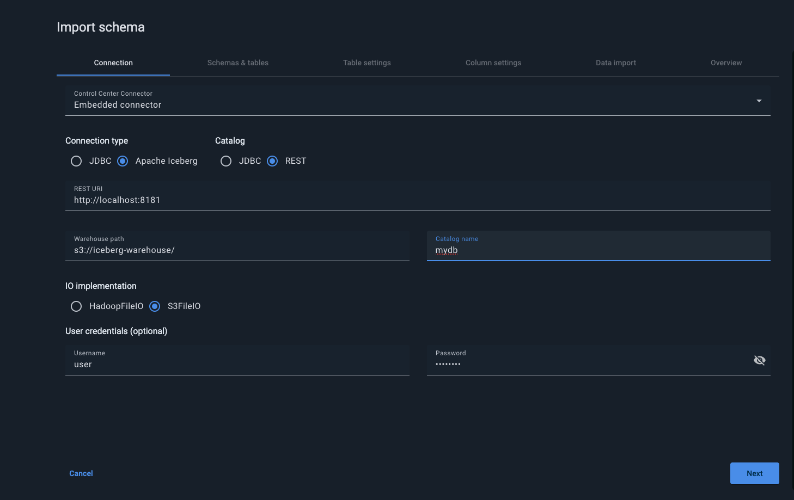

For REST catalogs, provide the following:

| Field | Description |
|---|---|
| REST URL | The base URL of the Iceberg REST catalog (for example, `http://localhost:8181`). |
| Warehouse path | Path to the Iceberg warehouse (for example, `s3://iceberg.warehouse`). |
| Catalog name | The name of the catalog to connect to. |
| ID implementation | The FileIO implementation to use: **HadoopFileIO** or **S3FileIO**. |
| Username / Password | Optional credentials. Passwords are never stored. |

Click **Test Connection** to verify the Iceberg catalog is reachable before proceeding.

## Schemas & Tables

After a successful connection, Control Center lists all schemas and tables available in the source database.

1. In the **Configuration name** field, enter a name for this import configuration. The name is used to save your progress and identify this import job.
2. Expand schemas in the tree and select the tables you want to import. Use **Select all** to select everything, or expand individual schemas to pick specific tables.


At least one schema and one table must be selected to proceed.


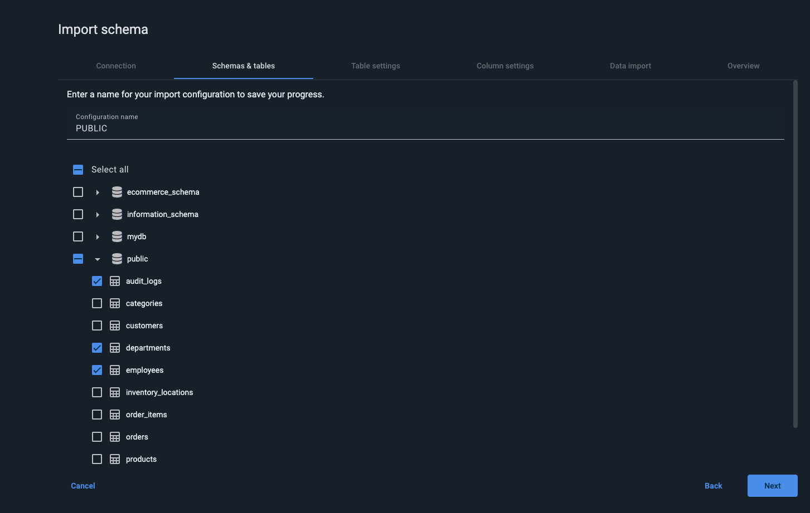

The imported schema will be loaded into one of the existing GridGain 9 clusters.

## Table Settings

Configure GridGain-specific storage settings for each selected table, choose the target cluster, and define how to handle naming conflicts.

### Target Cluster

Select the GridGain 9 cluster into which the schema will be imported. Only clusters in an active state are available. If no active cluster is available, click **Save and Close** to save your configuration and resume the import when a cluster becomes available.

### Conflict Resolution

If a schema with the same name already exists in the target cluster, select how to proceed:

- **Merge with existing schema** is set by default. When selected, the imported tables are added to the existing schema. Existing tables and data are not affected.

  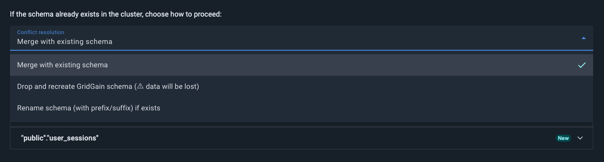
- When **Rename schema** is selected, the imported schema is renamed by adding a configurable prefix and/or suffix, avoiding any conflict with the existing schema.

  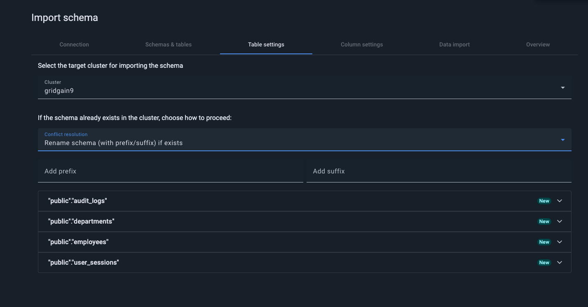
- When **Drop and recreate** is selected, note that **all existing data will be lost**:

  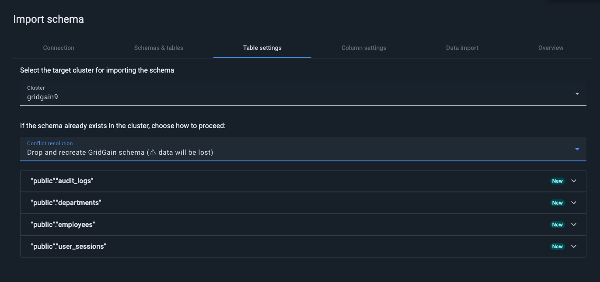

### Per-Table Storage Configuration

Expand any table row to configure GridGain-specific storage parameters for that table:

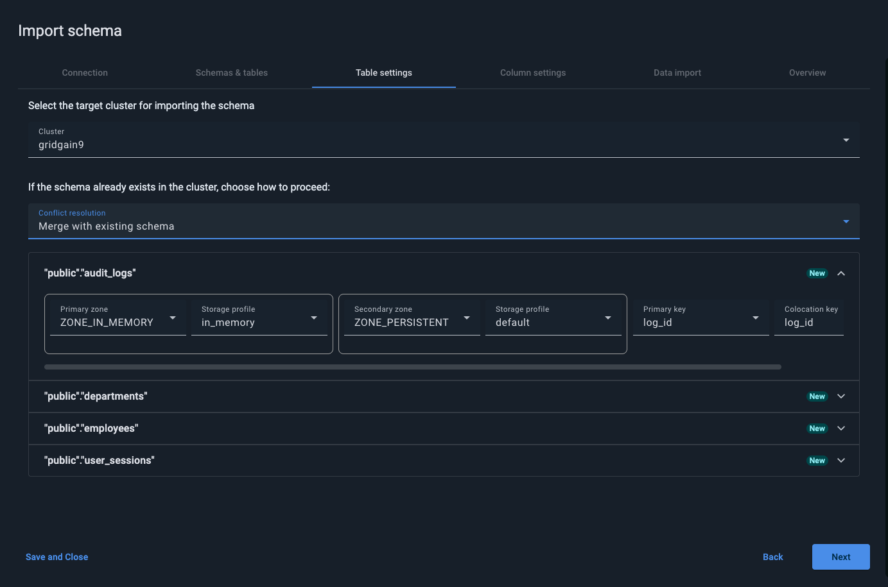

| Parameter | Description |
|---|---|
| Primary zone | The main distribution zone for the table. Defines how data partitions are distributed across cluster nodes. |
| Secondary zone | An optional backup zone for high availability. |
| Storage profile | Defines the storage type and performance characteristics (for example, in-memory or persistent). |
| Primary key | The column(s) used as the primary key in GridGain 9. |
| Colocation key | The column(s) used to group related records on the same nodes, enabling efficient distributed joins. |

Tables with configuration issues are highlighted. The **Summary** panel on the right shows the total number of fields with problems. Resolve all required issues before proceeding.


You can leave zone, storage profile, and key fields empty to use cluster defaults. This is useful when you want to import the schema quickly and tune storage settings later.


## Column Settings

Review and adjust the mapping of source columns to GridGain column definitions.

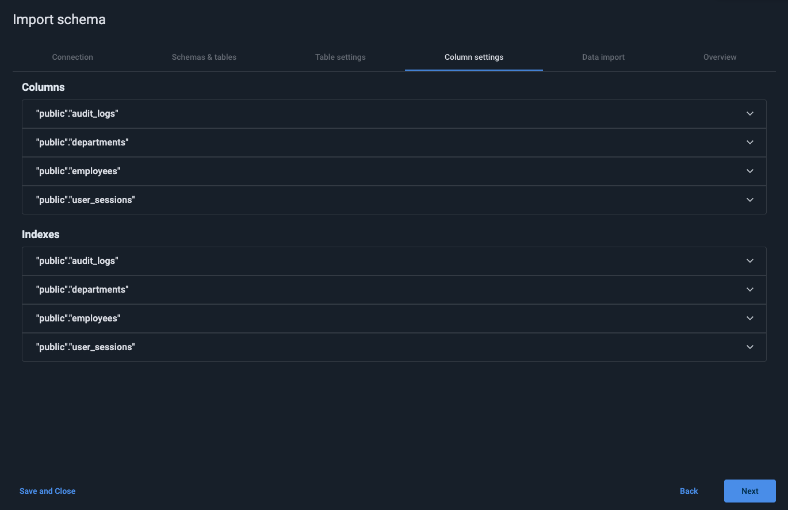

Each table can be expanded to inspect its columns. For each column you can modify:

| Field | Description |
|---|---|
| Target data type | The GridGain SQL data type for the column. Control Center maps source types to GridGain types automatically using default rules. Types that cannot be mapped automatically are highlighted in red and must be set manually before proceeding. |
| Default value | An optional default value for the column in GridGain. |
| Nullable | Whether the column accepts `NULL` values. |

Columns with unmapped or incompatible types are highlighted in red and require manual resolution before you can advance to the next step.

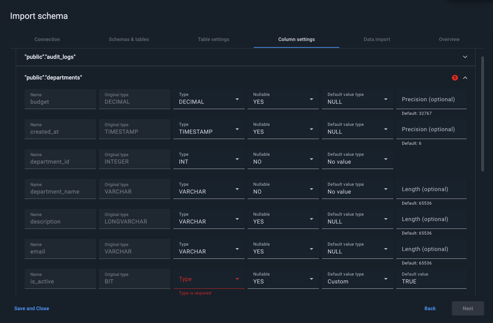

Each table can also be expanded to review its indexes. For each index you can:

- Change the index **Type** — switch between `SORT` and `HASH`.
- Reorder index columns.

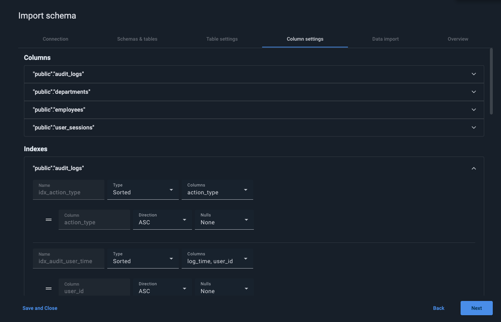

## Data Import

This step is shown when **Import data after schema is created** is enabled on the [Connection](#connection) step. When the toggle is on, `COPY INTO` statements are generated and included in the script alongside the `DDL` for execution in the final step.

Configure the data import parameters for each table:

- Select the **Import from** format: CSV, Parquet, or Apache Iceberg. When Apache Iceberg is selected, only REST and Glue catalog types are supported.
- Then select the **Source type**: choose File for a local or mounted path. Choose AWS S3 for a cloud bucket and make sure your warehouse path and credentials are configured.
- Set the **Source path**: enter the full path to your file. For S3, use the warehouse path format (e.g. `s3://bucket/path/`).

  
  An incorrect path will result in an empty import with no error.
  
- Select the target table.
- Select columns to import.

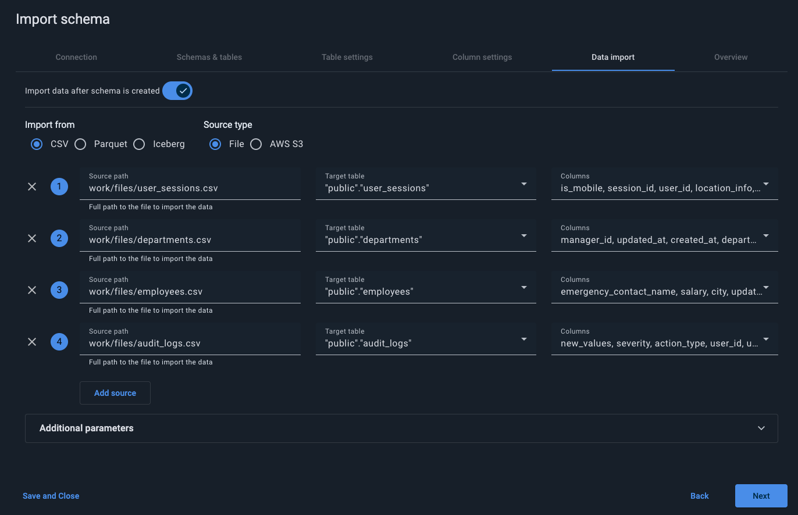

You can also configure additional parameters if your files use non-standard formatting — such as a custom delimiter, a non-default quote character, or custom null values.

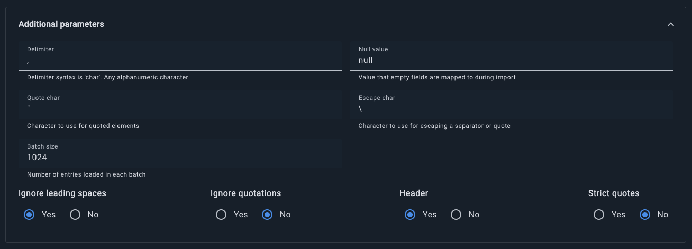

## Script Overview

This tab displays the generated scripts to review and edit before execution.

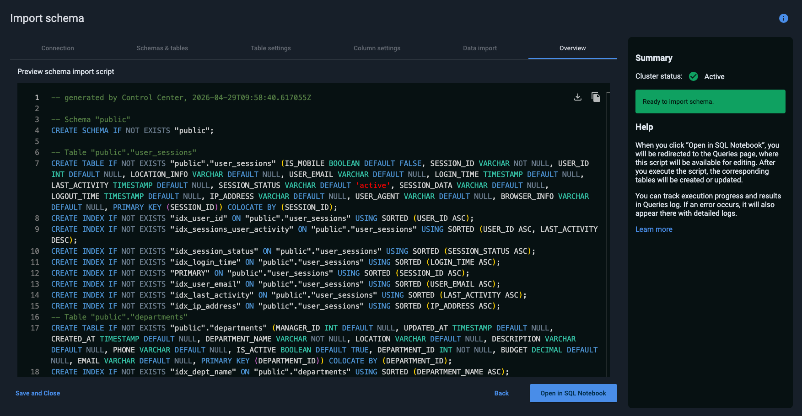

From this step you can:

- **Copy** the script to the clipboard.
- **Download** the script as an `.sql` file for use in future deployments or manual execution.
- Open the script in **SQL Notebook**: Control Center redirects you to the **Queries** [screen](../queries/querying-gg9.md), where this script will be available for editing. After you execute the script, the corresponding tables will be created or updated.

You can track execution progress and results in the **Queries log** [tab](../queries/querying-gg9.md#queries-log). If an error occurs, it will also appear there with detailed logs.

## Managing Imported Schemas

To view and manage all saved import configurations, choose the **Import Schemas** menu option in the user profile menu.

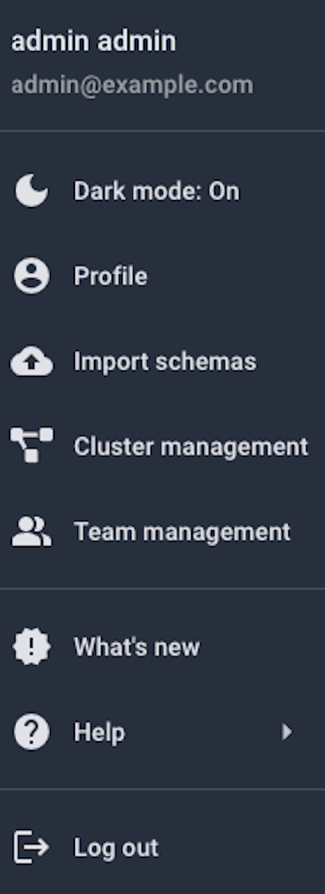

The screen lists all saved configurations with their name, connection type, dialect, target cluster, and last run date. You can filter the list by name, connection type, dialect, and cluster.

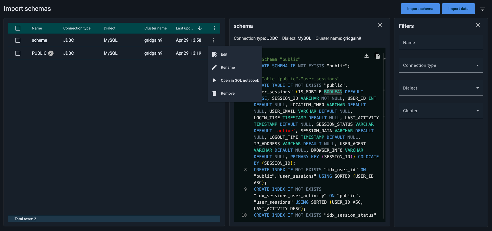

For each configuration, the row-level context menu provides the following actions:

- **Edit** — reopen the configuration to modify it.
- **Rename** — rename the configuration.
- **Open in SQL Notebook** — open the generated script in the [Queries](../queries/querying-gg9.md) screen for review or manual execution.
- **Remove** — delete the configuration.

To view the generated script and connection details for a configuration, click on a schema name to open the side panel on the right.

You can also start a new import from this screen by using the **Import schema** or **Import data** buttons in the top-right corner of the screen.
