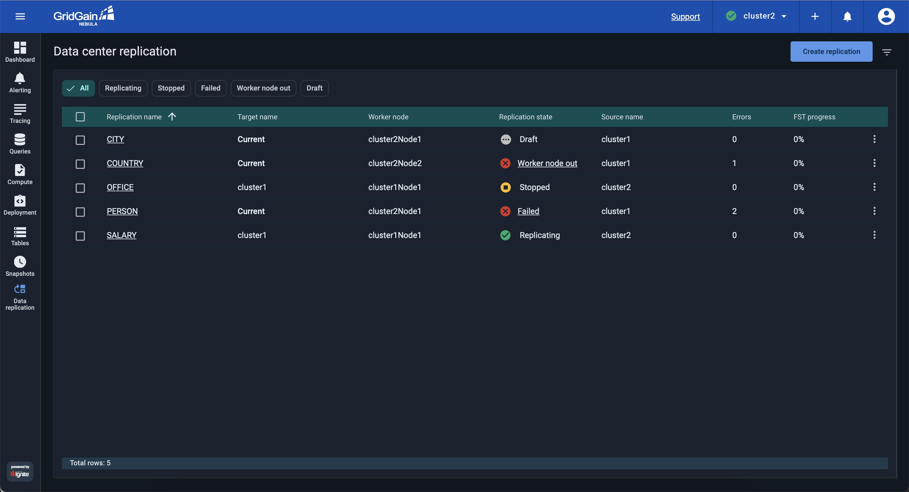
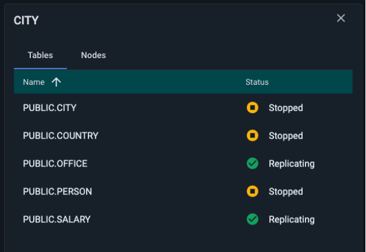
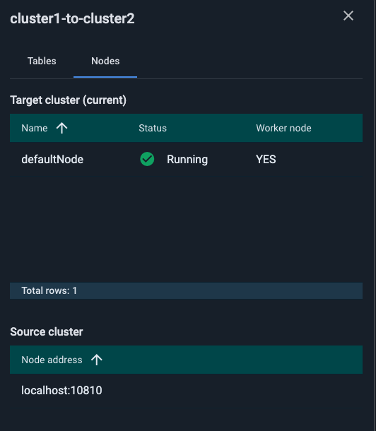
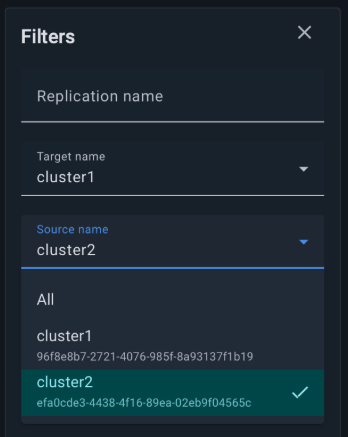
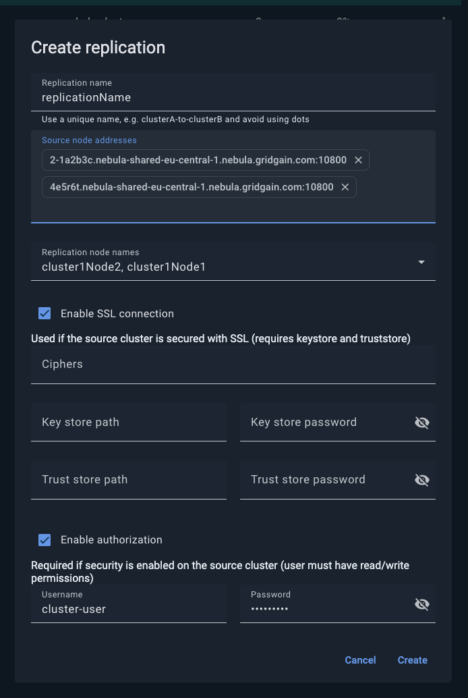
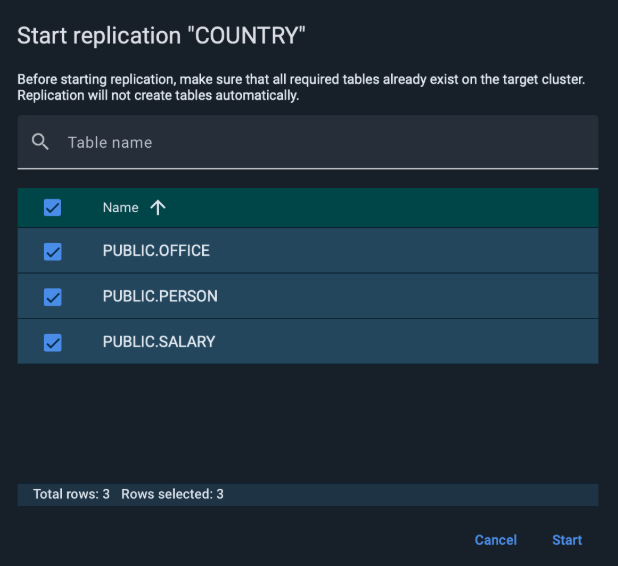
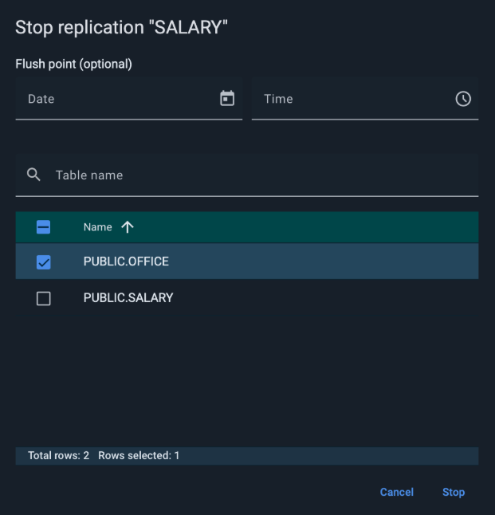
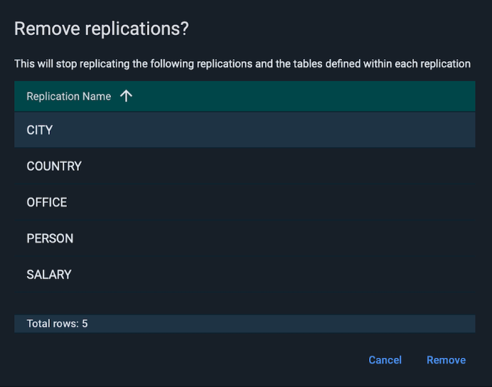

# Data Center Replication for GridGain 9 Clusters

Control Center supports data replication between clusters. You can configure it using the [CLI](https://www.gridgain.com/docs/gridgain9/latest/administrators-guide/data-center-replication/configuring-replication) or directly via the Data Center Replication screen in Control Center.


To use [attached](../../getting-started/connect/connect-gridgain9-cluster.md) clusters as a source or target for replication, your GridGain 9 license must include the Data Center Replication (DCR) feature. Managed clusters already include this feature, so no action is required.


## Data Replication Screen

The Data Replication screen lets you configure and manage replication between clusters.

By default, the list of existing replications includes the following columns:

| Column | Description |
|---|---|
| Replication name | Unique replication name. |
| Target name | The name of the target cluster. |
| Worker node | Name of the worker node. |
| Replication state | State of the selected replication. Possible states are: - `Draft` - `Replicating` - `Stopped` - `Failed` - `Worker node out` For `Failed` or `Worker node out` click on the state to open error log dialog. |
| Source name | The name of the source cluster. |
| Errors | Table errors if any occurred. |
| FST progress | Full state transfer progress, if initiated. |

To check the status of individual tables or nodes, click on the **Replication name** of the specific replication. A panel with two tabs will appear on the right side of the screen.

**Tables Tab:**

**Nodes Tab:**

#### Filters

Use the **Filters** panel to search and filter replications by name, cluster or specific tables.

### Creating Data Replication

To create a replication, start by specifying the source cluster and one or more source node addresses within that cluster. Then select the target cluster and its nodes.


If the source cluster is a Control Center cluster, you must enable [SSL](https://gridgain.com/docs/gridgain9/latest/administrators-guide/security/ssl-tls) connection. You can either provide a custom SSL keystore and truststore or leave these fields blank to use the default SSL keystore and truststore. Enable user [authorization](https://gridgain.com/docs/gridgain9/latest/administrators-guide/security/authentication#user-authorization) and provide the credentials you set when creating the cluster.


### Selecting Tables For Replication

After creating the replication, select all the tables you want to replicate.


Keep in mind, that once replication is started, you cannot add more tables.


Once the setup and validation are complete, the status will change to `Replicating`.

### Managing Replications

You can stop replication for all tables or select individual tables to pause. Optionally, you can specify a flush point to perform [replication](https://www.gridgain.com/docs/gridgain9/latest/administrators-guide/data-center-replication/configuring-replication#one-time-replication) up to a certain timestamp. The flush point guarantees that all data up to that timestamp is fully replicated, regardless of whether it is in the past or future.

To remove a replication, click **Remove** from the ⋮ menu for the selected replication. The dialog will show all tables that will stop replicating.

To remove multiple replications at once, select the checkboxes next to the replications you want to delete, then open the ⋮ menu and click **Remove**. In this case, the dialog will list the names of the selected replications instead of showing tables.
