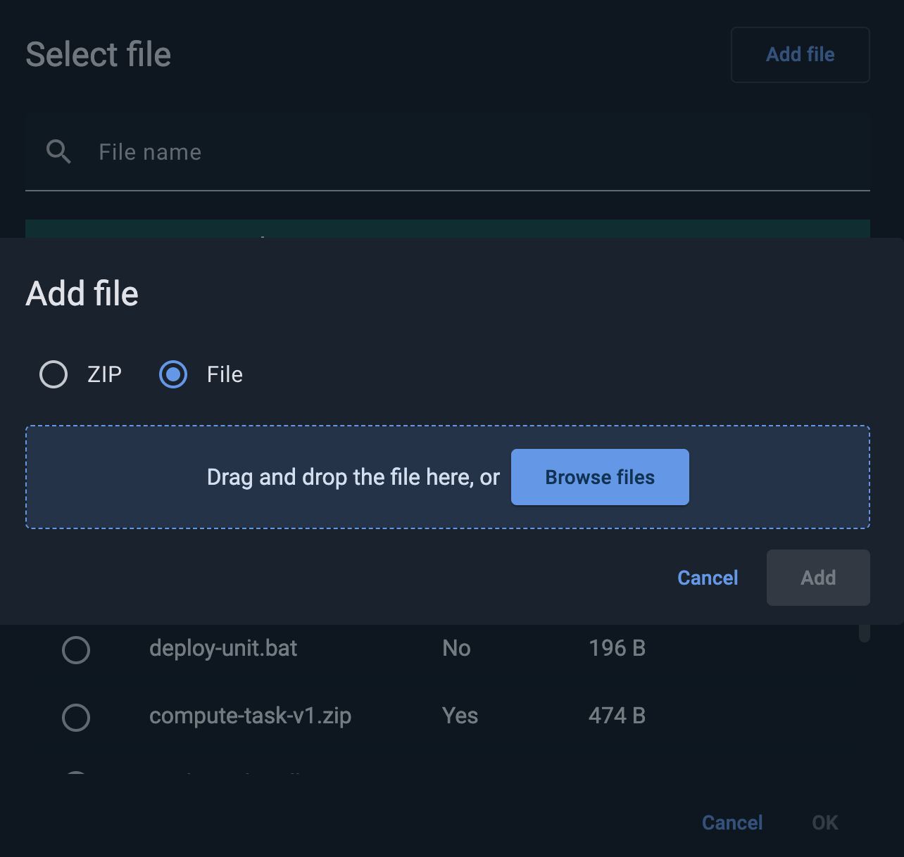
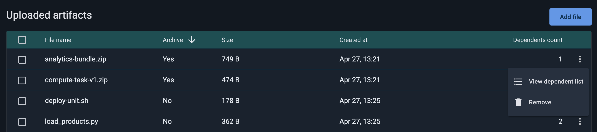
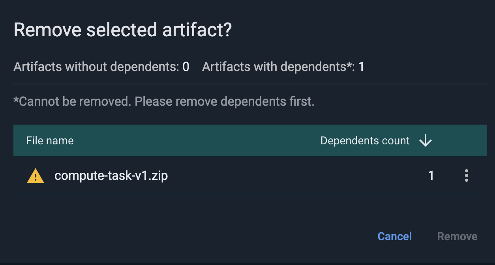

# Code Deployment with GridGain 9

You may want to deploy compute tasks to your GridGain nodes using Control Center. For example, you often need many dependencies to complete distributed computing tasks.

## Deployment Units

The **Deployment Units** tab shows all your deployments and allows you to create, modify, clone and remove deployment units.

### Creating a New Deployment Unit

To create a new deployment unit, click **Add Deployment Unit** and specify its name in the following dialog.

The newly created deployment unit is stored as a draft. As long as it is in the `Draft` state and has not been deployed, you can rename it. Once deployed, the unit cannot be renamed, you can only delete it or clone and assign it a version.

For a deployment unit to be eligible for deployment, it must contain the dependencies required to perform compute jobs. You can either upload the needed files or provide a direct URL to download them.

To add dependencies, first select your deployment unit while it is in the `Draft` state as you cannot add artifacts if the unit has already been deployed.

Then click **Add Artifact**. In the subsequent dialog, you have three options:

- **Uploaded artifact** - upload a new file from your local system. Files uploaded from your system will also appear in the **Sources** [tab](#sources), you can search and select artifacts.
- **Direct link** - provide the direct URL for the dependency.
- **ZIP archive** - upload a ZIP file directly as an artifact. Selecting this option opens a dedicated upload dialog instead of the native OS file picker. Control Center unpacks the archive and registers each entry as a separate artifact within the deployment unit. This option is useful when your compute task and all its dependencies are already bundled together in a single archive.

  
  A deployment unit can contain at most one ZIP archive. Once a ZIP artifact has been added, the **Add Artifact** button is disabled until the ZIP is removed.
  

After adding all required dependencies click **Deploy**. You will be asked to set the deployment unit version before deployment.


The version is not automatically incremented so you must define it manually using [semantic versioning](https://semver.org/).


When deploying a unit, you select either all nodes or a majority as the initial target. Choosing a majority means the unit is deployed on-demand to other nodes when they first need it to avoid unnecessary early copying.

You can view the version history in a separate [tab](#version-history) accessible from the **Deployment Units list**.

### Updating Deployment Unit

Deployment units are immutable, so you must create and deploy a new version whenever you want to change dependencies. To update a deployment unit:

1. Click **Clone**. This will create a new version of your deployment unit in **Draft** state.
2. Change the dependencies you need. To remove or edit existing dependencies, click ⋮ and select **Remove** or **Edit artefact** respectively. You can also **Add artefact** to add a new dependency.
3. Click **Deploy** and define a new unit version. Specify a version that is greater than the previous one.

To create a new deployment based on an existing version, click **Clone and Deploy** from the version’s menu and enter a new semver. This option may be useful for quickly replacing a unit deployed with an incorrect version.

You cannot **Clone** or **Clone and Deploy** units that were deployed via the CLI. To manage a CLI-deployed unit through Control Center, create a draft version from this unit, add artifacts, and deploy the new version.

### Version History

Control Center keeps a complete history of all deployment unit versions in the **Version History** table.

The table provides the following information:

| Menu item | Description |
|---|---|
| **Version** | Version number. |
| **Status** | Current version status. Possible version statuses: - `Draft` - A new unit that has not yet been deployed. - `Uploading` - The unit is being deployed to the cluster. - `Deployed` - The unit is currently deployed on the cluster and can be used. - `Obsolete` - The command to remove unit has been received, but it is still used in some jobs. - `Removing` - The unit is being removed. |
| **Files** | The number of files in the deployment unit. |
| **Deployed at** | Time and date of the deployment. |

### Reverting to an older version

If you want to switch to an older version (for example, one of the updated dependencies did not work as expected), you can deploy the previous version.

- Open **Version History**.
- Select the older version you need.
- Click **Clone and Deploy**.

Control Center will create a new version that copies all dependencies from the selected version.

## Sources

The **Sources** tab lets you review the dependencies used by your deployment units. You can see how many deployment units use each dependency and upload new dependencies for your code.

Sources are cluster-scoped, so the **Uploaded artifacts** table lists only the artifacts uploaded for the currently selected cluster.

The table includes the following columns:

| Column | Description |
|---|---|
| **File name** | The artifact file name. |
| **Archive** | Whether the artifact was uploaded as a ZIP archive (`Yes`/`No`). |
| **Size** | The file size. |
| **Created at** | Date and time the artifact was uploaded. |
| **Dependents count** | The number of deployment units that reference this artifact. |

To work with several artifacts at once, select them using the checkboxes in the first column, or select all of them using the checkbox in the table header.

### Uploading New Artifacts

To add a new artifact, click **Add file**. Control Center opens its own **Add file** dialog instead of the file picker of your operating system.

In the dialog, choose what you want to upload:

- **File** - one or more regular files, such as JAR files or scripts.
- **ZIP** - a single ZIP archive that bundles your compute task together with its dependencies.

Then either drag and drop your files onto the upload area or click **Browse files** and select them. Click **Add** to start the upload.

In **ZIP** mode, Control Center verifies that the file is a valid ZIP archive. If it is not, the dialog reports `Invalid ZIP file` and the **Add** button stays disabled.


An individual artifact cannot exceed 100 MB. If you select several files and some of them are larger, Control Center uploads the remaining ones and reports that the size limit was exceeded.


Once uploaded, an artifact is available to the deployment units of this cluster. To use it, add it to a deployment unit as an **Uploaded artifact** - see [Creating a New Deployment Unit](#creating-a-new-deployment-unit).

### Checking Dependent List

To see all deployment units that use a specific artifact, click ⋮ and select **View dependent list**. The dialog that opens lists all deployment units that use the selected artifact.

### Deleting Artifacts

To delete an artifact, click ⋮ and select **Remove**. If you selected several artifacts beforehand, **Remove** applies to the whole selection, and the confirmation dialog reports how many of the selected artifacts have dependents and how many do not.

Artifacts that have dependents cannot be removed. You must delete the dependent deployment units first - see [Checking Dependent List](#checking-dependent-list) to find them.

