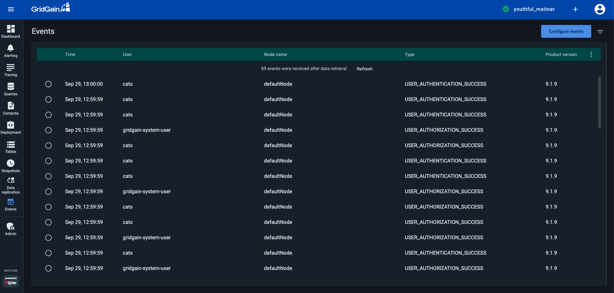
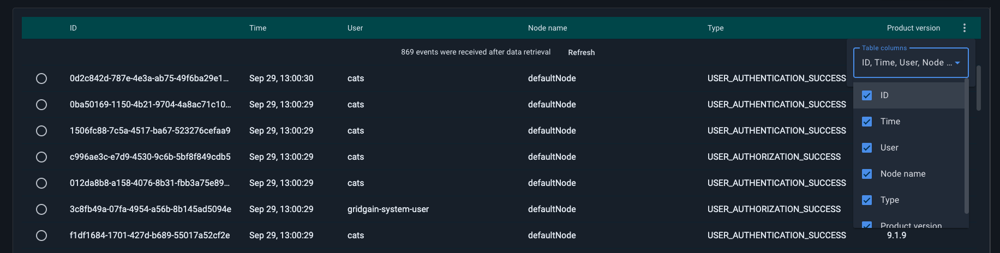
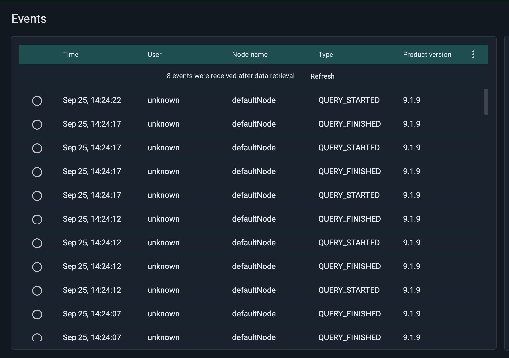
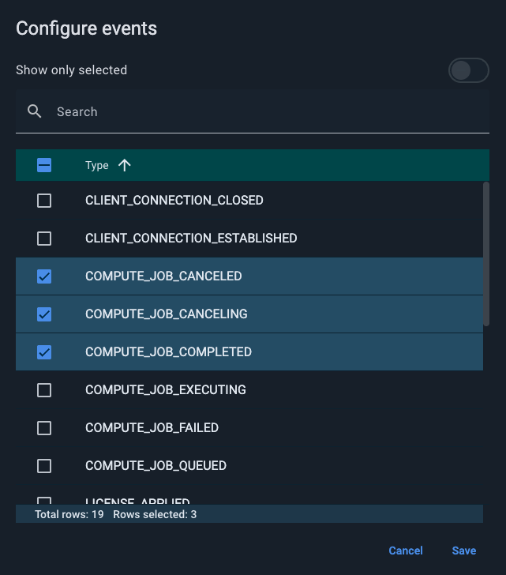
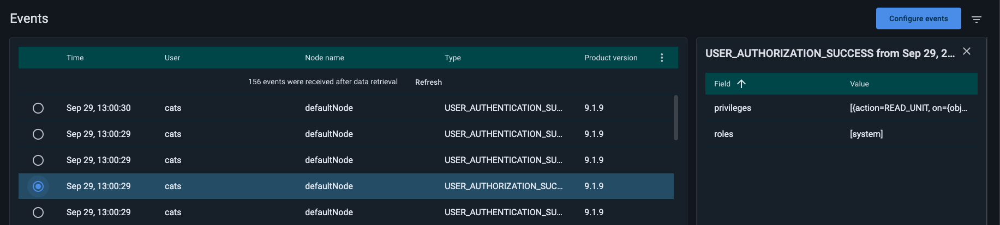
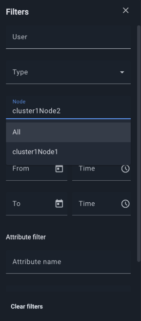

# Events Screen

Control Center supports event management for [GridGain 9](https://www.gridgain.com/docs/gridgain9/latest/developers-guide/events/events-list) and [Apache Ignite 3](https://ignite.apache.org/docs/ignite3/latest/developers-guide/events/events-list#map-reduce-task-events) clusters. You can view, inspect, and manage events through the **Events** screen.

You can choose which event fields to display by selecting the corresponding options in the `⋮` menu on the right side of the table.


If your cluster does not have [security](https://www.gridgain.com/docs/gridgain9/latest/administrators-guide/security/authentication) enabled, all events will be shown under the `unknown` user.


## Configure Events

When you enable event monitoring in Control Center, CC automatically configures the cluster: it creates an event channel subscribed to the relevant [event types](https://www.gridgain.com/docs/gridgain9/latest/developers-guide/events/events-list) and a webhook sink that delivers events to CC's own endpoint. No manual cluster-side setup is required.

For this to work, two network paths must be open:

- Control Center must be able to reach the cluster's REST API. See [Attaching a GridGain 9 Cluster](../../getting-started/connect/connect-gridgain9-cluster.md) for network prerequisites.
- All cluster nodes must be able to reach the Control Center instance — or the [Cloud Connector](../cloud-connector/connect-cloud-connector.md) if you use one — over HTTP.

To set up additional event channels or sinks outside of CC — for example, to write events to a log or forward them to a separate endpoint — see [Working with Events](https://www.gridgain.com/docs/gridgain9/latest/developers-guide/events/overview) in the GridGain 9 documentation.

### Filter Displayed Events

You can configure the **Events** screen to show only specific types of events. Use the configuration menu on the right side of the screen to select the event categories you want to display.

## View Event Details

To view the details of a particular event, select the event in the table. A details panel will appear on the right side of the screen.

When applying filters, you can narrow down events not only by type, user, node name, or time period, but also by [event attributes](https://www.gridgain.com/docs/gridgain9/latest/developers-guide/events/events-list). This allows for more precise control when analyzing cluster activity.

