# Queries Screen for GridGain 9 Clusters

The **Queries** screen allows you to execute SQL queries against the GridGain 9 cluster and view the query results.

The screen consists of two tabs:

- **Queries List** — execute SQL queries
- **Queries Log** — view the log of executed queries

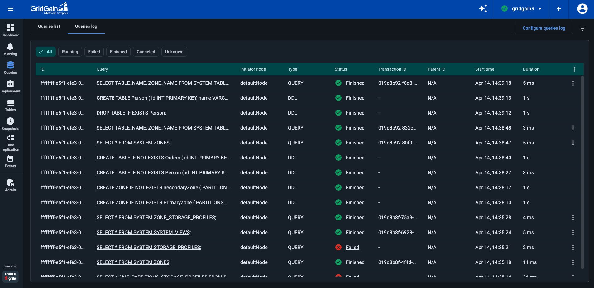

You can add multiple tabs to the screen, each containing an SQL expression and the query results (after you have executed the query). To add a tab, click the **+** icon on the tab bar.

## Defining Queries

Type the SQL expression in the "SQL editor" section of the tab.

You can enter multiple expressions in a single query. These are executed sequentially by an SQL script.

## Executing Queries

To execute a SQL statement, click **Execute** on the tab toolbar.

The query results are displayed in the lower part of the screen, in a tab matching the query expression one.

The tab-level context menu includes the following options:

- **Copy** - copies the result set to the clipboard
- **Remove** - deletes query and closes the tab
- **Rename** - set a custom name for the tab

The row-level context menu includes the **Copy** option, which copies the corresponding row to the clipboard.

## Working with Indexes

You can create indexes via the context menu in the **Queries** screen. This action will open a new tab with the predefined SQL request.

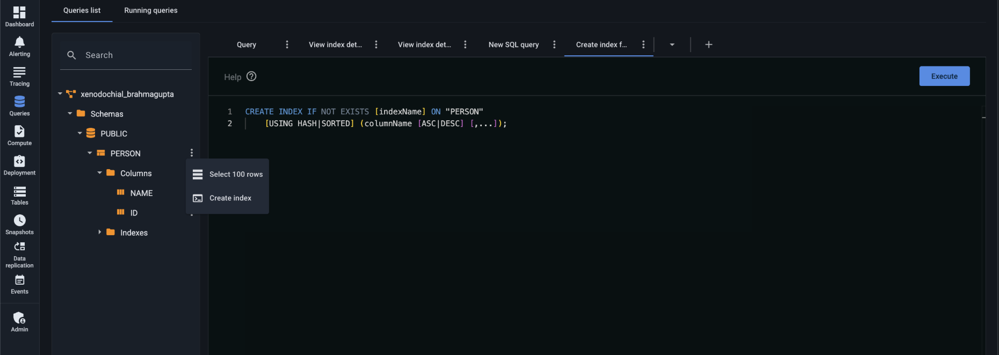

To view index details, click on the context menu and select **View Details**. A new tab will open and the request will run automatically.

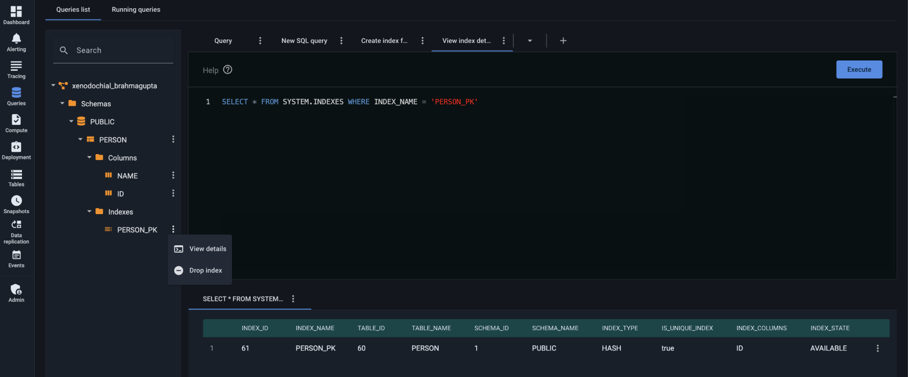

To drop an index, click on the context menu and select **Drop Index**. This will trigger the confirmation dialog and if the action is confirmed, a new tab will open and the request will run automatically.


You cannot drop an index for `PRIMARY KEY`.


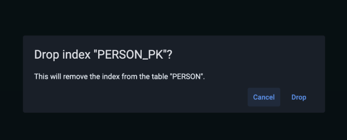

## Queries Log

The **Queries Log** tab shows all tracked queries.

For managed clusters, query tracking is enabled automatically.

For attached clusters, you need to enable the tab via the cluster update configuration button when you attach the cluster:

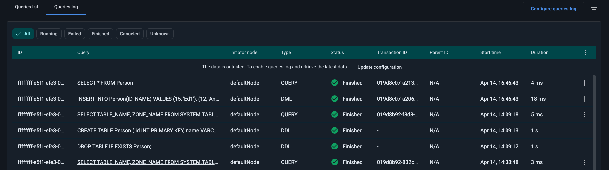

You can filter the display by status, query duration, and other criteria for a more precise view.

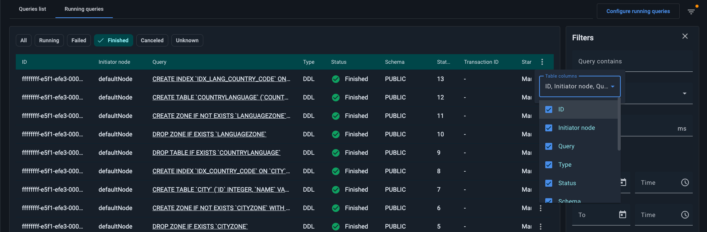

Each query includes the following details:

| Column | Description |
|---|---|
| ID | Query ID. |
| Query | The query text. |
| Initiator node | Node where the query is executed. |
| Type | Query type. |
| Schema | The schema used. Hidden by default — enable via the column context menu. |
| Status | Query status. Possible values: - `Running` - `Finished` - `Failed` - `Canceled` - `Unknown` |
| Statement number | Position of the statement within the SQL script. Hidden by default — enable via the column context menu. |
| Transaction ID | Transaction ID. Not applicable for [DDL](https://www.gridgain.com/docs/gridgain9/latest/sql-reference/ddl) queries. |
| Start time | The time the query started. |
| Parent ID | ID of the parent query that initiated this query. Available for queries executed via the SQL CLI on the cluster, but not for those run in the **Queries List** tab editor. |
| Duration | Query duration. |

### Checking Failure Reasons

If a query is marked as `Failed`, click its status to see detailed error information.

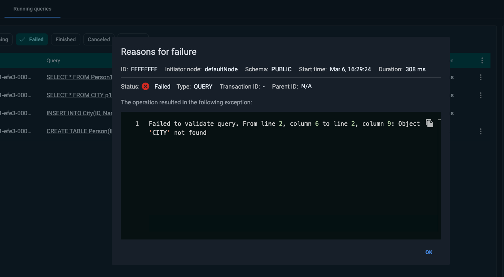

### Canceling Queries

When a query is in `Running` status, you can cancel it from the row-level context menu. Once canceled, its status will change to `Canceled`.

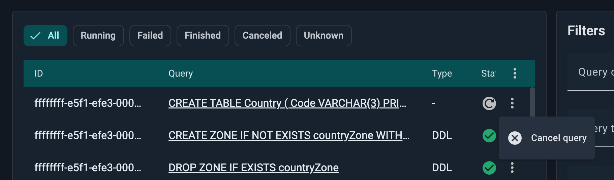

### Explaining Queries

To analyze an executed query, run an `EXPLAIN` query using the row-level context menu. For more details on how the `EXPLAIN` query works in GridGain, refer to the [documentation](../../gg8/queries/querying.md#using-the-explain-statement).

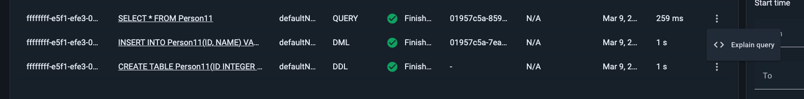

A new tab opens in the **Queries List**, displaying the results of the EXPLAIN query.

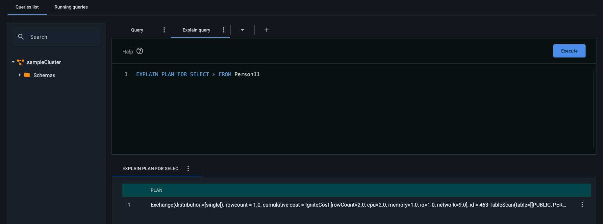

### Selecting Queries to Track

To reduce GridGain Control Center load and minimize disk space usage, you can specify which queries to track by setting a minimum query duration. Only queries that exceed the specified duration will appear in the **Queries Log** tab.

To select queries to track:

- Click **Configure queries log** in the top-right corner of the tab.
- In the **Configure queries log** dialog, define query duration and click **Save**.

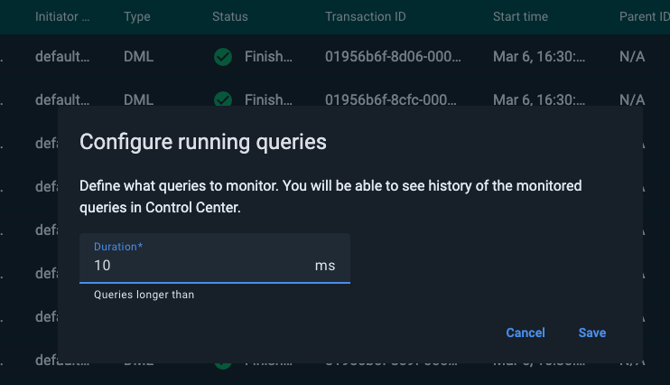

For example, entering "500" in the **Duration** field will track only queries lasting longer than 500 ms. This applies even to queries already in `Running` status when you save the configuration.
