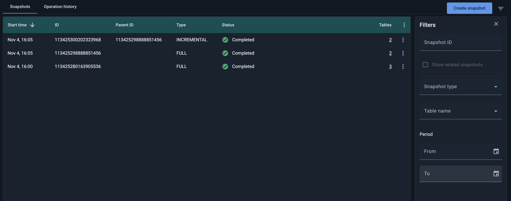
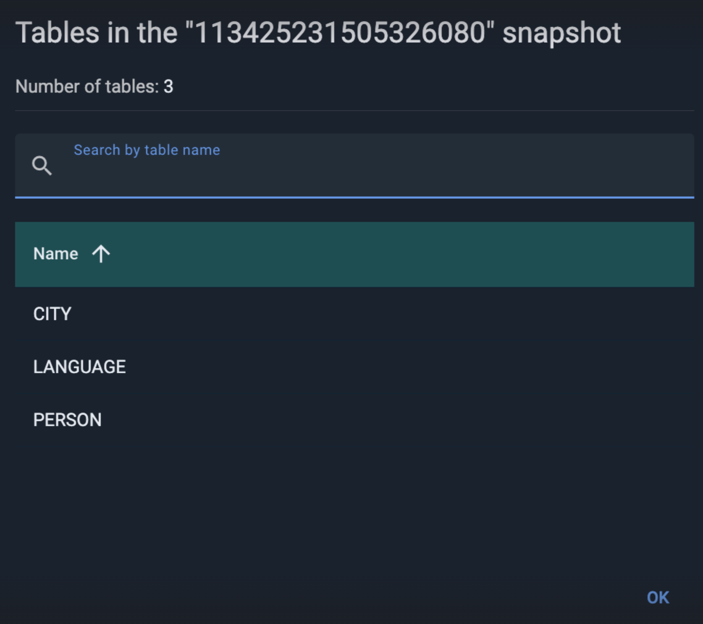
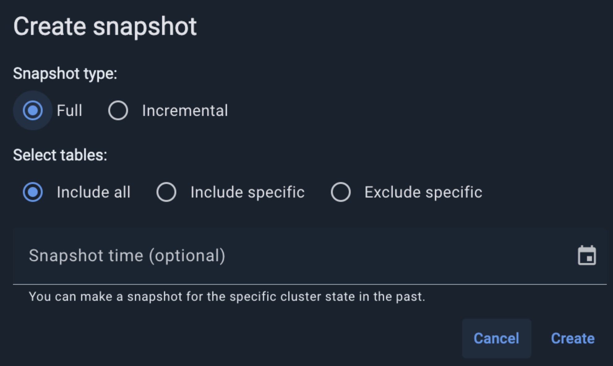
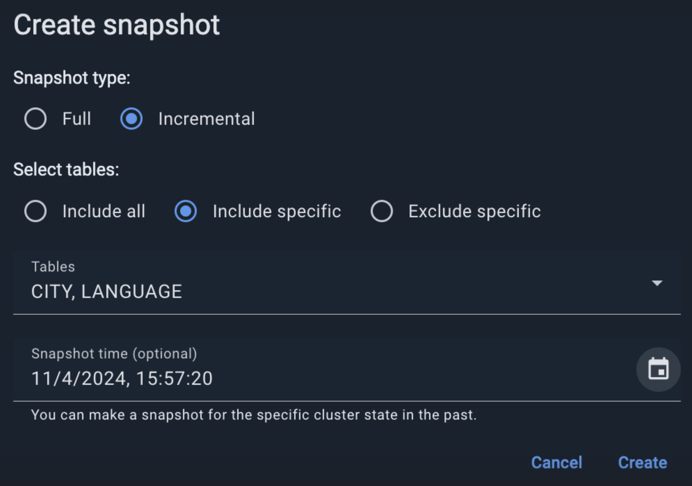
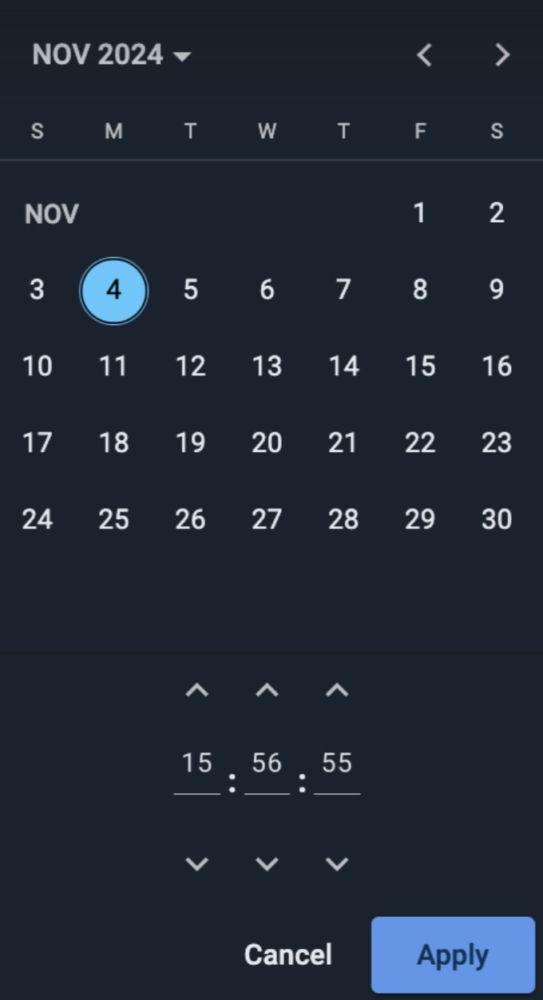
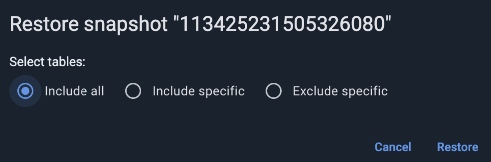
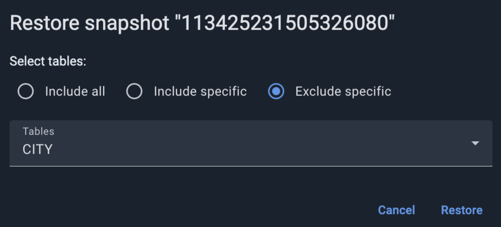

# Snapshot Management for GridGain 9 Clusters

You can manage snapshots for GridGain 9 clusters via the **Snapshots** tab of the **Snapshots** screen. This tab lets you create, restore, and delete snapshots.

## Viewing Snapshots

By default, the **Snapshots** screen displays the following information about each snapshot:

| Column | Description |
|---|---|
| Start Time | Time when the "snapshot create" operation began. |
| ID | The snapshot ID. |
| Parent ID | For [incremental snapshots](https://www.gridgain.com/docs/gridgain9/latest/administrators-guide/snapshots/snapshots-and-recovery#creating-incremental-snapshots), the ID of the "parent" [full snapshot](https://www.gridgain.com/docs/gridgain9/latest/administrators-guide/snapshots/snapshots-and-recovery#creating-full-snapshots). |
| Type | FULL or INCREMENTAL. |
| Status | The status of the snapshot operation: PREPARED, STARTED, COMPLETED, or FAILED. |
| Tables | The number of tables included in the snapshot. A hyperlink that displays the included tables' list. |


In addition to the snapshots created in Control Center, the list contains those snapshots that were created using programming APIs or the snapshot management tool. See [Snapshots and Recovery](https://www.gridgain.com/docs/gridgain9/latest/administrators-guide/snapshots/snapshots-and-recovery) for details.


1. To add or remove columns to/from the list, select or deselect these columns in the list-level context menu.
2. To filter the snapshot list, define the filtering criteria in the **Filters** section on the right of the screen.
3. To view a list of tables included in a snapshot, click the hyperlinked value in the snapshot's **Tables** field.

   
4. To show child (incremental) snapshots for a "parent" (full) snapshot, select **Show related snapshots** from the parent snapshot's context menu.

## Creating Snapshots

To create a snapshot:

1. Click **Create snapshot**.

   The **Create snapshot** dialog opens.

   
2. Select the snapshot type: **Full** (default) or **Incremental**.
3. Optionally, to change the default snapshot scope (all tables):
   1. Select one of the alternative options:
      - **Include specific** to include only explicitly specified tables
      - **Exclude specific** to include all tables except for explicitly specified ones
   2. From the **Tables** drop-down list, select the tables to be included or excluded (depending on the option you have selected in (a) above).

      
4. Optionally, in the **Snapshot time** field, enter a datetime in the past for the snapshot to reflect. Click the "calendar" icon and use controls in the dialog that pops up.

   
5. Click **Create**.

A snapshot is created in each node's snapshot folder, which is specified in the [cluster configuration](https://www.gridgain.com/docs/gridgain9/latest/administrators-guide/config/cluster-config#snapshots-configuration).

## Restoring Snapshots

To restore a snapshot:

1. From the context menu of the snapshot you want to restore, select **Restore from snapshot**.

   The **Restore snapshot \<ID>** dialog opens.

   

   By default, you restore all tables found in the snapshot.
2. To exclude specific tables:
   1. Select the **Exclude specific** option.

      The dialog layout changes.

      
   2. From the **Tables** drop-down list, select the required tables.
3. Alternatively, to restore (include) only specific tables:
   1. Select the **Include specific** option.

      This excludes from the restoration process all tables found in the snapshot.
   2. From the **Tables** drop-down list, select the tables to restore.
4. Click **Restore**.

## Removing Snapshots

To remove a snapshot:

1. From the context menu of the snapshot you want to remove, select **Remove**.
2. In the confirmation dialog that opens, click **Remove**.
