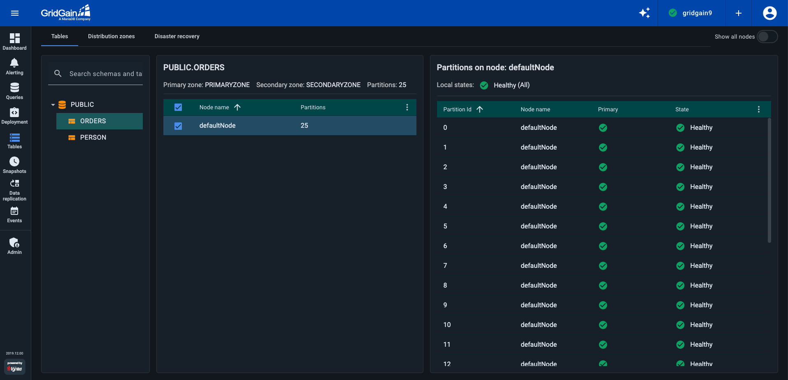
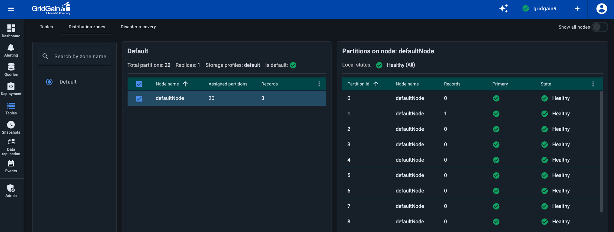
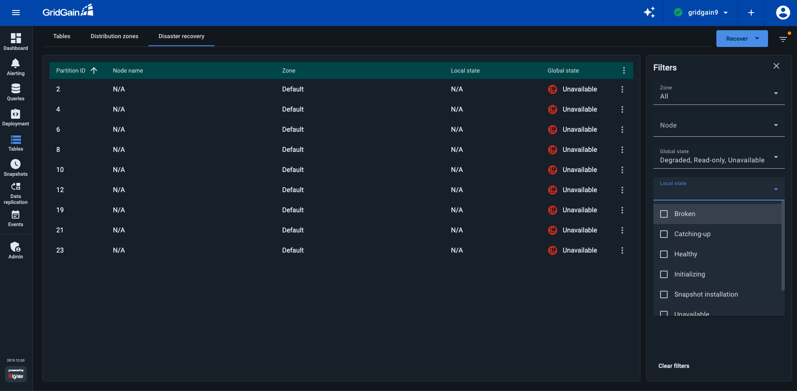
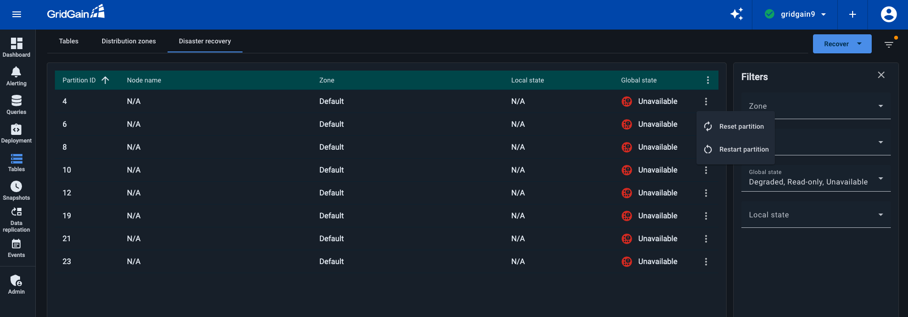
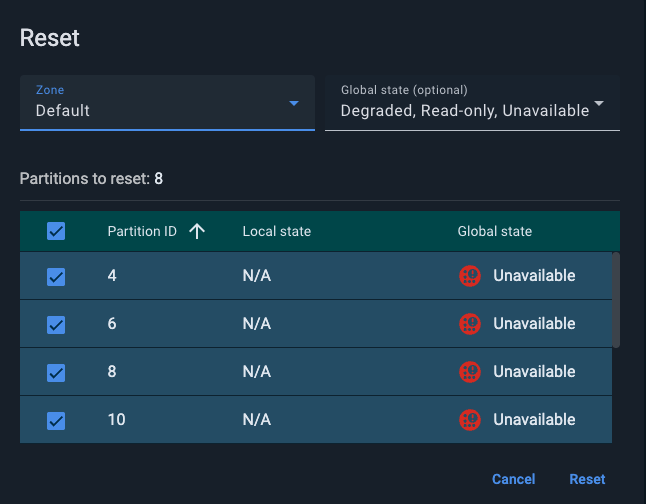
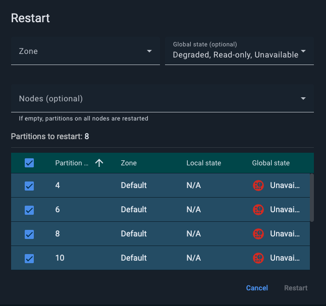
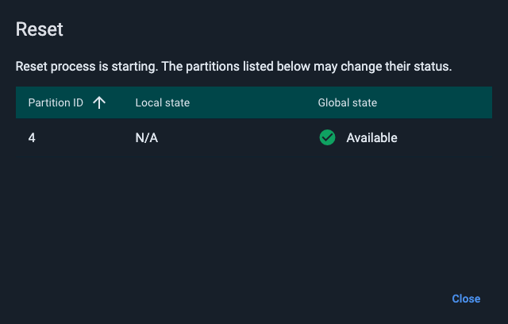

# Tables

The **Tables** screen is available for GridGain 9 clusters.

This screen enables you to see the distribution of [partitions](https://www.gridgain.com/docs/gridgain9/latest/administrators-guide/storage/data-partitions) between the current cluster's nodes for a selected table or distribution zone.

## Viewing Partitions for a Table

To view partition distribution for a table:

1. Select the **Tables** tab.

   
2. In the leftmost section, find and select the required table.

   The **\<Table name>** panel displays the primary zone, secondary zone (if configured), and total partition count for the selected table.
3. In the **\<Table name>** section, select the required cluster node(s).
4. In the **Partitions on node: \<Node name>**, view the partitions and their state.
5. To view those nodes that have no selected table's partitions distributed to them, toggle on **Show all nodes** in the top right corner.

By default, the list includes the following columns:

| Column | Description |
|---|---|
| Partition ID | The partition ID. |
| Node name | The name of the node. |
| Primary | Whether the partition copy on this node is primary. |
| State | The [state of the partition](https://www.gridgain.com/docs/gridgain9/latest/administrators-guide/disaster-recovery#local-partition-states) on the node. Possible states are: - `UNAVAILABLE` - this state might be used when the partition is not yet started or is already stopping. - `HEALTHY` - alive partition with a healthy state machine. - `INITIALIZING` - partition is starting right now. - `INSTALLING_SNAPSHOT`- partition is installing a Raft snapshot from the leader. - `CATCHING_UP` - partition is catching up, meaning that it hasn't replicated part of the log yet. - `BROKEN` - partition is in a broken state, typically because its state machine threw an exception. - `UNKNOWN` - partition state is unknown for Control Center. |

In all of the **Tables** tab sections, you can add or remove columns to/from the entity list by selecting or deselecting column names in the context menu.

## Viewing Partitions for a Distribution Zone

To view partitions for a distribution zone:

1. Select the **Distribution zones** tab.

   
2. In the leftmost section, find and select the required distribution zone.
3. In the **\<Zone name>** section, select the required cluster node(s).
4. In the **Partitions on node: \<Node name>**, view the partitions and their state.
5. To view those nodes that have no selected zone's partitions distributed to them, toggle on **Show all nodes** in the top right corner.

By default, the list includes the following columns:

| Column | Description |
|---|---|
| Partition ID | The partition ID. |
| Records | The amount of records a partition contains. |
| Node name | The name of the node. |
| Primary | Whether the partition copy on this node is primary. |
| State | The [state of the partition](https://www.gridgain.com/docs/gridgain9/latest/administrators-guide/disaster-recovery#local-partition-states) on the node. Possible states are: - `UNAVAILABLE` - this state might be used when the partition is not yet started or is already stopping. - `HEALTHY` - alive partition with a healthy state machine. - `INITIALIZING` - partition is starting right now. - `INSTALLING_SNAPSHOT`- partition is installing a Raft snapshot from the leader. - `CATCHING_UP` - partition is catching up, meaning that it hasn't replicated part of the log yet. - `BROKEN` - partition is in a broken state, typically because its state machine threw an exception. - `UNKNOWN` - partition state is unknown for Control Center. |

In all of the **Distribution zones** tab sections, you can add or remove columns to/from the entity list by selecting or deselecting column names in the context menu.

## Disaster Recovery

### Listing Lost Partitions

The **Disaster Recovery** tab enables you to identify and recover lost table partitions. By default, the tab displays partitions that are in the `Degraded`, `Read-only`, or `Unavailable` states. If all partitions are in `Healthy` state, the tab will remain empty.

The filter panel on the right lets you refine your search among all partitions by table, node, zone, and its local and global states:

| Column | Description |
|---|---|
| Partition ID | Partition ID. |
| Node name | Name of the node hosting the partition. |
| Zone | Zone where partition is located |
| Local state | The local [state](https://www.gridgain.com/docs/gridgain9/latest/administrators-guide/disaster-recovery#local-partition-states) of a partition. Possible states are: - `UNAVAILABLE` - this state might be used when the partition is not yet started or is already stopping. - `HEALTHY` - alive partition with a healthy state machine. - `INITIALIZING` - partition is starting right now. - `INSTALLING_SNAPSHOT`- partition is installing a Raft snapshot from the leader. - `CATCHING_UP` - partition is catching up, meaning that it hasn't replicated part of the log yet. - `BROKEN` - partition is in a broken state, typically because its state machine threw an exception. - `UNKNOWN` - partition state is unknown for Control Center. |
| Global state | The global [state](https://www.gridgain.com/docs/gridgain9/latest/administrators-guide/disaster-recovery#global-partition-states) of a partition. If no information for a partition is available, it changes its status to `Unknown`. Possible global states are: - `AVAILABLE` - all replicas are healthy. - `DEGRADED` - there are healthy replicas, and they form a majority. - `READ_ONLY` - there are healthy replicas, but they don't form a majority. - `UNAVAILABLE` - there are no healthy replicas. - `UNKNOWN` - partition state is unknown for Control Center. |

### Recovering Lost Partitions

If the partition status indicates issues with its replicas, for example, when partitions are marked as `DEGRADED`, `READ_ONLY`, or `UNAVAILABLE`, you can attempt to repair it using either the **Restart** or **Reset** option.

For detailed instructions on disaster recovery and repair procedures, refer to the disaster recovery [documentation](https://www.gridgain.com/docs/gridgain9/latest/administrators-guide/disaster-recovery).


It is advisable to use **Restart** first. If that does not resolve the issue, then consider using **Reset**. Keep in mind that **Reset** option may lead to data loss or cluster unavailability.


You can recover a single partition by using the row-level context menu:

Alternatively, you can recover multiple partitions by clicking the **Recover** button in the top-right corner of the screen. First, select the table and zone where the lost partitions are located. You can further refine your selection by partition global state.

Note, that by default, all partitions within the selected table and zone are chosen. If you need to recover only a subset, deselect the partitions you do not want to recover.

When performing a **Restart** operation, you can additionally select partitions by node. If no nodes are selected, the operation will restart partitions on all nodes.

During the **Reset** and **Restart** operations the state of the selected partitions may change. This change does not necessarily indicate a successful operation. If the operation fails or ends inconclusively, an error message will be displayed.

You also can perform recovery operations via Gridgain [CLI](https://www.gridgain.com/docs/gridgain9/latest/ignite-cli-tool#disaster-recovery-commands) commands.
