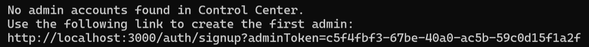

# Control Center Docker Image

This page describes how to run Control Center with Docker.

GridGain provides two docker images: Control Center Frontend and Control Center Backend. The easiest way to start Control Center in Docker is to use docker-compose, which enables you to start multi-container applications with a single configuration file.

## Prerequisites

- [Docker](https://www.docker.com/get-started) and [Docker compose](https://docs.docker.com/compose/)

## Compose File

Docker Compose needs a configuration files that defines an application. In our case, the application consists of two containers: Control Center Backend and Control Center Frontend. The frontend uses nginx to redirect user requests and, therefore, needs an nginx configuration file.

The docker-compose file must define the following actions:

- Pull docker images for Control Center Frontend and Control Center Backend:

  ```bash
  docker image pull gridgain/control-center-frontend:latest
  docker image pull gridgain/control-center-backend:latest
  ```
- Mount nginx configuration file `control-center.conf`, which is used by the frontend to handle user requests (see below for a sample nginx configuration file).

  
  ```nginx
  upstream backend {
    server control-center-backend:3000;
  }

  server {
    listen 8008;
    server_name _;

    set $ignite_console_dir /data/www;

    root $ignite_console_dir;

    error_page 500 502 503 504 /50x.html;

    location / {
      try_files $uri /index.html = 404;
    }

    location /api/v1 {
      proxy_pass http://backend;
      proxy_set_header X-Forwarded-Proto $scheme;
      proxy_set_header X-Forwarded-Host $http_host;
      proxy_set_header X-Forwarded-For $proxy_add_x_forwarded_for;
      proxy_pass_header X-XSRF-TOKEN;
    }

    location /agents {
      proxy_pass http://backend;
      proxy_http_version 1.1;
      proxy_set_header Upgrade $http_upgrade;
      proxy_set_header Connection "upgrade";
      proxy_set_header Origin http://backend;
    }

    location /browsers {
      proxy_pass http://backend;
      proxy_http_version 1.1;
      proxy_set_header Upgrade $http_upgrade;
      proxy_set_header Connection "upgrade";
      proxy_set_header Origin http://backend;
      proxy_pass_header X-XSRF-TOKEN;
    }

    location = /50x.html {
      root $ignite_console_dir/error_page;
    }
  }
  ```
  
- Set [configuration parameters](../admin-guide/configuration.md) via environment variables.
- Start the backend and frontend containers and bind the frontend to port `8008`.

  ```bash
  docker compose up -d
  ```

Following is an example docker-compose file:


```yaml
version: '3'
services:
  backend:
    image: gridgain/control-center-backend:latest
    container_name: control-center-backend
    # Restart on crash.
    restart: on-failure
    environment:
      # Java settings
      - JVM_OPTS=
    networks:
      - control-center

  frontend:
    image: gridgain/control-center-frontend:latest
    container_name: control-center-frontend
    depends_on:
      - backend
    volumes:
      - ${PWD}/control-center.conf:/etc/nginx/control-center.conf
    ports:
      # Proxy HTTP Nginx port (HOST_PORT:DOCKER_PORT)
      - 8008:8008
    networks:
      - control-center

networks:
  control-center:
    # Name of the docker network to create
    name: control-center
```


Optionally, to introduce a custom `ignite-config.xml` file, mount the config map as follows:

```yaml
services:
  backend:
    image: gridgain/control-center-backend:latest
    container_name: control-center-backend
    # Restart on crash.
    restart: on-failure
    environment:
      # Java settings
      - JVM_OPTS=
    volumes:
      - ${PWD}/ignite-config.xml:/opt/gridgain-control-center/ignite-config.xml
```

## Launching Control Center

Put `docker-compose.yaml` and `control-center.conf` into a directory and run the following command in that directory:

```bash
docker compose up -d
```

The command starts two containers and binds the frontend container to port `8008`. Run the following command to verify that the containers launched successfully:

```bash
$ docker-compose ps
         Name                        Command               State                    Ports
-----------------------------------------------------------------------------------------------------------
control-center-backend    /bin/sh -c ./control-center.sh   Up      3000/tcp
control-center-frontend   nginx -g daemon off;             Up      80/tcp, 8008/tcp, 0.0.0.0:8008->8008/tcp
```

In the above example, Control Center is running on port `8008`.

You have to launch Control Center from the admin account, which needs to be created:

1. Navigate to the Control Center backend log and find the "admin account" link:

   
2. Copy the link to your browser. Replace `3000` with `8008` and follows the link.
3. In the Control Center UI that appears, [sign in the admin account and add the Control Center license](../getting-started/adding-license.md).

The cluster will try to connect to the default Control Center URI (`http://localhost:3000`), which is the expected behavior. You can change the Control Center port using the management script:

```bash
{GRIDGAIN_HOME}/bin/management.sh --uri http://localhost:8008
```

See [Control Center URI](../getting-started/connect/connect-gridgain-cluster.md#control-center-uri) for details.

## Configuration Parameters

You can set Control Center configuration parameters by providing environment variables in the `docker-compose.yaml` file.

For a complete list of parameters, see [Configuration Parameters](../admin-guide/configuration.md).

## How to Add HTTPS to Control Center in Docker

To add HTTPS to Control Center, you need to prepare your the docker-compose file and nginx configuration for it to use:

1. Create a `docker-compose.yaml` file that uses certificate files:

   ```yaml
   version: '3'
   services:
     backend:
       image: gridgain/control-center-backend:latest
       container_name: control-center-backend
       # Restart on crash.
       restart: on-failure
       environment:
         - JVM_OPTS=
       volumes:
         - ${PWD}/work:/opt/gridgain-control-center/work
     frontend:
       image: gridgain/control-center-frontend:latest
       container_name: control-center-frontend
       depends_on:
         - backend
       volumes:
         - ${PWD}/control-center.conf:/etc/nginx/control-center.conf
         - ${PWD}/server.crt:/etc/nginx/server.crt
         - ${PWD}/server.nopass.key:/etc/nginx/server.nopass.key
       ports:
         # Proxy HTTP Nginx port (HOST_PORT:DOCKER_PORT)
         - 80:8008
         - 443:8443
   ```
2. Create a `control-center.conf` nginx configuration file with the following content:

   ```nginx
   upstream backend {
       server backend:3000;
   }

   server {
      listen 8008 default_server;
      listen [::]:8008 default_server;
      server_name _;
      return 301 https://$host$request_uri;
   }

   server {
       listen 8443 ssl;
       server_name _;
       ssl_certificate         /etc/nginx/server.crt;
       ssl_certificate_key     /etc/nginx/server.nopass.key;
       # Enable Mutual SSL if disabled https will be used.
       #ssl_verify_client       on;
       ssl_protocols       TLSv1.2;
       ssl_ciphers         HIGH:!aNULL:!MD5;
       set $ignite_console_dir /data/www;
       root $ignite_console_dir;

       error_page 500 502 503 504 /50x.html;

       location / {
           try_files $uri /index.html = 404;
       }

       location /api/v1 {
           proxy_pass http://backend;
           proxy_set_header X-Forwarded-Proto $scheme;
           proxy_set_header X-Forwarded-Host $http_host;
           proxy_set_header X-Forwarded-For $proxy_add_x_forwarded_for;
           proxy_pass_header X-XSRF-TOKEN;
       }

       location /browsers {
           proxy_pass http://backend;
           proxy_http_version 1.1;
           proxy_set_header Upgrade $http_upgrade;
           proxy_set_header Connection "upgrade";
           proxy_set_header Origin http://backend;
           proxy_pass_header X-XSRF-TOKEN;
       }

       location /agents {
           proxy_pass http://backend;
           proxy_http_version 1.1;
           proxy_set_header Upgrade $http_upgrade;
           proxy_set_header Connection "upgrade";
           proxy_set_header Origin http://backend;
       }

       location = /50x.html {
           root $ignite_console_dir/error_page;
       }
   }
   ```
3. Generate your certificate files: `server.crt` and `server.key`.
4. Start Control Center:

   ```bash
   docker compose up
   ```

## Upgrading from a Previous Control Center Version


The "direct" upgrade works as described below for Control Center versions 2022.3 and more recent. For older versions, you need to first upgrade to 2022.3, then from 2022.3 - to the target version.


To migrate data from an existing Control Center installation to a new version:

1. Mount the `work` directory for the old installation.
2. Use the same work directory in the new Control Center version.
3. Do one of the following:
   - Add the following property to application.properties or application.yaml:

     ```
     control.repositories.auto-migrate-enabled=true
     ```
   - Launch Control Center with the following JVM_OPTS environment variable:

     ```
     -Dcontrol.repositories.auto-migrate-enabled=true
     ```

     For example, you can launch it from the command line like this:

     ```
     JVM_OPTS='-Dcontrol.repositories.auto-migrate-enabled=true' ./control-center.sh
     ```

## Next Steps

- [Change Configuration Parameters](../admin-guide/configuration.md) - make sure you [optimize the disk space utilization](../admin-guide/disk-space-optimization.md)
- [Add a License](../getting-started/adding-license.md)
- Connect a [GridGain](../getting-started/connect/connect-gridgain-cluster.md) cluster or an [Apache Ignite](../getting-started/connect/connect-ignite-cluster.md) cluster
