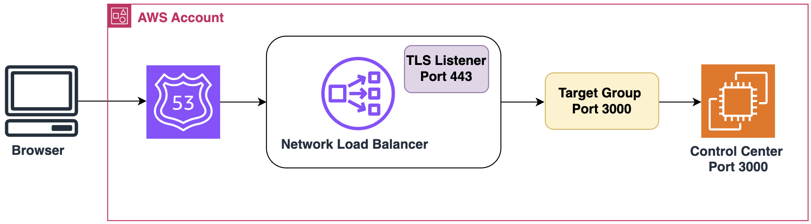

# Control Center on AWS EC2 Linux Instances

This page describes how to install Control Center on an [Amazon EC2 Linux instance](https://docs.aws.amazon.com/AWSEC2/latest/UserGuide/EC2_GetStarted.html).

## Folder Layout

We suggest the following layout assuming that the Control Center installation folder is `/opt/ggcc` (the `CC_ROOT` environment variable).

| Folder / File | Description |
|---|---|
| `/opt/ggcc` | The root folder for all the data related to Control Center. |
| `/opt/ggcc/gridgain-control-center-on-premise-20xx.1`<br>`/opt/ggcc/gridgain-control-center-on-premise-20xx.4`<br>`/opt/ggcc/gridgain-control-center-on-premise-20xy.1` | Control Center distribution folders you have obtained from Sales. |
| `/opt/ggcc/current` | Pointer (symlink) to the currently used Control Center version. |
| `/opt/ggcc/work` | Control Center work directory. |
| `/opt/ggcc/application.properties` | Optional. Control Center [customization file](../admin-guide/configuration.md#common-properties). |
| `/opt/ggcc/ggcc.sh` | The startup script that describes the folder layout. You can add custom settings to this file. |

The above layout enables you to update or upgrade Control Center in just three steps:

1. Extract the new release from its ZIP archive to `/opt/ggcc/gridgain-control-center-on-premise-20XX.Y`.
2. Update the `symlink` value to point to the new release folder:

   ```bash
   ln -sfn /opt/ggcc/gridgain-control-center-on-premise-20XX.Y current
   ```
3. Follow the Control Center version update instructions.

## Startup Script

The `/opt/ggcc/ggcc.sh` content is as follows:

```bash
#!/bin/bash

# Variables that start with 'CC_' are created only for convenience
# We don't export them, so they aren't propagated to Control Center itself

# Amount of heap to allocate for the Control Center JVM (default 2)
CC_HEAP_GB=2

CC_ROOT="/opt/ggcc"
CC_HOME="${CC_ROOT}/current"
CC_WORK_DIR="${CC_ROOT}/work"
CC_LOG_DIR="${CC_WORK_DIR}/log"

# On a fresh installation, this directory might not exist,
# so we need to create it first, because without it JVM won't be able
# to write CC logs, and will fail with an error
[[ ! -d ${CC_LOG_DIR} ]] && mkdir -p ${CC_LOG_DIR}

# Adjust the heap size appropriately
export JVM_OPTS="${JVM_OPTS} -Xms${CC_HEAP_GB:-2}g -Xmx${CC_HEAP_GB:-2}g"
export JVM_OPTS="${JVM_OPTS} -DIGNITE_WORK_DIR=${CC_WORK_DIR}"
export JVM_OPTS="${JVM_OPTS} -DIGNITE_LOG_DIR=${CC_LOG_DIR}"
export JVM_OPTS="${JVM_OPTS} -DIGNITE_QUIET=false"

# Collect GC logs
export JVM_OPTS="${JVM_OPTS} -XX:+ScavengeBeforeFullGC -XX:+PrintFlagsFinal -XX:+UnlockDiagnosticVMOptions"
export JVM_OPTS="${JVM_OPTS} -Xlog:gc*:${CC_LOG_DIR}/ggcc.gc.log:time,uptime:filecount=10,filesize=100M"

# Capture heap-dump in case of OOM
export JVM_OPTS="${JVM_OPTS} -XX:+HeapDumpOnOutOfMemoryError -XX:+ExitOnOutOfMemoryError -XX:HeapDumpPath=${CC_LOG_DIR}"

# Export the work dir
export IGNITE_WORK_DIR=${CC_WORK_DIR}

${CC_HOME}/control-center.sh
```

## System.d Service

To simplify the Control Center life cycle management, you can register it as a system.d service.

To register:

1. Create the `/etc/systemd/system/ggcc.service` unit file (substitute `$USER` with your system account):

   ```bash
   [Unit]
   Description=GridGain Control Center
   Documentation=https://www.gridgain.com/docs/control-center/latest/index
   After=network.target

   [Service]
   Type=exec
   User=$USER

   # All the required environment variables are specified in /opt/ggcc/ggcc.sh,
   # so we don't need to use EnvironmentFile or Environment params
   WorkingDirectory=/opt/ggcc
   ExecStart=/bin/bash /opt/ggcc/ggcc.sh
   Restart=on-failure
   RestartSec=60s

   [Install]
   WantedBy=multi-user.target
   ```
2. Register the newly created file in System.d:

   ```bash
   $ systemctl daemon-reload
   ```

You can now start, stop, or restart Control Center using the `systemctl` utility:

```bash
$ systemctl start ggcc.service
$ systemctl restart ggcc.service
$ systemctl stop ggcc.service
```

## Different Origins

To provide Control Center with a URL different from the local EC2 instance, configure the allowed HTTP origins. Otherwise, the Control Center frontend (UI) will not be able to get data from the backend. The browser dev-tools will show failures to establish a web-socket connection.

For example, you might want to create a dedicated DNS name in Amazon Route 53 and hide Control Center behind the Network Load Balancer.



You can achieve the above in one of the following ways.

### Public DNS

Add a public DNS name to the `control.browsers.allowed-origins` property in the `/opt/ggcc/application.properties` [file](../admin-guide/configuration.md#common-properties).

```bash
control.browsers.allowed-origins=https://public-dns-name.com
```

### Reverse Proxy Server

Bootstrap a reverse proxy server like Nginx to perform the origin header substitution using `/etc/nginx/control-center.conf`:

```nginx
# 3000 is the port the backend listens to by default - can be configured via application.properties)
# 8080 is a port where nginx will listen for external connections - should match the AWS Target Group port (in this case, 8080)

upstream backend {
  server localhost:3000;
}

server {
    listen 8080;
    server_name _;

    location / {
      proxy_pass http://backend;
      proxy_set_header X-Forwarded-Proto $scheme;
      proxy_set_header X-Forwarded-Host $http_host;
      proxy_set_header X-Forwarded-For $proxy_add_x_forwarded_for;
      proxy_pass_header X-XSRF-TOKEN;
    }

    # If all attached clusters have direct access to backend you can remove /agents location
    location /agents {
      proxy_pass http://backend;
      proxy_http_version 1.1;
      proxy_set_header Upgrade $http_upgrade;
      proxy_set_header Connection "upgrade";
      proxy_set_header Origin http://backend;
    }

    location /browsers {
      proxy_pass http://backend;
      proxy_http_version 1.1;
      proxy_set_header Upgrade $http_upgrade;
      proxy_set_header Connection "upgrade";
      proxy_set_header Origin http://backend;
      proxy_pass_header X-XSRF-TOKEN;
    }
}
```

## Next Steps

- [Change Configuration Parameters](../admin-guide/configuration.md) - make sure you [optimize the disk space utilization](../admin-guide/disk-space-optimization.md)
- [Add a License](../getting-started/adding-license.md)
- Connect a [GridGain](../getting-started/connect/connect-gridgain-cluster.md) cluster or an [Apache Ignite](../getting-started/connect/connect-ignite-cluster.md) cluster
