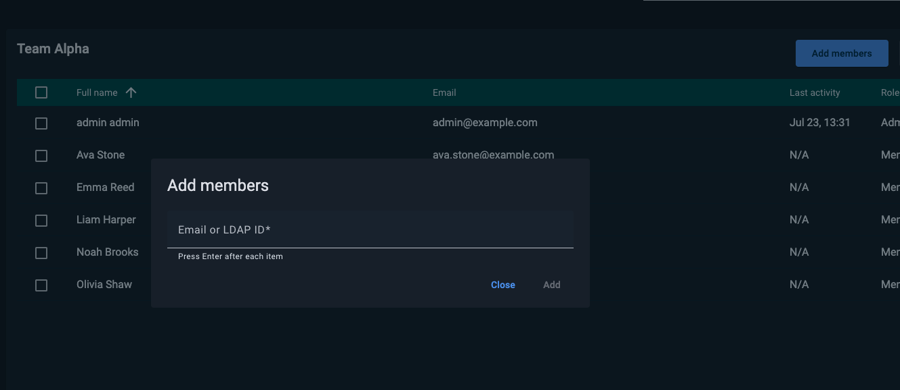
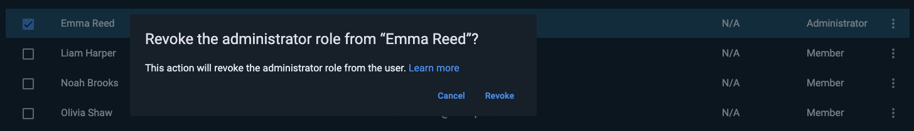
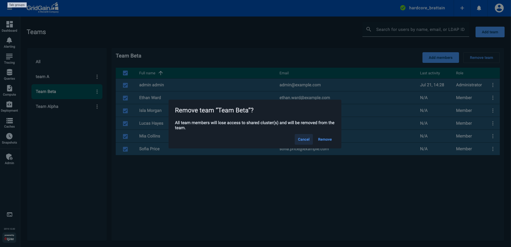

# Managing Teams

As a Control Center user, you can use teams to share Control Center features (such as the Dashboards, SQL, and Alerts screens) between the team participants.

One of the shareable features is access to clusters — for details, see [Cluster Management Screen](../cluster-management.md) and [My Cluster Screen](../gg9/dashboard/my-cluster.md).


You need no special privileges to create a team.


A team participant can be:

- *Member* — a Control Center user invited to the team by one of that team's administrators. Members can use the features and clusters the team has access to. They can also leave the team.
- *Administrator* — a Control Center user who created the team, or who was promoted to the administrator role after joining it. Administrators can perform the full set of team activities, including renaming the team and inviting and removing members.

You manage teams and team members on the **Teams** screen. To navigate to this screen, select **Team Management** from the user profile menu.

The left-hand side of the screen lists all the existing teams.

The right-hand side of the screen, titled with the team name (or **All**), lists:

- If a specific team is selected on the left-hand side — members of that team
- If **All** is selected — all members of all teams you (the current user) belong to
- If **Global Team** is selected — all Control Center users or, if integrated with AD/LDAP, all AD/LDAP users who have logged into Control Center at least once


**Global Team** appears in the list only when `account.globalTeam.enabled` is set to `true` in your environment. For details, see [Global Team](#global-team).


To find a team member, use the search field above the member list.

## Teams

### Creating a Team

To create a team, click **Add Team**. Control Center prompts you for a team name.


Team names are not unique within a Control Center instance.


Enter a name for the team and click **Create Team**.

Control Center prompts you to add a member to the new team. Add a member — see [Adding Members to a Team](#adding-members-to-a-team) — or click **Cancel** to add members later.

The team you have created appears on the list in the left-hand part of the screen. You automatically become an *administrator* of that team.

### Renaming a Team


Only team *administrators* can rename a team.


To rename a team, click `⋮` next to the team name and select **Rename**. Edit the team name and click **Save**.

### Removing a Team


Only team *administrators* can remove a team.


To remove a team, select that team on the left-hand side of the screen, then click **Remove Team** above the team member list on the right-hand side.

In the confirmation dialog, click **Remove**.

Users who had access to clusters and features as members of the removed team lose that access.

## Members

### Adding Members to a Team


Only team *administrators* can add members to a team.


To add members to a team, select that team on the left-hand side of the screen, then click **Add Members** above the team member list on the right-hand side. In the **Add Members** dialog, start typing a Control Center user's email or LDAP ID. As you type, matching users appear in a drop-down list. Select a suggested user, or finish typing the email/ID and press \[Enter]. You can add multiple users in a single operation. When done, click **Add**.

The users are added to the selected team as *members*.

### Promoting and Demoting Members

By default, the Control Center users are added to a team with the *member* role.

As a team administrator, you can promote a team member to the *administrator* role. To promote a member, click `⋮` by that member's name on the list in the right-hand part of the screen and select **Make administrator**. In the confirmation dialog, click **Grant**.

As a team administrator, you can also demote another administrator to the *member* role. To demote an administrator, click `⋮` by that administrator's name on the list in the right-hand part of the screen and select **Revoke administrator**. In the confirmation dialog, click **Revoke**.

### Removing Members


Only team *administrators* can remove members from a team.


As a team administrator, you can remove one member at a time or remove several members in a single operation.

To remove a single member, click `⋮` next to the *member* or *administrator* you want to remove and select **Remove**. In the confirmation dialog, click **Remove**.

To remove several members at once:

1. Select a specific team on the left-hand side of the screen. The team member list displays a checkbox in front of each row.
2. Select the checkboxes of the members you want to remove.
3. Click `⋮` next to any of the selected members and select **Remove**.
4. In the confirmation dialog, click **Remove**.

The removed users lose access to the clusters and features shared through the team.


Bulk selection is available only when a specific team is selected. Checkboxes do not appear in the **All** view, where the same user can belong to several teams at once.


While more than one member is selected, the **Make administrator**, **Revoke administrator**, and **Leave team** actions are disabled. Clear the selection down to one member to use them.

### Leaving a Team

As a team member or administrator, you can leave any team you belong to.


If you are the only *administrator* of a team, you need to promote one of the *members* of that team to the *administrator* role before leaving. For details, see [Promoting and Demoting Members](#promoting-and-demoting-members).


Click `⋮` next to the team you want to leave and select **Leave Team**. In the confirmation dialog, click **Leave**.

## Global Team

The Global Team is a system-managed team available when `account.globalTeam.enabled` is set to `true` in your [environment configuration](../admin-guide/configuration.md#teams). Unlike regular teams, its membership is managed automatically by Control Center — you do not need to invite users or manage access manually.

### How It Works

When enabled, Control Center automatically creates a team called *Global Team*:

- All active local Control Center users are added to Global Team automatically.
- If your environment is integrated with AD/LDAP, AD/LDAP users are added to Global Team upon their first login into Control Center. Users who have never logged in are not included.

Because membership is managed by the system, you cannot manually add or remove individual users from Global Team, nor rename or delete it.

### Cluster Auto-Attach

When `account.globalTeam.attachCluster` is set to `true`, Control Center automatically shares every cluster in the environment with Global Team — including clusters registered after this setting is enabled.


`account.globalTeam.attachCluster` applies to all clusters. You cannot exclude individual clusters from auto-attach while this setting is enabled. To restrict access to specific clusters, disable `account.globalTeam.attachCluster` and share clusters with individual teams manually.


This makes Global Team useful for automating cluster access management in large environments. For example, you can attach clusters without generating individual tokens. For details, see [How can I automate connection of clusters to Control Center?](../faq.md#how-can-i-automate-connection-of-clusters-to-control-center)
