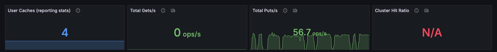
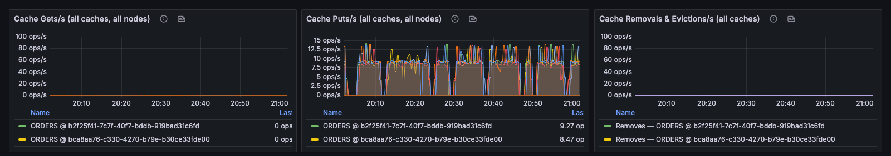
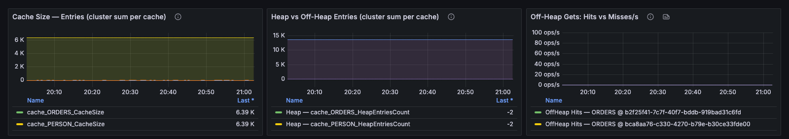
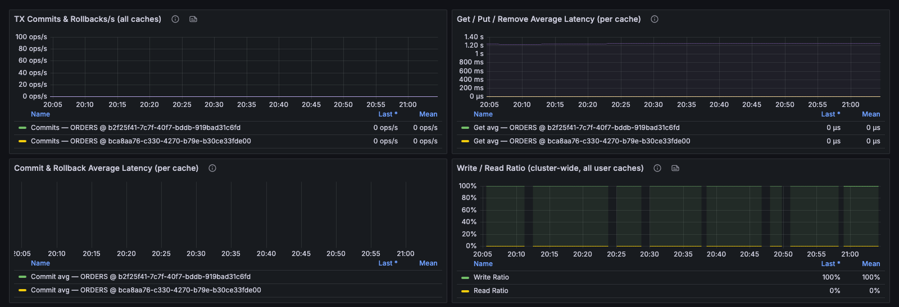
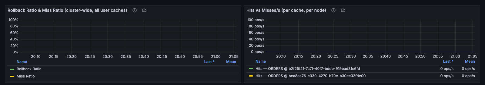

# Caches

This dashboard shows per-cache performance for user data: throughput, size, transactions, and hit and rollback ratios.


The panels show data only for caches with statistics enabled (`statisticsEnabled=true` in the cache configuration). A cache without statistics reports its counters as `0` and its size as `-1`.


### Overview

<figure><figcaption></figcaption></figure>

| Panel                             | Description                                                                         |
| --------------------------------- | ----------------------------------------------------------------------------------- |
| **User Caches (reporting stats)** | Number of caches reporting statistics, including the internal system cache.        |
| **Total Gets/s**                  | Get operations per second across all caches and nodes.                              |
| **Total Puts/s**                  | Put operations per second across all caches and nodes.                              |
| **Cluster Hit Ratio**             | Hits as a share of hits and misses. A low value means most reads miss.              |

### Cache Throughput

Operation rates with one series per cache on each node, so an imbalance between caches or a single node taking most of the traffic is visible.

<figure><figcaption></figcaption></figure>

| Panel                                        | Description                                                                                         |
| -------------------------------------------- | --------------------------------------------------------------------------------------------------- |
| **Cache Gets/s (all caches, all nodes)**     | Get rate per cache, per node.                                                                       |
| **Cache Puts/s (all caches, all nodes)**     | Put rate per cache, per node.                                                                       |
| **Cache Removals & Evictions/s (all caches)** | Removals against evictions. Removals come from the application; evictions come from memory pressure. |

### Cache Size & Off-Heap

<figure><figcaption></figcaption></figure>

| Panel                                                | Description                                                                                                |
| ---------------------------------------------------- | ---------------------------------------------------------------------------------------------------------- |
| **Cache Size — Entries (cluster sum per cache)**     | Entries per cache, including primary and backup copies. A sudden drop indicates eviction or a lost node.  |
| **Heap vs Off-Heap Entries (cluster sum per cache)** | Entries held on heap against entries held off heap.                                                        |
| **Off-Heap Gets: Hits vs Misses/s**                  | Off-heap hits and misses per second. A miss means the entry had to come from the backing store or the primary node. |

### Cache Transactions

Average latencies are calculated as total operation time divided by the number of operations since node start. Caches with no operations show gaps.

<figure><figcaption></figcaption></figure>

| Panel                                                | Description                                                                                              |
| ---------------------------------------------------- | -------------------------------------------------------------------------------------------------------- |
| **TX Commits & Rollbacks/s (all caches)**            | Commits against rollbacks per cache. A high share of rollbacks indicates contention or application errors. |
| **Get / Put / Remove Average Latency (per cache)**   | Average get, put, and remove time per cache since node start.                                            |
| **Commit & Rollback Average Latency (per cache)**    | Average commit and rollback time per cache since node start.                                             |
| **Write / Read Ratio (cluster-wide, all user caches)** | The mix of reads and writes in the workload.                                                           |

### Cache Hit / Miss & Transaction Ratios

How many transactions roll back and how many reads are served, independent of load. The ratios are cluster-wide totals across all user caches.

<figure><figcaption></figcaption></figure>

| Panel                                                          | Description                                                                                  |
| -------------------------------------------------------------- | -------------------------------------------------------------------------------------------- |
| **Rollback Ratio & Miss Ratio (cluster-wide, all user caches)** | Rollbacks as a share of all transactions, and misses as a share of all reads.               |
| **Hits vs Misses/s (per cache, per node)**                     | Hits and misses per cache, per node, to find the cache behind a low hit ratio.               |

_This page is: Copyright © 2026 MariaDB. All rights reserved._


