# Cluster

This dashboard is the at-a-glance health page for a whole GridGain 8 cluster. It shows whether the cluster is up, whether every partition is still backed up, whether any node is under pressure, whether the topology is stable, and how transactions, SQL, thread pools, and inter-node traffic behave.

### Header Tiles

The figures to check first, counted over nodes that are still reporting.

<figure>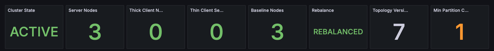<figcaption></figcaption></figure>

| Panel                    | Description                                                                                                                                                                  |
| ------------------------ | ---------------------------------------------------------------------------------------------------------------------------------------------------------------------------- |
| **Cluster State**        | ACTIVE or INACTIVE. If any node reports the cluster as inactive, the tile shows INACTIVE. A read-only cluster shows as ACTIVE.                                                |
| **Server Nodes**         | Number of server nodes in the cluster topology.                                                                                                                              |
| **Thick Client Nodes**   | Number of client-mode nodes that joined the topology.                                                                                                                         |
| **Thin Client Sessions** | Open thin-client connections. A partition-aware client opens one connection per server node, so one client on three servers counts as three.                               |
| **Baseline Nodes**       | Number of nodes in the baseline topology. A difference from **Server Nodes** means a baseline node is missing from the topology.                                             |
| **Rebalance**            | REBALANCED or REBALANCING. A deactivated cluster owns no partitions, so the tile shows `-`.                                                                                   |
| **Topology Version**     | Increases each time a node joins or leaves. A changing number means topology churn.                                                                                          |
| **Min Partition Copies** | The lowest number of copies of any partition across all cache groups. `0` means a partition has no copy left (data loss). `1` means one more node failure causes data loss. |

### Cluster State

<figure>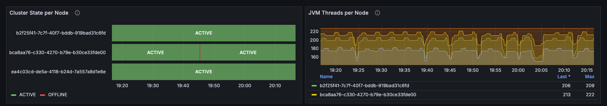<figcaption></figcaption></figure>

| Panel                      | Description                                                                                                                                          |
| -------------------------- | ---------------------------------------------------------------------------------------------------------------------------------------------------- |
| **Cluster State per Node** | ACTIVE, INACTIVE, or OFFLINE over time for each node. OFFLINE means the node stopped reporting metrics.                                              |
| **JVM Threads per Node**   | Live threads per node against the cluster's peak. A count that keeps rising on a steady workload suggests a thread leak.                             |

### CPU & Heap (All Nodes)

Shows where CPU and memory pressure sits and whether it is spread evenly. The per-node lines identify the busiest node. The maximum, average, and minimum lines show whether a rise is cluster-wide or one node pulling away.

<figure>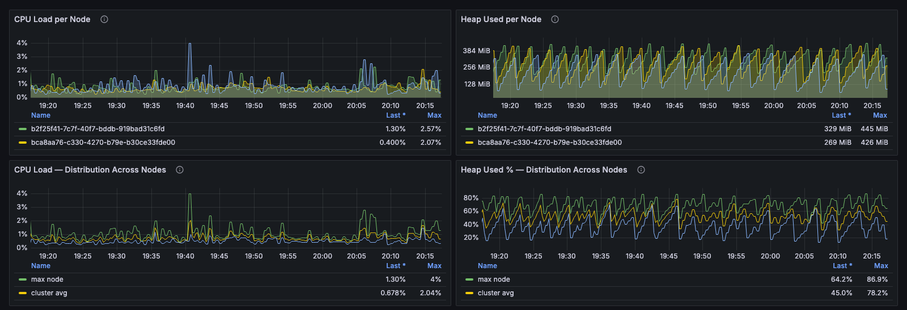<figcaption></figcaption></figure>

| Panel                                       | Description                                                                                                                  |
| ------------------------------------------- | ---------------------------------------------------------------------------------------------------------------------------- |
| **CPU Load per Node**                       | Process CPU load per node.                                                                                                    |
| **Heap Used per Node**                      | Java heap in use per node, in bytes.                                                                                          |
| **CPU Load — Distribution Across Nodes**    | CPU load of the busiest node, the cluster average, and the quietest node. A wide gap means work is unevenly distributed.      |
| **Heap Used % — Distribution Across Nodes** | The same three lines for heap use as a fraction of each node's maximum heap. A high maximum on a low average means one node is heading for GC pressure. |

### Nodes & Topology

<figure>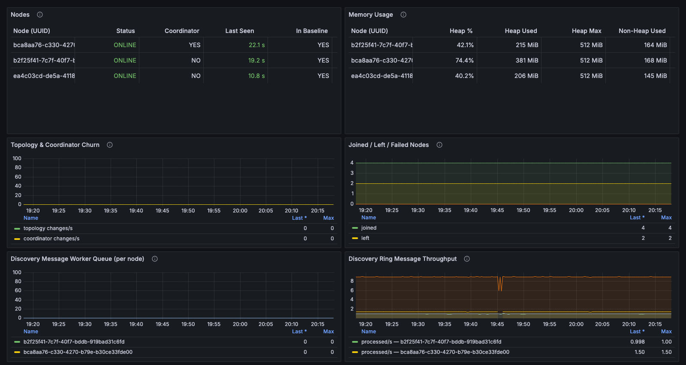<figcaption></figcaption></figure>

| Panel                                         | Description                                                                                                                                                                                                                     |
| --------------------------------------------- | ------------------------------------------------------------------------------------------------------------------------------------------------------------------------------------------------------------------------------- |
| **Nodes**                                     | One row per node, least recently seen first: ONLINE or OFFLINE, whether the node is the coordinator, time since last report, baseline membership, uptime, and long JVM pause count. An OFFLINE row keeps the last values that node reported. |
| **Memory Usage**                              | Heap percentage, heap used and maximum, non-heap memory, and thread count per node.                                                                                                                                             |
| **Topology & Coordinator Churn**              | Topology changes and coordinator elections per second. Churn without a planned restart indicates unstable discovery.                                                                                                           |
| **Joined / Left / Failed Nodes**              | Cumulative counts of nodes that joined, left, or failed, and the gap between baseline nodes and server nodes. A non-zero gap means the baseline expects nodes the cluster cannot see.                                         |
| **Discovery Message Worker Queue (per node)** | Backlog in the discovery message worker. A queue that stops draining often comes before a node is segmented from the cluster.                                                                                                  |
| **Discovery Ring Message Throughput**         | Discovery messages processed and received per node. A node whose processed rate drops to zero while the cluster keeps receiving is about to be segmented. The coordinator normally processes more messages than other nodes. |

### Partition & Backup Health

Partition redundancy across every cache group, and the rebalance and index work that temporarily reduces it.

<figure>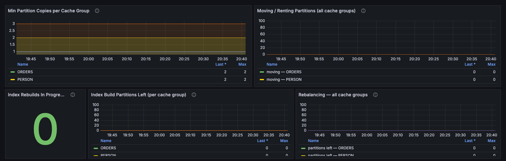<figcaption></figcaption></figure>

| Panel                                              | Description                                                                                                                 |
| -------------------------------------------------- | --------------------------------------------------------------------------------------------------------------------------- |
| **Min Partition Copies per Cache Group**           | Redundancy per cache group. `0` means a partition is lost; `1` means no redundancy is left.                                 |
| **Moving / Renting Partitions (all cache groups)** | Partitions being rebalanced to a node, and partitions and entries waiting to be evicted after ownership moves to another node. |
| **Index Rebuilds In Progress**                     | Number of caches rebuilding their indexes. SQL queries against these caches can fall back to full scans.                    |
| **Index Build Partitions Left (per cache group)**  | Partitions still waiting for an index build. Drops to zero when the rebuild finishes.                                       |
| **Rebalancing — all cache groups**                 | Rebalance progress and throughput across every cache group and cache.                                                       |

### JVM Pauses

A stop-the-world pause makes a node look slow to the rest of the cluster, and a long enough pause makes it look dead. GridGain counts only pauses longer than its pause detector threshold (500 ms by default).

<figure>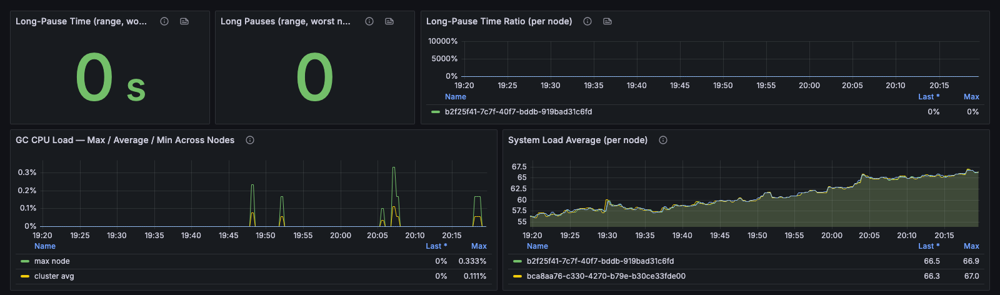<figcaption></figcaption></figure>

| Panel                                              | Description                                                                                                 |
| -------------------------------------------------- | ----------------------------------------------------------------------------------------------------------- |
| **Long-Pause Time (range, worst node)**            | Time lost to long JVM pauses over the dashboard time range, on the worst node.                              |
| **Long Pauses (range, worst node)**                | Number of long JVM pauses over the dashboard time range, on the worst node.                                 |
| **Long-Pause Time Ratio (per node)**               | Fraction of time each node spent paused. `0.01` is 1%.                                                      |
| **GC CPU Load — Max / Average / Min Across Nodes** | Share of CPU spent on garbage collection on the busiest, average, and quietest node. Above `0.5`, a node has little CPU left for real work. |
| **System Load Average (per node)**                 | Operating system load average, which distinguishes a busy JVM from a busy host.                             |

### Partition Map Exchange (PME)

Every topology change and every cache start or stop triggers a partition map exchange, and cache operations are blocked while it runs. Exchange duration is the cluster's own measure; the time cache operations were blocked is what users experience.

<figure>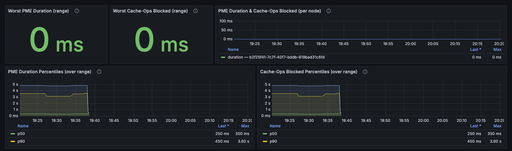<figcaption></figcaption></figure>

| Panel                                           | Description                                                                                                                     |
| ----------------------------------------------- | ------------------------------------------------------------------------------------------------------------------------------- |
| **Worst PME Duration (range)**                  | Longest exchange over the dashboard time range. An exchange over 10 seconds is slow, and over 60 seconds it is likely hung.     |
| **Worst Cache-Ops Blocked (range)**             | Longest time cache operations were blocked by an exchange over the dashboard time range.                                        |
| **PME Duration & Cache-Ops Blocked (per node)** | Both durations per node, to identify a single slow node.                                                                        |
| **PME Duration Percentiles (over range)**       | p50, p90, and p99 exchange duration over the dashboard time range. Precision is limited by GridGain's histogram buckets (500 ms, 1 s, 5 s, 30 s). |
| **Cache-Ops Blocked Percentiles (over range)**  | The same percentiles for the time cache operations were blocked.                                                                |

### Clients & Sessions

<figure>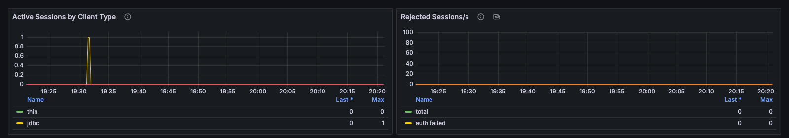<figcaption></figcaption></figure>

| Panel                             | Description                                                                                                                         |
| --------------------------------- | ----------------------------------------------------------------------------------------------------------------------------------- |
| **Active Sessions by Client Type** | Open sessions for thin, JDBC, ODBC, and REST clients, with thick client nodes shown alongside.                                      |
| **Rejected Sessions/s**           | Rejected connections per second by cause: total rejections, failed authentication, timeouts, and rejected SSL connections.          |

### Transactions

<figure>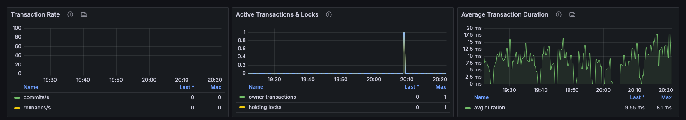<figcaption></figcaption></figure>

| Panel                            | Description                                                                                                                                  |
| -------------------------------- | -------------------------------------------------------------------------------------------------------------------------------------------- |
| **Transaction Rate**             | Commits and rollbacks per second. A spike in rollbacks indicates contention or application errors.                                           |
| **Active Transactions & Locks**  | Active transactions, transactions holding locks, and locked keys. Locked keys rising while the commit rate stays flat indicates long-running transactions. |
| **Average Transaction Duration** | Average transaction time, calculated from total transaction time divided by the number of commits and rollbacks.                            |

### SQL

<figure>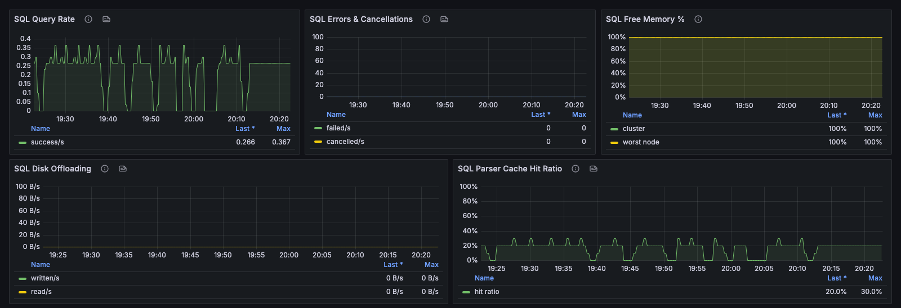<figcaption></figcaption></figure>

| Panel                          | Description                                                                                                                                  |
| ------------------------------ | -------------------------------------------------------------------------------------------------------------------------------------------- |
| **SQL Query Rate**             | Successful user queries per second.                                                                                                          |
| **SQL Errors & Cancellations** | Failed, canceled, and out-of-memory query rates.                                                                                              |
| **SQL Free Memory %**          | Free SQL query memory as a share of the quota, cluster-wide and on the worst node. The worst node determines the risk of out-of-memory errors. |
| **SQL Disk Offloading**        | Bytes written to and read from disk by queries that exceeded their memory quota. Sustained offloading means the quota is too small for the workload. |
| **SQL Parser Cache Hit Ratio** | Share of statements served from the parsed-statement cache. A low ratio under load means queries are not parameterized.                     |

### Thread Pools (All Discovered Pools)

Every thread pool the nodes report is shown, so any saturating pool is visible. The striped executor and the data streamer executor have their own panels because clients feel their saturation directly.

<figure>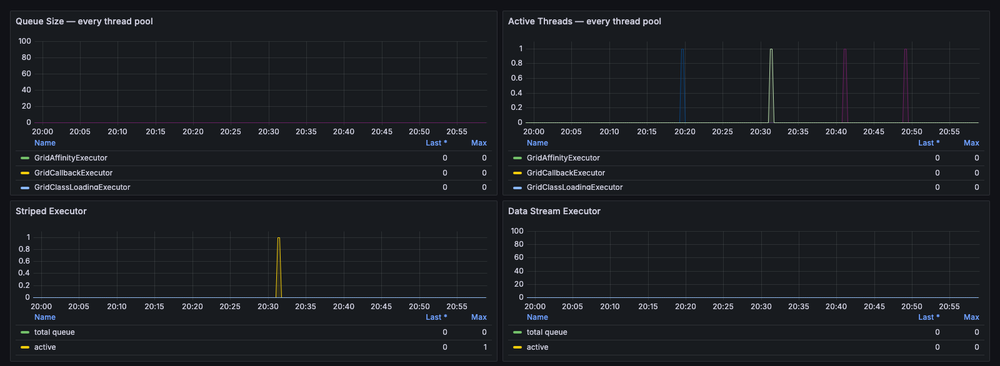<figcaption></figcaption></figure>

| Panel                                  | Description                                                                                                                   |
| -------------------------------------- | ----------------------------------------------------------------------------------------------------------------------------- |
| **Queue Size — every thread pool**     | Queue depth for every thread pool.                                                                                            |
| **Active Threads — every thread pool** | Active threads per pool. Compare with the pool size to find a pool running at its maximum.                                    |
| **Striped Executor**                   | Queue size, active threads, and starvation flag of the striped executor, which runs cache operations.                         |
| **Data Stream Executor**               | Queue size, active threads, and starvation flag of the data streamer executor, which handles bulk loads and rebalance data.  |

### Communication

<figure>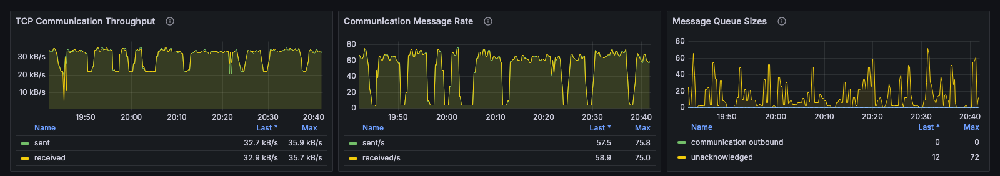<figcaption></figcaption></figure>

| Panel                            | Description                                                                                                       |
| -------------------------------- | ----------------------------------------------------------------------------------------------------------------- |
| **TCP Communication Throughput** | Bytes sent and received between nodes.                                                                            |
| **Communication Message Rate**   | Messages sent and received per second, which can change independently of payload size.                           |
| **Message Queue Sizes**          | Outbound and unacknowledged message backlog. Sustained growth means a node is falling behind.                     |

### JVM GC Detail

This row is collapsed and shows no data in a default installation. It requires JVM garbage collector metrics, which the GridGain metric exporter doesn't send.

_This page is: Copyright © 2026 MariaDB. All rights reserved._


