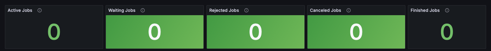
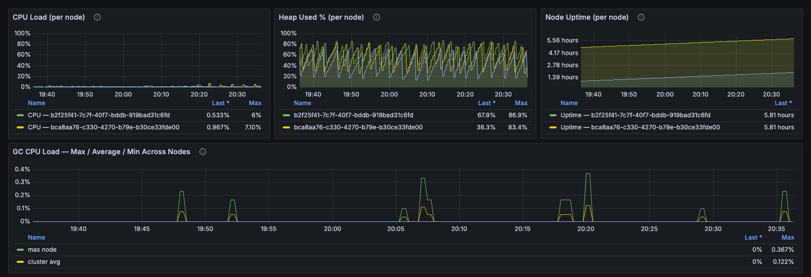
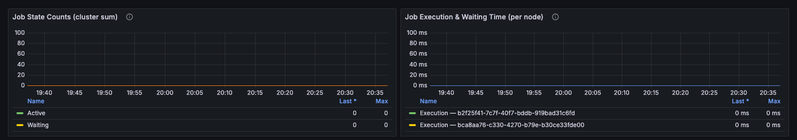
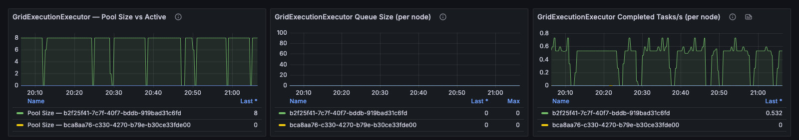

# Compute

This dashboard shows cluster-wide compute job health: how many jobs are in each state, how long they run and wait, and whether the thread pool that runs them has capacity left.

### Header Tiles

Job counts across the cluster. **Rejected Jobs** shows that the cluster cannot absorb the load. **Canceled Jobs** and **Finished Jobs** are cumulative since node start, so watch how fast they change rather than their absolute values.

<figure><figcaption></figcaption></figure>

| Panel             | Description                                                     |
| ----------------- | --------------------------------------------------------------- |
| **Active Jobs**   | Jobs running now.                                               |
| **Waiting Jobs**  | Jobs queued for an execution thread.                            |
| **Rejected Jobs** | Jobs rejected because the queue was full or a node was overloaded. |
| **Canceled Jobs** | Jobs canceled, cumulative since node start.                     |
| **Finished Jobs** | Jobs completed, cumulative since node start.                    |

### CPU & Memory

Compute work uses CPU and heap, so a compute problem often shows here before it shows in the job counts.

<figure><figcaption></figcaption></figure>

| Panel                                              | Description                                                                                                 |
| -------------------------------------------------- | ----------------------------------------------------------------------------------------------------------- |
| **CPU Load (per node)**                            | Process CPU load and the share used by garbage collection, per node.                                        |
| **Heap Used % (per node)**                         | Heap in use as a fraction of the maximum heap, per node.                                                    |
| **Node Uptime (per node)**                         | Time since each node started. Compare with job execution time to spot drifting durations.                   |
| **GC CPU Load — Max / Average / Min Across Nodes** | Share of CPU spent on garbage collection on the busiest, average, and quietest node. Above `0.5`, a node has little CPU left for jobs. |

### Compute Jobs

Sustained waiting or rejected jobs mean the cluster is out of compute capacity. Execution time rising while load stays flat points to a regression in the job itself.

<figure><figcaption></figcaption></figure>

| Panel                                       | Description                                                       |
| ------------------------------------------- | ----------------------------------------------------------------- |
| **Job State Counts (cluster sum)**          | Active, waiting, rejected, and canceled jobs across the cluster.  |
| **Job Execution & Waiting Time (per node)** | Job execution time and queue time per node.                       |

### GridExecutionExecutor Thread Pool

`GridExecutionExecutor` is the thread pool that runs compute jobs. When it is saturated, jobs wait or are rejected.

<figure><figcaption></figcaption></figure>

| Panel                                                  | Description                                                                                                 |
| ------------------------------------------------------ | ----------------------------------------------------------------------------------------------------------- |
| **GridExecutionExecutor — Pool Size vs Active**        | Active threads against the configured pool size. Active threads at the pool size with a growing queue means compute is saturated. |
| **GridExecutionExecutor Queue Size (per node)**        | Jobs waiting for a thread, per node.                                                                        |
| **GridExecutionExecutor Completed Tasks/s (per node)** | Completed tasks per second, per node. A flat line means the node is running no jobs.                        |

_This page is: Copyright © 2026 MariaDB. All rights reserved._


