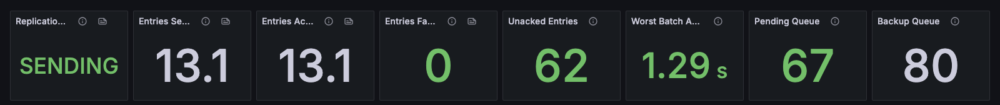
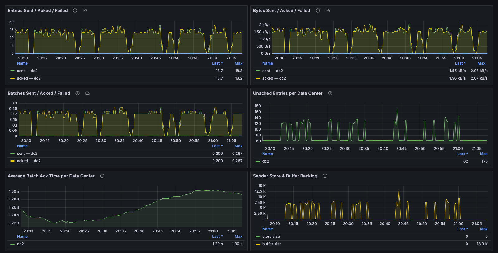
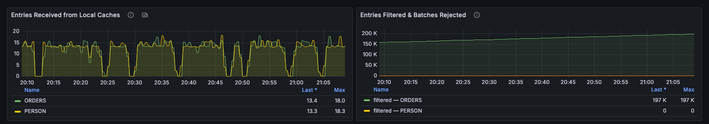
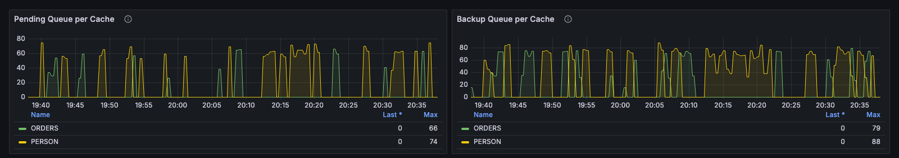
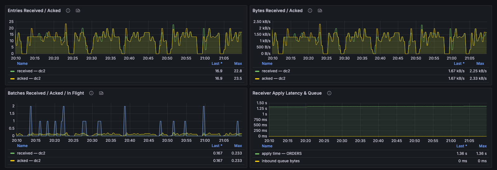

# Data Center Replication

This dashboard shows replication out of and into the cluster: sender throughput and backlog per remote data center, the updates local caches pass to the sender, per-cache queues, and the receiver side. In a bidirectional setup, both the sender and receiver sections show data on each cluster.

### Header Tiles

Whether replication is moving, how fast, and how far behind it is. Watch **Unacked Entries**: it is the backlog of entries sent but not yet acknowledged, and a number that keeps rising means the remote data center has stopped keeping up.

<figure><figcaption></figcaption></figure>

| Panel                    | Description                                                                                                                                      |
| ------------------------ | ------------------------------------------------------------------------------------------------------------------------------------------------ |
| **Replication State**    | SENDING or IDLE, based on sender traffic over the last 2 minutes. GridGain doesn't export a replication state metric, so `control.sh --dr state` remains the authoritative check. |
| **Entries Sent/s**       | Entries per second sent by this cluster's sender hubs.                                                                                           |
| **Entries Acked/s**      | Entries per second acknowledged by remote receivers. A persistent gap against **Entries Sent/s** means a backlog is building.                   |
| **Entries Failed/s**     | Entries per second that failed to replicate.                                                                                                     |
| **Unacked Entries**      | Entries sent but not yet acknowledged.                                                                                                           |
| **Worst Batch Ack Time** | Slowest average batch acknowledgment time across remote data centers.                                                                            |
| **Pending Queue**        | Cache updates waiting in the replication pending queue.                                                                                          |
| **Backup Queue**         | Updates buffered for partitions this node holds as backups.                                                                                      |

### Sender — Per Remote Data Center

Outbound replication split by destination, so a problem with the link to one data center can be told apart from a cluster-wide problem.

<figure><figcaption></figcaption></figure>

| Panel                                      | Description                                                                                                       |
| ------------------------------------------ | ----------------------------------------------------------------------------------------------------------------- |
| **Entries Sent / Acked / Failed**          | Entries sent, acknowledged, and failed per remote data center.                                                    |
| **Bytes Sent / Acked / Failed**            | The same, in bytes.                                                                                               |
| **Batches Sent / Acked / Failed**          | The same, in batches.                                                                                             |
| **Unacked Entries per Data Center**        | Entries sent but not yet acknowledged, per destination. Normally near zero; a rising line is the earliest sign of a degraded link. |
| **Average Batch Ack Time per Data Center** | Replication latency per destination.                                                                              |
| **Sender Store & Buffer Backlog**          | Batches stored for retry and batches held in memory waiting to be sent.                                          |

### Sender Ingest — From Local Caches

Updates the cluster's data nodes pass to the sender hubs, before batching and sending. Compare with the per-data-center section to tell whether the application is writing less or the link is slow.

<figure><figcaption></figcaption></figure>

| Panel                                    | Description                                                                                                  |
| ---------------------------------------- | ------------------------------------------------------------------------------------------------------------ |
| **Entries Received from Local Caches**   | Updates arriving at the sender hubs, per cache.                                                              |
| **Entries Filtered & Batches Rejected**  | Updates the sender discarded, either filtered by the sender group filter or rejected. Both are normally zero. |

### Replication Backlog — Per Cache

The backlog from the header tiles, broken down per cache. Sustained growth on one cache points to that cache rather than the link.

<figure><figcaption></figcaption></figure>

| Panel                       | Description                                                      |
| --------------------------- | ---------------------------------------------------------------- |
| **Pending Queue per Cache** | Updates waiting to be sent, per replicated cache.                |
| **Backup Queue per Cache**  | Updates buffered for backup partitions, per cache.               |

### Receiver — Per Remote Data Center

Inbound replication split by source data center, and how long this cluster takes to apply what arrives.

<figure><figcaption></figcaption></figure>

| Panel                                    | Description                                                                                                  |
| ---------------------------------------- | ------------------------------------------------------------------------------------------------------------ |
| **Entries Received / Acked**             | Entries received and acknowledged per source data center.                                                    |
| **Bytes Received / Acked**               | The same, in bytes.                                                                                          |
| **Batches Received / Acked / In Flight** | Batches received and acknowledged, and batches in flight (received but not yet stored and acknowledged).     |
| **Receiver Apply Latency & Queue**       | Time between a batch arriving and being stored, per cache, and the size of the inbound queue in bytes.      |

_This page is: Copyright © 2026 MariaDB. All rights reserved._


