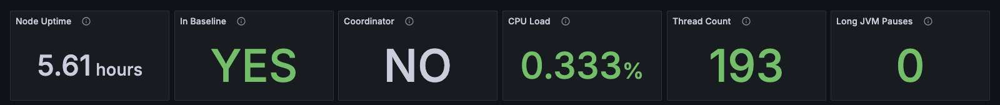
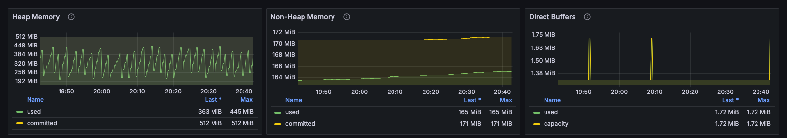
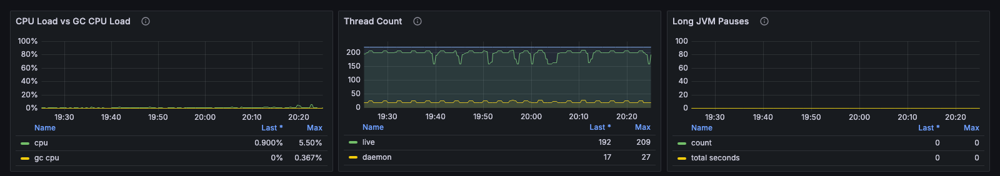
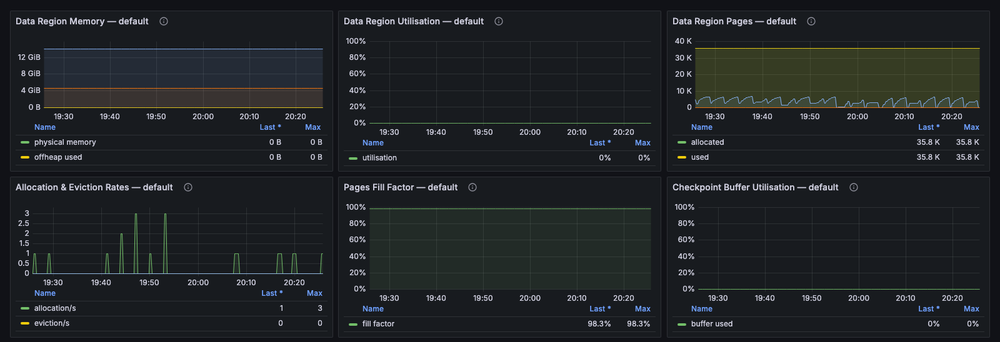
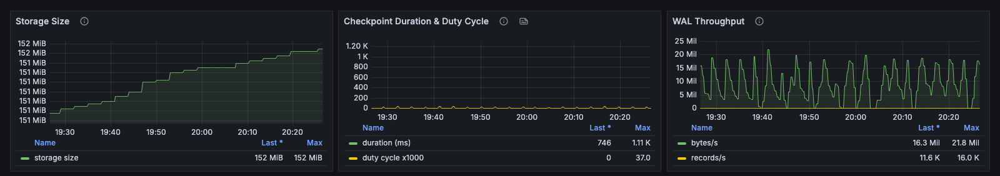
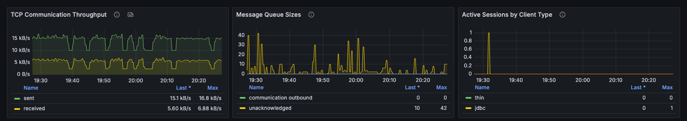
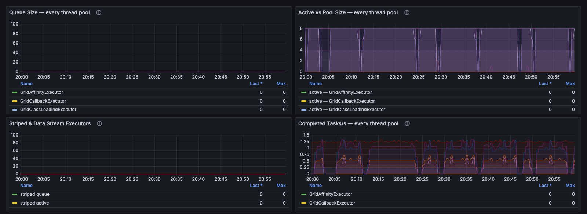
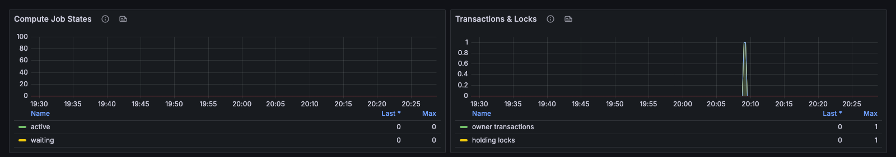

# Node

This dashboard shows everything about one node, selected with the **Instance** filter: its role, JVM memory, CPU and threads, the selected data region, its storage and write-ahead log (WAL), its communication, its thread pools, and the compute and transaction work running on it. Open it from the [Cluster](cluster.md) dashboard when a node looks wrong, or from the node's row in the Enterprise Manager **Databases** list.

### Header Tiles

Every tile shows **N/A** once the node has stopped reporting, so a stopped node doesn't present its last values as current.

<figure><figcaption></figcaption></figure>

| Panel               | Description                                                                                   |
| ------------------- | --------------------------------------------------------------------------------------------- |
| **Node Uptime**     | Time since the node joined.                                                                   |
| **In Baseline**     | Whether the node is in the baseline topology. A server node outside the baseline holds no partitions. |
| **Coordinator**     | Whether the node is the cluster coordinator.                                                  |
| **CPU Load**        | Process CPU load on the node.                                                                 |
| **Thread Count**    | Live JVM threads.                                                                             |
| **Long JVM Pauses** | Long JVM pauses since the node started, counting only pauses longer than 500 ms.              |

### JVM Memory

Each memory pool stops a node for a different reason: heap exhaustion causes GC pressure, steadily growing non-heap memory points to a class-loading leak, and direct buffer exhaustion stalls network and page store I/O.

<figure><figcaption></figcaption></figure>

| Panel               | Description                                                                                         |
| ------------------- | --------------------------------------------------------------------------------------------------- |
| **Heap Memory**     | Heap used, committed, and maximum.                                                                  |
| **Non-Heap Memory** | Non-heap memory used and committed, including metaspace. Unbounded growth suggests a class-loading leak. |
| **Direct Buffers**  | Direct buffer memory used and capacity. Use approaching capacity causes allocation stalls.          |

### CPU & Threads

<figure><figcaption></figcaption></figure>

| Panel                       | Description                                                        |
| --------------------------- | ------------------------------------------------------------------ |
| **CPU Load vs GC CPU Load** | Total process CPU load and the share used by garbage collection.   |
| **Thread Count**            | Live, daemon, and peak thread counts.                              |
| **Long JVM Pauses**         | Long JVM pause count and total pause time on the node.             |

### Data Region

The off-heap data region selected with the **Data region** filter. A region that runs out of space starts replacing pages, which turns memory reads into disk reads. A full checkpoint buffer starts throttling writes.

<figure><figcaption></figcaption></figure>

| Panel                             | Description                                                                         |
| --------------------------------- | ----------------------------------------------------------------------------------- |
| **Data Region Memory**            | Physical memory size, off-heap memory used, off-heap size, and maximum size of the region, in bytes. |
| **Data Region Utilization**       | Off-heap memory used as a share of the region size. The built-in alert rules warn at 80%, 90%, and 95%. |
| **Data Region Pages**             | Allocated, used, dirty, and empty data pages.                                       |
| **Allocation & Eviction Rates**   | Rates at which pages are allocated, evicted, and replaced.                          |
| **Pages Fill Factor**             | How full allocated pages are. A falling fill factor indicates fragmentation.        |
| **Checkpoint Buffer Utilization** | Share of the checkpoint buffer in use. A high value causes write throttling.        |

### Storage & WAL (This Node)

Disk footprint and write path for this node. For the cluster-wide view, see the [Persistence](persistence.md) dashboard.

<figure><figcaption></figcaption></figure>

| Panel                                | Description                                                                                       |
| ------------------------------------ | ------------------------------------------------------------------------------------------------- |
| **Storage Size**                     | On-disk size of the persistent store on this node.                                                |
| **Checkpoint Duration & Duty Cycle** | Longest checkpoint per display interval, and the share of time the node spends checkpointing.    |
| **WAL Throughput**                   | WAL bytes written per second and WAL records logged per second.                                   |

### Communication

<figure><figcaption></figcaption></figure>

| Panel                              | Description                                                         |
| ---------------------------------- | ------------------------------------------------------------------- |
| **TCP Communication Throughput**   | Bytes sent and received by this node.                               |
| **Message Queue Sizes**            | Communication and discovery message backlog on this node.           |
| **Active Sessions by Client Type** | Thin, JDBC, ODBC, and REST client sessions connected to this node.  |

### Thread Pools (All Discovered Pools)

Every thread pool on the node. A pool running at its configured size with a non-empty queue is saturated.

<figure><figcaption></figcaption></figure>

| Panel                                     | Description                                                                                         |
| ----------------------------------------- | --------------------------------------------------------------------------------------------------- |
| **Queue Size — every thread pool**        | Queue depth per pool.                                                                               |
| **Active vs Pool Size — every thread pool** | Active threads against the configured size of each pool.                                          |
| **Striped & Data Stream Executors**       | Queue size, active threads, and starvation flag of the pools that run cache operations and bulk loads. |
| **Completed Tasks/s — every thread pool** | Completed tasks per second, per pool.                                                               |

### Compute & Transactions (This Node)

The workload running on this node, so a node that looks busy on the [Cluster](cluster.md) dashboard can be tied to its jobs and transactions.

<figure><figcaption></figcaption></figure>

| Panel                    | Description                                                                                     |
| ------------------------ | ----------------------------------------------------------------------------------------------- |
| **Compute Job States**   | Active and waiting jobs, and the rates of started, finished, and rejected jobs.                 |
| **Transactions & Locks** | Active transactions, transactions holding locks, locked keys, and commit and rollback rates.    |

_This page is: Copyright © 2026 MariaDB. All rights reserved._


