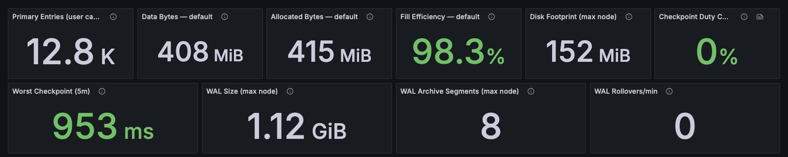
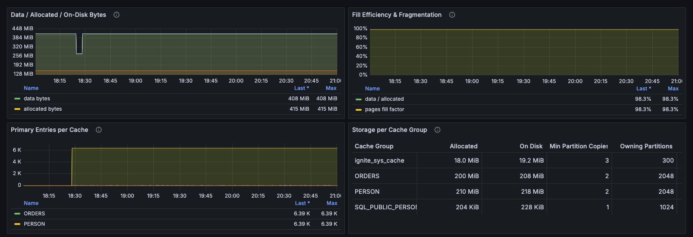
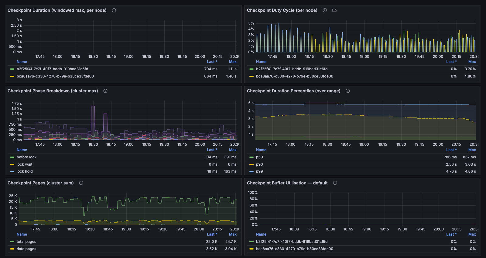
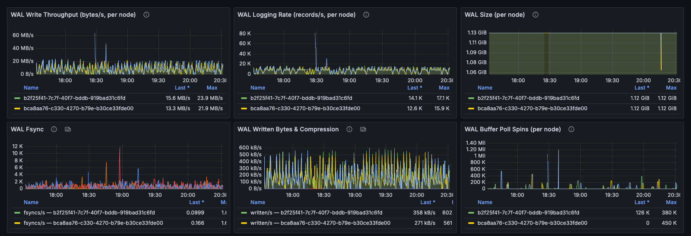
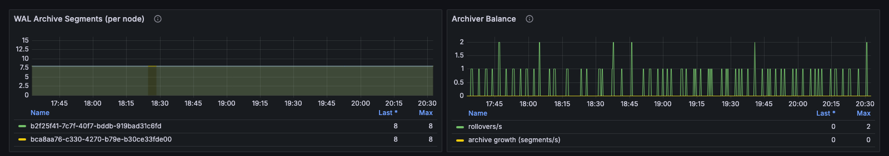
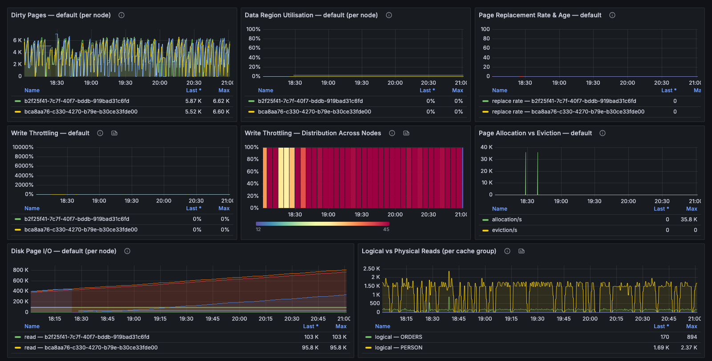

# Persistence

This dashboard shows how much data the cluster holds, how much disk it uses, and whether the write path (checkpoints, the write-ahead log (WAL), page replacement, and write throttling) keeps up. The default time range is 3 hours, because checkpoint and WAL behavior is best read as a trend.

### Header Tiles

Data volume on the left, write-path health on the right. Data region figures are cluster totals. Disk and WAL figures are the maximum of any node, because each node has its own disk.

<figure><figcaption></figcaption></figure>

| Panel                                  | Description                                                                                                         |
| -------------------------------------- | ------------------------------------------------------------------------------------------------------------------- |
| **Primary Entries (user caches)**      | Number of entries across user caches, counting primary copies only.                                                 |
| **Data Bytes**                         | Bytes occupied by data in the selected data region, including all copies.                                           |
| **Allocated Bytes**                    | Bytes allocated in the selected data region to hold that data.                                                      |
| **Fill Efficiency**                    | Data bytes as a share of allocated bytes. A falling ratio indicates fragmentation.                                  |
| **Disk Footprint (max node)**          | Largest on-disk size of any node.                                                                                   |
| **Checkpoint Duty Cycle (worst node)** | Share of time the busiest node spends checkpointing. `0.5` means half the time.                                     |
| **Worst Checkpoint (5m)**              | Longest checkpoint in the last 5 minutes.                                                                           |
| **WAL Size (max node)**                | Largest WAL size of any node.                                                                                       |
| **WAL Archive Segments (max node)**    | Highest number of WAL archive segments on any node. The archive limit is set in bytes (`maxWalArchiveSize`), so what a segment count means depends on the segment size (`walSegmentSize`). |
| **WAL Rollovers/min**                  | WAL segment rollovers per minute.                                                                                   |

### Real Data Volume vs Disk Footprint

The amount of data can be measured as bytes occupied, bytes allocated, or bytes on disk, and capacity planning goes wrong when these are confused. This section shows all three together and breaks the volume down per cache and per cache group.

<figure><figcaption></figcaption></figure>

| Panel                               | Description                                                                                                                  |
| ----------------------------------- | ---------------------------------------------------------------------------------------------------------------------------- |
| **Data / Allocated / On-Disk Bytes** | Data, allocated, and used bytes in the data region (cluster totals), and on-disk size (worst node).                         |
| **Fill Efficiency & Fragmentation** | Data-to-allocated ratio and page fill factor. Both falling together means space is allocated but not occupied.               |
| **Primary Entries per Cache**       | Number of entries per cache.                                                                                                 |
| **Storage per Cache Group**         | Allocated size, on-disk size, minimum partition copies, owned partitions, and tombstones per cache group.                    |

### Checkpoints

A checkpoint writes dirty pages to disk and holds a lock while it starts. Long checkpoints block cache operations, and a node that checkpoints most of the time has no headroom for a burst of writes.

<figure><figcaption></figcaption></figure>

| Panel                                             | Description                                                                                                       |
| ------------------------------------------------- | ----------------------------------------------------------------------------------------------------------------- |
| **Checkpoint Duration (windowed max, per node)**  | Longest checkpoint per display interval, per node, so a long checkpoint stays visible after shorter ones follow it. |
| **Checkpoint Duty Cycle (per node)**              | Share of time each node spends checkpointing.                                                                     |
| **Checkpoint Phase Breakdown (cluster max)**      | Time spent in each checkpoint phase. Lock wait and lock hold block cache operations; fsync depends on the disk.  |
| **Checkpoint Duration Percentiles (over range)**  | p50, p90, and p99 checkpoint duration over the dashboard time range.                                              |
| **Checkpoint Pages (cluster sum)**                | Total, data, and copy-on-write pages written per checkpoint. Copy-on-write pages are extra work caused by writes during the checkpoint. |
| **Checkpoint Buffer Utilization**                 | Share of the checkpoint buffer in use in the selected data region. The built-in alert rules warn at 66% and 80%. |

### WAL — Work Directory

Every write goes to the WAL first, so WAL latency is write latency.

<figure><figcaption></figcaption></figure>

| Panel                                         | Description                                                                                                  |
| --------------------------------------------- | ------------------------------------------------------------------------------------------------------------ |
| **WAL Write Throughput (bytes/s, per node)**  | WAL bytes written per second, per node.                                                                      |
| **WAL Logging Rate (records/s, per node)**    | WAL records logged per second, per node.                                                                     |
| **WAL Size (per node)**                       | WAL size per node.                                                                                           |
| **WAL Fsync**                                 | Fsync rate and average fsync duration. A rising average at a steady rate means the disk is the bottleneck.   |
| **WAL Written Bytes & Compression**           | Bytes written, and compressed bytes when WAL compaction is enabled.                                          |
| **WAL Buffer Poll Spins (per node)**          | Spins while waiting for WAL buffer space. Sustained spinning means writers are contending for the buffer.   |

### WAL — Archive

WAL segments roll over into the archive and are compacted or deleted from it. This section shows whether removal keeps pace with new segments.

<figure><figcaption></figcaption></figure>

| Panel                                | Description                                                                                                                                  |
| ------------------------------------ | -------------------------------------------------------------------------------------------------------------------------------------------- |
| **WAL Archive Segments (per node)**  | Number of WAL archive segments per node.                                                                                                     |
| **Archiver Balance**                 | Segment rollovers per second against archive growth per second. Sustained growth while rollovers stay flat means segments accumulate faster than they are removed. |

### Dirty Pages, Throttling & Page Replacement

When a data region fills up, dirty pages accumulate faster than checkpoints write them, the checkpoint buffer fills, GridGain throttles writes, and pages start being replaced. After that, every read of a replaced page costs a disk read.

<figure><figcaption></figcaption></figure>

| Panel                                           | Description                                                                                                                      |
| ----------------------------------------------- | -------------------------------------------------------------------------------------------------------------------------------- |
| **Dirty Pages (per node)**                      | Pages modified since the last checkpoint. A sawtooth pattern is healthy; a rising baseline means checkpoints are falling behind. |
| **Data Region Utilization (per node)**          | Fill level of the selected data region per node.                                                                                 |
| **Page Replacement Rate & Age**                 | Page replacement rate and age. Replacement starts when the region is full. A falling age means pages are replaced sooner after loading. |
| **Write Throttling**                            | Time the region spends throttling writes. A non-zero value means writes are slowed so checkpointing can catch up.               |
| **Write Throttling — Distribution Across Nodes** | Heatmap of write throttling per node. One hot band means a single node's disk is holding back the cluster.                      |
| **Page Allocation vs Eviction**                 | Page allocation rate against eviction rate for the selected data region.                                                         |
| **Disk Page I/O (per node)**                    | Pages read, written, and replaced per node.                                                                                      |
| **Logical vs Physical Reads (per cache group)** | Reads served from memory against reads from disk. A rising share of physical reads means the working set has outgrown the data region. |

### Collapsed Rows

Two rows, **WAL & archive disk usage** and **WAL mode & state**, are collapsed and show no data in a default installation. They require metrics that the GridGain metric exporter doesn't send.

_This page is: Copyright © 2026 MariaDB. All rights reserved._


